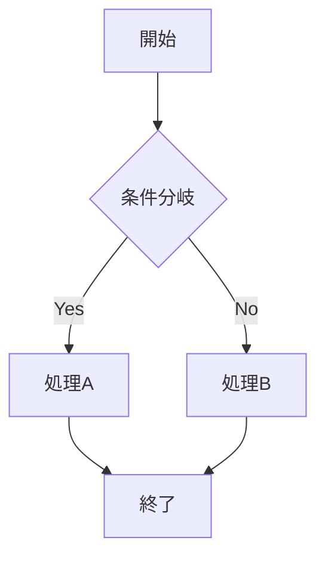
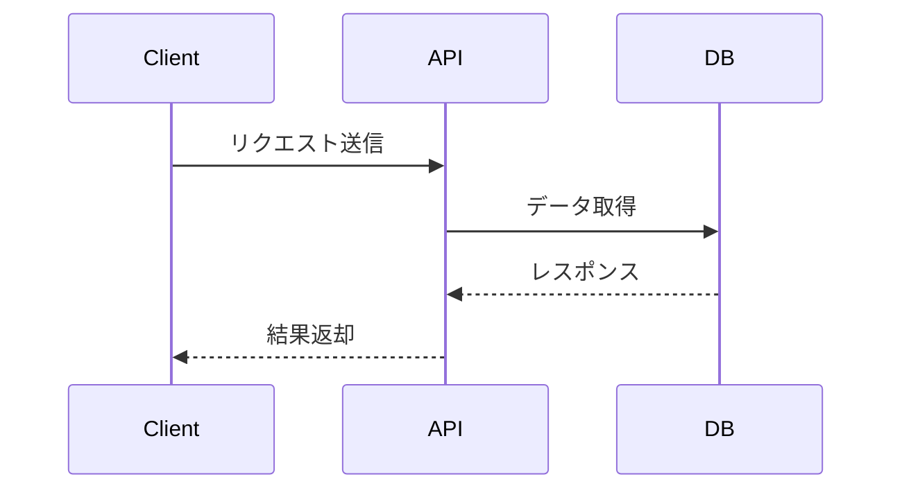

## ツール選択の基準

図を作成するときは以下の順番でツールを検討すること。

1. **mermaid** — まず mermaid で表現できるか検討する。Markdownファイルに埋め込める手軽さが最大の利点
2. **diagrams.net (draw.io)** — mermaid では表現が難しい複雑なレイアウトや、視覚的な装飾が必要な場合に使う

## mermaid を使う場合

### 図の種類と使い分け

| 図の種類 | mermaid 宣言 | 適した用途 |
|---|---|---|
| フローチャート | `flowchart TD` / `flowchart LR` | 処理の流れ、条件分岐、ワークフロー |
| シーケンス図 | `sequenceDiagram` | コンポーネント間の通信、API呼び出しの順序 |
| クラス図 | `classDiagram` | データモデル、オブジェクト間の関係 |
| ER図 | `erDiagram` | データベーススキーマ、エンティティの関係 |
| 状態遷移図 | `stateDiagram-v2` | ステートマシン、ライフサイクル |
| ガントチャート | `gantt` | スケジュール、タスクの依存関係 |
| マインドマップ | `mindmap` | 概念の整理、トピックの関係 |

### 記述例

**フローチャート（処理の流れ）**

**シーケンス図（コンポーネント間の通信）**

### 注意事項

- ノード名に`()`や`[]`などの特殊文字を含める場合はダブルクォートで囲む（例: `A["処理(初期化)"]`）
- 日本語テキストはそのまま使用できるが、長すぎるラベルは折り返しされないため簡潔にする
- フローチャートの方向は `TD`（上から下）を基本とし、横に長くなる場合は `LR`（左から右）に切り替える

## diagrams.net (draw.io) を使う場合

mermaid では対応が難しい以下のケースで使用する。

- 複数の図を1ファイルにまとめたい
- アイコンや画像を図に組み込みたい
- 細かいレイアウト調整が必要な場合

### MCP の使用

draw.io で図を作成する際は、`drawio` MCP サーバーのツールを使用すること。

### ファイルの保存先

調査ドキュメントに対応する図は `docs/images/<調査ドキュメント>/` に保存する。`<調査ドキュメント>` は対象の調査ドキュメントのファイル名（拡張子なし）を使用すること。`.drawio` ソースファイルと `.png` エクスポート画像はどちらも同じディレクトリに保存する。

ドキュメントからは `.png` を相対パスで参照すること。
