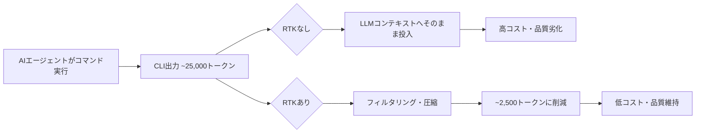
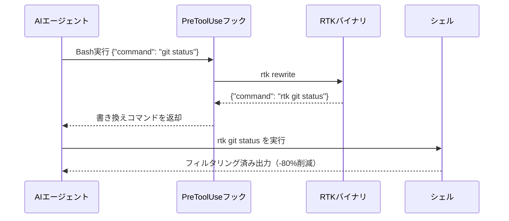
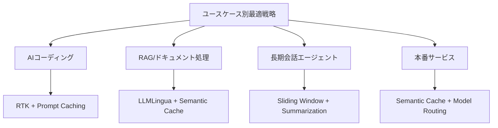

# RTK（Rust Token Killer）とコンテキスト消費コスト削減の仕組み

## 概要

RTK（Rust Token Killer）は、AIコーディングエージェントとシェルの間に介在するCLIプロキシツールです。
シェルコマンドの出力をLLMのコンテキストウィンドウに到達する前にフィルタリング・圧縮することで、LLMトークン消費量を60〜90%削減します。

- **リポジトリ**: [https://github.com/rtk-ai/rtk](https://github.com/rtk-ai/rtk)
- **最新安定版**: v0.40.0（2026年5月13日リリース）
- **GitHub Stars**: 50,000超（2026年5月時点）
- **実装言語**: Rust（単一バイナリ、外部依存ゼロ）
- **処理オーバーヘッド**: 10ms未満

---

## 背景：なぜコンテキスト消費コストが問題になるのか

AIコーディングアシスタントの普及に伴い、LLMのコンテキスト消費コストは深刻な問題となっています。

### 主要LLM APIの課金体系（2026年5月時点）

> **注意**: 価格は頻繁に変更されます。最新情報は各公式ページを必ず確認してください。
> - Anthropic: [https://www.anthropic.com/pricing](https://www.anthropic.com/pricing)
> - OpenAI: [https://openai.com/api/pricing](https://openai.com/api/pricing)
> - Google: [https://ai.google.dev/pricing](https://ai.google.dev/pricing)

| モデル | 入力（/1Mトークン） | 出力（/1Mトークン） | キャッシュ読み取り | キャッシュ書き込み |
|--------|---------------------|---------------------|-------------------|--------------------|
| Claude Opus | 参照要 | 参照要 | 入力の10% | 入力の125% |
| Claude Sonnet | 参照要 | 参照要 | 入力の10% | 入力の125% |
| Claude Haiku | 参照要 | 参照要 | 入力の10% | 入力の125% |
| GPT-4.1 | 参照要 | 参照要 | 自動50%割引 | - |
| Gemini 2.5 Flash | 参照要 | 参照要 | 通常の10% | - |

入出力の両方に課金される構造上、コンテキストが大きいほど費用が指数的に増加します。
キャッシュ書き込みはAnthropicの場合通常より25%増しのコストがかかりますが、同一プロンプトの繰り返し利用で大幅な節約が見込めます。

### コスト問題の本質



開発セッションでは`git status`、`cargo test`、`ls`などのコマンドが繰り返し実行され、その出力の大部分はボイラープレートや冗長情報です（RTK公式READMEでは平均89%が削減可能と述べられています）。
これがそのままLLMのコンテキストに流れ込むと、コンテキスト長の増加により応答品質が低下するという報告もあります（※具体的な数値については複数の研究が存在しますが、環境やモデルにより大きく異なります）。

参考: [RTK README - Why RTK](https://github.com/rtk-ai/rtk/blob/master/README.md)

---

## RTKの仕組み：CLIプロキシによるコスト削減

### アーキテクチャ

RTKはLLM自体には手を加えず、「コマンド実行とLLMの間」にプロキシとして介在します。



Claude Codeの場合、`rtk init -g`を実行すると`~/.claude/settings.json`にPreToolUseフックが自動登録されます。
以降はBashツール経由のすべてのコマンドが透過的にRTK経由となります。

### 4つのコア最適化戦略

#### 1. スマートフィルタリング（Smart Filtering）
コメント行・空白行・定型文（ボイラープレート）をコマンド出力から除去します。

#### 2. グループ化（Grouping）
類似する項目を集約します。`git status`の変更ファイルを種類別にグループ化するなど。

#### 3. 切り詰め（Truncation）
重要なシグナル（エラーメッセージ、失敗したテスト結果）を保持しながら、冗長な成功ログや繰り返し情報を削除します。
テスト実行では失敗したテストのみを表示します。

#### 4. 重複排除（Deduplication）
繰り返されるログ行を「×N回」というカウント付きの単一行に圧縮します。

```
# 元の出力（50行）
WARNING: dependency 'foo' is deprecated
WARNING: dependency 'foo' is deprecated
WARNING: dependency 'foo' is deprecated
...（47回繰り返し）

# RTK処理後（1行）
WARNING: dependency 'foo' is deprecated (×50)
```

### コマンド別削減率（公式READMEの概算値）

> **注**: 削減率はプロジェクトの規模・状態により異なります。以下は公式READMEおよびユーザー報告に基づく概算値です。
> 参考: [RTK README](https://github.com/rtk-ai/rtk/blob/master/README.md)

| コマンド | 削減率（概算） | 備考 |
|---------|-------------|------|
| `cargo test` | 約90% | 失敗テストのみを表示 |
| `git status` | 約80% | グループ化・コンパクト表示 |
| `find` | 約75〜80% | フィルタリングと切り詰め |
| `git diff` | 約75% | 凝縮差分 |
| `grep` | 約50% | 重複排除 |
| `ls / tree` | 約80% | カテゴリ別グループ化 |
| **30分セッション合計** | **約80%** | **RTK公式READMEの例示値** |

---

## インストール・設定

### インストール方法

```bash
# 推奨（Homebrew）
brew install rtk

# クイックインストール
curl -fsSL https://raw.githubusercontent.com/rtk-ai/rtk/refs/heads/master/install.sh | sh

# Cargo経由（ソースビルド）
cargo install --git https://github.com/rtk-ai/rtk
```

### AIツールへの統合

```bash
# Claude Code（推奨）
rtk init -g

# Gemini CLI
rtk init -g --gemini

# Cursor
rtk init -g --agent cursor

# CI/CD環境（非対話型）
rtk init -g --auto-patch
```

### 設定ファイル

- macOS: `~/Library/Application Support/rtk/config.toml`
- Linux: `~/.config/rtk/config.toml`

```toml
[hooks]
# RTK最適化から除外するコマンド
exclude_commands = ["curl", "playwright"]

[tee]
enabled = true
mode = "failures"   # "failures" | "always" | "never"
```

---

## 基本的な使い方

```bash
# ディレクトリ操作
rtk ls .                          # トークン最適化ディレクトリツリー
rtk ls . --ultra-compact          # ASCIIアイコンでさらに削減

# ファイル操作
rtk read file.rs -l aggressive    # シグネチャのみ（本体を除去）
rtk smart file.rs                 # 2行のコード概要

# Git操作
rtk git status                    # コンパクト表示
rtk git diff                      # 凝縮差分
rtk git commit -m 'msg'           # 'ok abc1234' と返却
rtk git push                      # '15行→1行: ok main'（~10トークン）

# テスト実行
rtk cargo test                    # 失敗のみ表示（-90%削減）
rtk pytest                        # Python テスト圧縮

# 統計確認
rtk gain                          # トークン節減統計を表示
rtk gain --graph                  # 過去30日グラフ
rtk discover                      # 最適化機会を探索
```

---

## 一般的なコンテキスト最適化手法との比較

RTKはLLMのコンテキスト最適化手法の一つですが、他の手法とは異なるアプローチを取っています。

### 主要手法の比較

| 手法 | 削減率 | 実装コスト | 精度への影響 | 適用場面 |
|------|--------|------------|--------------|----------|
| RTK（CLIプロキシ） | 60〜90% | 低（init一発） | なし | AIコーディングアシスタント |
| LLMLingua（MS Research） | 20〜95% | 中 | 1.5%以内 | RAG、長文コンテキスト |
| プロンプトキャッシュ（API） | 50〜90% | 低 | なし | 繰り返しシステムプロンプト |
| スライディングウィンドウ | 可変 | 低 | あり（古い記憶喪失） | 会話型エージェント |
| 要約（Summarization） | 可変 | 中 | わずか | 長期会話、エージェント |
| RAG | 大幅 | 高 | なし〜改善 | 大規模知識ベースアクセス |
| セマンティックキャッシュ | 繰り返し依存 | 中〜高 | なし | 類似クエリが多いサービス |

### 競合ツール

> 以下の競合ツール情報は調査時点のものです。各ツールの最新状況は公式リポジトリを確認してください。

- **Headroom**: ML（ModernBERT）ベースの汎用コンテキスト圧縮。JSON・コード（AST対応）・ログ・RAG結果・会話履歴を対象とし、RTKとは補完的な関係。
- **Caveman**: ホスト型/SDK形式のサービス。会話履歴の肥大化に特化したコンテキスト圧縮。CLIコマンド出力ではなく会話コンテキスト全体を対象とする。
- **rtk-alternative（Go製）**: YAMLによる宣言型フィルター定義のGo製代替実装。RTKと類似のコマンドリライト方式。

### 最大効果を得るための組み合わせ戦略



---

## 他手法のコード例

### Anthropic Prompt Cachingの実装

参考: [Anthropic Prompt Caching ドキュメント](https://docs.anthropic.com/en/docs/build-with-claude/prompt-caching)

```python
# Anthropic SDK (anthropic>=0.25.0 で prompt caching 対応)
import anthropic

client = anthropic.Anthropic()

response = client.messages.create(
    model="claude-opus-4-5",  # 最新モデルは公式ドキュメントで確認してください
    max_tokens=1024,
    system=[
        {
            "type": "text",
            "text": "You are an expert software engineer..." + large_context,
            "cache_control": {"type": "ephemeral"}  # キャッシュ対象に指定
        }
    ],
    messages=[{"role": "user", "content": user_question}]
)

# cache_read_input_tokens: キャッシュ読み取りトークン（通常の10%課金）
# cache_creation_input_tokens: キャッシュ作成トークン（通常の125%課金）
print(response.usage)
```

### LLMLinguaによるプロンプト圧縮

```python
from llmlingua import PromptCompressor

llm_lingua = PromptCompressor(
    model_name="microsoft/llmlingua-2-xlm-roberta-large-meetingbank",
    use_llmlingua2=True
)

compressed = llm_lingua.compress_prompt(
    context,
    ratio=0.5,      # 50%に圧縮
    target_token=300
)
print(compressed["compressed_prompt"])
```

### スライディングウィンドウメモリ（LangChain）

参考: [LangChain Memory ドキュメント](https://python.langchain.com/docs/concepts/memory/)

```python
# LangChain v0.1.x 系の記法（v0.2以降はlangchain_communityパッケージを参照）
from langchain.memory import ConversationSummaryBufferMemory
from langchain.llms import OpenAI

llm = OpenAI(temperature=0)
# max_token_limit超えで古いメッセージをLLMが自動要約
memory = ConversationSummaryBufferMemory(
    llm=llm,
    max_token_limit=500,
    memory_key="chat_history"
)
```

---

## アンチパターン

### 1. フックなしでの個別コマンド呼び出し

`rtk git status`を手動で毎回入力するだけでは効果が限定的。`rtk init -g`で自動書き換えフックを有効化することが必須。

### 2. Claude Code組み込みツール経由での期待

Claude Codeの`Read`・`Grep`・`Glob`などのネイティブツールはPreToolUseフックをバイパスするため、RTKの恩恵を受けられない。
これらの代わりにBashツール経由でシェルコマンドを使うか、明示的に`rtk`コマンドを呼び出す必要がある。

```bash
# NG: Claude Codeの組み込みGrepツール使用（RTK非対応）
# → Grepツールが直接実行されるためフックが効かない

# OK: Bashツール経由でgrepを使用
rtk grep -r "pattern" ./src
```

### 3. ネイティブWindowsでのフック期待

ネイティブWindows環境ではPreToolUseフック機能がサポートされず、CLAUDE.mdインジェクションモードにフォールバックする。
完全な自動書き換えにはWSLの使用が必須。

### 4. フック実装でのダブルリライト

既に`rtk git status`形式に書き換えられたコマンドを再度リライトすると`rtk rtk git status`となり失敗する。
フック実装ではすでにRTK経由のコマンドをそのまま通過させるガードが必要。

### 5. フックエラー時にexit非ゼロを返す

フックが`exit 1`などを返すとエージェントのコマンド実行がブロックされる。
すべてのエラーパスは`exit 0`で終了させ、元のコマンドをそのまま実行させるフォールバックが必須。

### 6. exclude_commandsの不適切な設定

`curl`や`playwright`などRTKが誤って最適化すると副作用が出るコマンドを除外しないと、予期しない出力削減が発生する可能性がある。

```toml
[hooks]
# 副作用が出うるコマンドは必ず除外
exclude_commands = ["curl", "playwright", "wget"]
```

---

## 参考情報

- [RTK GitHub リポジトリ](https://github.com/rtk-ai/rtk)
- [RTK README](https://github.com/rtk-ai/rtk/blob/master/README.md)
- [RTK Hooks ドキュメント](https://github.com/rtk-ai/rtk/blob/master/hooks/README.md)
- [RTK インストールガイド](https://github.com/rtk-ai/rtk/blob/master/INSTALL.md)
- [How RTK reduces LLM token usage for AI coding agents](https://dev.to/arshtechpro/how-rtk-reduces-llm-token-usage-for-ai-coding-agents-2kfd)
- [DeepWiki: RTK Token Optimization Strategies](https://deepwiki.com/rtk-ai/rtk/3.2-token-optimization-strategies)
- [DeepWiki: Claude Code Integration](https://deepwiki.com/rtk-ai/rtk/2.3-claude-code-integration)
- [Prompt Compression Techniques](https://medium.com/@kuldeep.paul08/prompt-compression-techniques-reducing-context-window-costs-while-improving-llm-performance-afec1e8f1003)
- [Context Window Optimization Techniques in LLM Applications](https://www.daydreamsoft.com/blog/context-window-optimization-techniques-in-llm-applications-maximizing-performance-and-reducing-costs)
- [Anthropic Prompt Caching ドキュメント](https://docs.anthropic.com/en/docs/build-with-claude/prompt-caching)
- [LLM API Cost Breakdown: Claude vs Gemini vs OpenAI](https://mem0.ai/blog/llm-api-cost-breakdown-claude-gemini-openai-compared)

最終更新日: 2026/05/19
