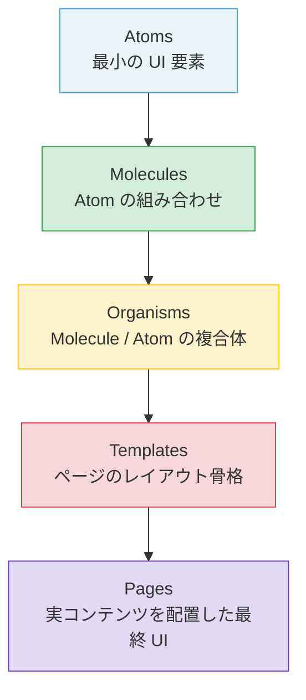
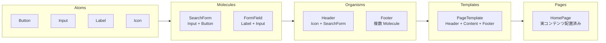
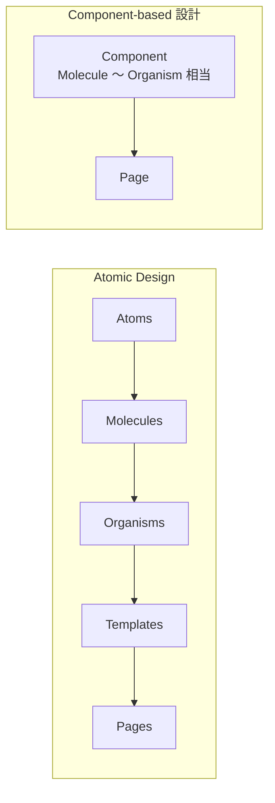
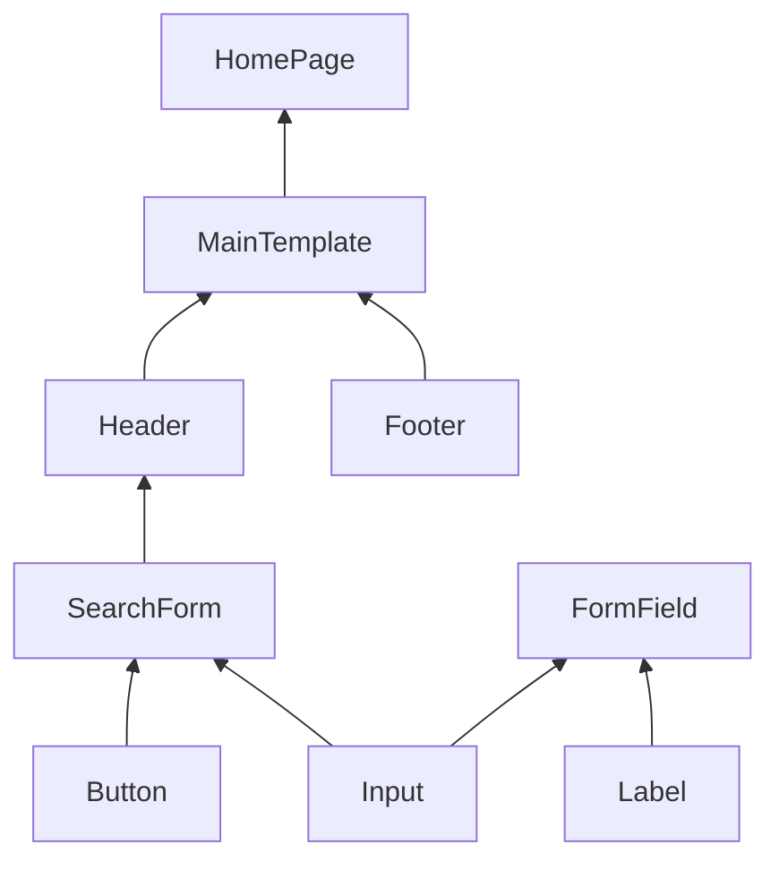

# Atomic Design 入門ガイド

初学者がフロントエンド開発における Atomic Design の全体像を把握するための導入資料。

---

## 目次

1. [Atomic Design とは何か](#1-atomic-design-とは何か)
2. [なぜ必要なのか](#2-なぜ必要なのか)
3. [5つの階層](#3-5つの階層)
4. [他の設計手法との比較](#4-他の設計手法との比較)
5. [よくある誤解やアンチパターン](#5-よくある誤解やアンチパターン)
6. [実際のコードイメージ](#6-実際のコードイメージ)
7. [参考情報](#7-参考情報)

---

## 1. Atomic Design とは何か

Atomic Design は、Web フロントエンドエンジニア・デザイナーの [Brad Frost](https://bradfrost.com/) が 2013 年に提唱した **UI コンポーネント設計方法論**。

化学の原子理論（「すべての物質は原子から成り、原子が集まって分子を形成し、さらに複雑な構造体を形成する」）をインスピレーション源とし、UI を階層的に分解・構築する考え方を示している。

> "Atomic design is atoms, molecules, organisms, templates, and pages concurrently working together to create effective interface design systems."  
> — Brad Frost, *Atomic Design* （[出典](https://atomicdesign.bradfrost.com/chapter-2/)）

### 誕生の背景

スマートフォンの普及によるデバイスの多様化が急速に進んだ 2010 年代初頭、Web 開発者はあらゆる画面サイズ・ブラウザに対応しなければならない状況に置かれた。

「ページ単位」で設計・実装するという従来の開発スタイルでは、UI の再利用性・一貫性の維持が困難になっていた。Brad Frost はこの課題を解決するために、**「ページを作るのではなく、システムを作る（build systems, not pages）」** というコンセプトのもと Atomic Design を考案した。

参考: [Brad Frost's Atomic Design: build systems, not pages](https://www.designsystems.com/brad-frosts-atomic-design-build-systems-not-pages/)

---

## 2. なぜ必要なのか

### 解決する課題

| 課題 | Atomic Design による解決 |
|------|--------------------------|
| UI の重複実装 | 最小単位（Atom）を再利用し、重複を排除する |
| デザインの不一貫性 | 共通コンポーネントを組み合わせて一貫性を担保する |
| スケールしにくいコードベース | 階層構造により変更影響範囲を明確にする |
| デザイナーと開発者の認識齟齬 | 共通の語彙（Atom / Molecule / Organism 等）で会話できる |
| ページ追加時の工数増大 | 既存コンポーネントの組み合わせでページを組み立てられる |

### 主なメリット

- **再利用性の向上**: 小さな単位で定義されたコンポーネントを複数箇所で使い回せる。
- **一貫性の確保**: デザインシステムとして管理することで、視覚的な一貫性を保てる。
- **保守性の向上**: 変更箇所が限定的になり、修正の影響範囲を把握しやすい。
- **チームコラボレーション**: デザイナーと開発者が共通の言語で議論できる。

参考: [Atomic Design by Brad Frost（公式書籍サイト）](https://atomicdesign.bradfrost.com/)

---

## 3. 5つの階層

Atomic Design は UI を **5つの階層** に分類する。これは線形のプロセスではなく、各階層が同時並行で機能する **思考モデル** である。



### 3-1. Atoms（原子）

**UI における最小構成要素。それ以上分解すると機能を失う要素。**

具体例:
- ボタン（`<button>`）
- テキスト入力フィールド（`<input>`）
- ラベル（`<label>`）
- アイコン
- カラーパレット・タイポグラフィ定義

> "Atoms are the basic building blocks of matter. Applied to web interfaces, atoms are our HTML tags, such as a form label, an input or a button."  
> — [Atomic Design Methodology](https://atomicdesign.bradfrost.com/chapter-2/)

### 3-2. Molecules（分子）

**複数の Atom が組み合わさり、単一の機能を担うコンポーネント。**

具体例:
- 検索フォーム（Input + Button + Label の組み合わせ）
- フォームフィールド（Label + Input）
- ナビゲーションリンク（Icon + テキスト）

Molecule を設計する際のポイントは **「1つの明確な役割を持つこと」**。シンプルに保つことで再利用しやすくなる。

### 3-3. Organisms（有機体）

**Atom・Molecule が組み合わさり、UI の独立したセクションを形成する複合コンポーネント。**

具体例:
- ヘッダー（ロゴ Atom + ナビゲーション Molecule + 検索フォーム Molecule）
- 商品カードリスト
- フッター

Organism はページ上で独立して意味をなす単位で、独自の状態（State）や外部データとのやり取りを持つこともある。

### 3-4. Templates（テンプレート）

**Organism を配置し、ページのレイアウト構造（骨格）を定義するもの。実際のコンテンツは含まない。**

Templates の段階では「どこに何が置かれるか」というレイアウトに集中し、実際のテキストや画像データは扱わない。これにより、コンテンツに依存しない汎用的なレイアウトが定義できる。

具体例:
- ブログ記事ページのレイアウト
- 商品一覧ページのレイアウト

### 3-5. Pages（ページ）

**Template に実際のコンテンツを流し込んだ最終的な UI。ユーザーが実際に見る画面。**

Pages はユーザーが実際に操作する最終成果物であり、デザインの検証・テストを行う場でもある。実コンテンツを配置することで、Template のレイアウトが成立しているかどうかを確認できる。

### 5階層の構造全体図



---

## 4. 他の設計手法との比較

### 4-1. Atomic Design vs Component-based 設計

一般的な Component-based 設計は、Atomic Design における Molecule や Organism 相当のレベルからコンポーネントを作り始める。両者は排反ではなく、**Component-based 開発の中に Atomic Design の思考を取り入れる** ことが多い。



| 観点 | Atomic Design | Component-based 設計 |
|------|--------------|----------------------|
| 粒度 | 最小単位（HTML 要素）から定義 | 機能単位から定義 |
| 一貫性 | システム全体で厳密に担保 | コンポーネントごとに判断 |
| 学習コスト | 高め（5階層の概念理解が必要） | 低め（直感的） |
| 再利用性 | 高い（最小単位からの組み合わせ） | 中程度（コンポーネント依存） |
| 向いているプロジェクト | 大規模・長期・デザインシステム構築 | 小〜中規模・短期プロジェクト |
| ビジネスロジックの扱い | 明示的な指針なし | 各コンポーネントに内包しやすい |

参考: [Atomic Design vs. Traditional Component Structures](https://medium.com/@basitk5000/atomic-design-vs-traditional-component-structures-what-designers-need-to-know-990315ae1d69)

### 4-2. 他の関連アプローチ

| 手法 | 概要 | Atomic Design との関係 |
|------|------|------------------------|
| **Design System** | カラー・タイポグラフィ・コンポーネントなどを一元管理するシステム | Atomic Design は Design System 構築の方法論の1つ |
| **Feature-Sliced Design** | 機能（Feature）単位でコードを分割するアーキテクチャ | Atomic Design と組み合わせて使われることが多い |
| **BEM (CSS 命名規則)** | Block / Element / Modifier でクラス名を命名するルール | Atom / Molecule / Organism の考えと親和性がある |

---

## 5. よくある誤解やアンチパターン

### アンチパターン 1: 厳格すぎる分類へのこだわり

**「これは Molecule か Organism か？」という議論に時間をかけすぎること。**

Atomic Design の階層分類は厳密なルールではなく、あくまで **思考の整理ツール**。実際のプロジェクトでは「どちらにも見える」コンポーネントは多い。分類の議論より、コンポーネントが **再利用可能か・単一の責務を持つか** に集中することが重要。

### アンチパターン 2: UI 設計手法をアーキテクチャ全体に適用しようとする

**Atomic Design は UI 構成の方法論であり、アプリケーションアーキテクチャ全般のルールではない。**

状態管理・API 通信・ビジネスロジックの置き場所については Atomic Design は明示的な指針を持たない。これらを Organism や Template に詰め込みすぎると、コンポーネントが肥大化し保守困難になる。

> "Frontend code needs to manage state, interaction logic, data binding, and often even business logic" — ビジュアル要素の階層化だけでは、State 管理や動的な挙動を適切に捉えられないという問題が生じる。  
> — [Why Atomic Design Is Not for Frontend: A Deep Dive](https://dev.to/it_vturbo/why-atomic-design-is-not-for-frontend-a-deep-dive-32in)

### アンチパターン 3: 過剰な分割（オーバーエンジニアリング）

**単一箇所でしか使わない要素を無理に Atom に分解すること。**

再利用されない Atom を量産しても管理コストが増えるだけ。**「本当に複数箇所で使われるか」** を基準に分割を判断すること。

### アンチパターン 4: チーム内で共通理解がないまま導入する

**一部のメンバーだけが Atomic Design を理解し、他のメンバーが理解していない状態での導入。**

共通の語彙や分類基準がなければ、コンポーネントが乱雑に配置されシステムが崩壊する。導入前にチーム全体での学習・合意形成が不可欠。

### アンチパターン 5: 小規模プロジェクトへの無条件適用

**ページ数が少ない・一人開発・短期プロジェクトへの Atomic Design 適用。**

Atomic Design はシステムの規模が大きくなるほど効果を発揮する。小規模プロジェクトでは設計コストがメリットを上回ることがある。

参考:
- [The Double-Edged Sword of Atomic Design](https://hackernoon.com/the-double-edged-sword-of-atomic-design)
- [Atomic Design and Its Relevance in Frontend in 2025](https://dev.to/m_midas/atomic-design-and-its-relevance-in-frontend-in-2025-32e9)

---

## 6. 実際のコードイメージ

React を用いた簡単な実装イメージを示す。実際のプロダクションコードではなく、概念理解のための疑似コード的サンプル。

### ディレクトリ構成

```
src/
└── components/
    ├── atoms/
    │   ├── Button.tsx
    │   ├── Input.tsx
    │   └── Label.tsx
    ├── molecules/
    │   ├── SearchForm.tsx
    │   └── FormField.tsx
    ├── organisms/
    │   ├── Header.tsx
    │   └── Footer.tsx
    ├── templates/
    │   └── MainTemplate.tsx
    └── pages/
        └── HomePage.tsx
```

### Atom: Button コンポーネント

```tsx
// atoms/Button.tsx
type ButtonProps = {
  label: string;
  onClick: () => void;
  variant?: "primary" | "secondary";
};

export const Button = ({ label, onClick, variant = "primary" }: ButtonProps) => {
  return (
    <button className={`btn btn--${variant}`} onClick={onClick}>
      {label}
    </button>
  );
};
```

### Molecule: SearchForm コンポーネント

```tsx
// molecules/SearchForm.tsx
// ※ 疑似コードのため useState の import は省略（実際は import { useState } from "react" が必要）
import { Input } from "../atoms/Input";
import { Button } from "../atoms/Button";

type SearchFormProps = {
  onSearch: (query: string) => void;
};

export const SearchForm = ({ onSearch }: SearchFormProps) => {
  const [query, setQuery] = useState("");

  return (
    <div className="search-form">
      <Input value={query} onChange={setQuery} placeholder="検索キーワード" />
      <Button label="検索" onClick={() => onSearch(query)} />
    </div>
  );
};
```

### Organism: Header コンポーネント

```tsx
// organisms/Header.tsx
import { SearchForm } from "../molecules/SearchForm";

type HeaderProps = {
  onSearch: (query: string) => void;
};

export const Header = ({ onSearch }: HeaderProps) => {
  return (
    <header className="header">
      <div className="header__logo">MyApp</div>
      <nav className="header__nav">{/* ナビゲーションリンク */}</nav>
      <SearchForm onSearch={onSearch} />
    </header>
  );
};
```

### Template: MainTemplate コンポーネント

```tsx
// templates/MainTemplate.tsx
import { Header } from "../organisms/Header";
import { Footer } from "../organisms/Footer";

type MainTemplateProps = {
  children: React.ReactNode;
  onSearch: (query: string) => void;
};

export const MainTemplate = ({ children, onSearch }: MainTemplateProps) => {
  return (
    <div className="layout">
      <Header onSearch={onSearch} />
      <main className="layout__content">{children}</main>
      <Footer />
    </div>
  );
};
```

### Page: HomePage コンポーネント

```tsx
// pages/HomePage.tsx
import { MainTemplate } from "../templates/MainTemplate";

export const HomePage = () => {
  const handleSearch = (query: string) => {
    // 実際の検索処理
    console.log("Search:", query);
  };

  return (
    <MainTemplate onSearch={handleSearch}>
      <h1>ようこそ</h1>
      <p>ここに実際のページコンテンツが入ります。</p>
    </MainTemplate>
  );
};
```

### コンポーネントの依存関係図



参考:
- [Atomic Design Pattern: Structuring Your React Application](https://rjroopal.medium.com/atomic-design-pattern-structuring-your-react-application-970dd57520f8)
- [react-atomic-design（GitHub）](https://github.com/danilowoz/react-atomic-design)

---

## 7. 参考情報

| タイトル | URL |
|----------|-----|
| Atomic Design by Brad Frost（公式書籍サイト） | [https://atomicdesign.bradfrost.com/](https://atomicdesign.bradfrost.com/) |
| Atomic Design Methodology（公式 Chapter 2） | [https://atomicdesign.bradfrost.com/chapter-2/](https://atomicdesign.bradfrost.com/chapter-2/) |
| Brad Frost's Atomic Design: build systems, not pages | [https://www.designsystems.com/brad-frosts-atomic-design-build-systems-not-pages/](https://www.designsystems.com/brad-frosts-atomic-design-build-systems-not-pages/) |
| Atomic Design vs. Traditional Component Structures | [https://medium.com/@basitk5000/atomic-design-vs-traditional-component-structures-what-designers-need-to-know-990315ae1d69](https://medium.com/@basitk5000/atomic-design-vs-traditional-component-structures-what-designers-need-to-know-990315ae1d69) |
| The Double-Edged Sword of Atomic Design | [https://hackernoon.com/the-double-edged-sword-of-atomic-design](https://hackernoon.com/the-double-edged-sword-of-atomic-design) |
| Atomic Design and Its Relevance in Frontend in 2025 | [https://dev.to/m_midas/atomic-design-and-its-relevance-in-frontend-in-2025-32e9](https://dev.to/m_midas/atomic-design-and-its-relevance-in-frontend-in-2025-32e9) |
| Why Atomic Design Is Not for Frontend: A Deep Dive | [https://dev.to/it_vturbo/why-atomic-design-is-not-for-frontend-a-deep-dive-32in](https://dev.to/it_vturbo/why-atomic-design-is-not-for-frontend-a-deep-dive-32in) |
| Atomic Design Pattern: Structuring Your React Application | [https://rjroopal.medium.com/atomic-design-pattern-structuring-your-react-application-970dd57520f8](https://rjroopal.medium.com/atomic-design-pattern-structuring-your-react-application-970dd57520f8) |
| react-atomic-design（GitHub） | [https://github.com/danilowoz/react-atomic-design](https://github.com/danilowoz/react-atomic-design) |

---

最終更新日: 2026/05/09
