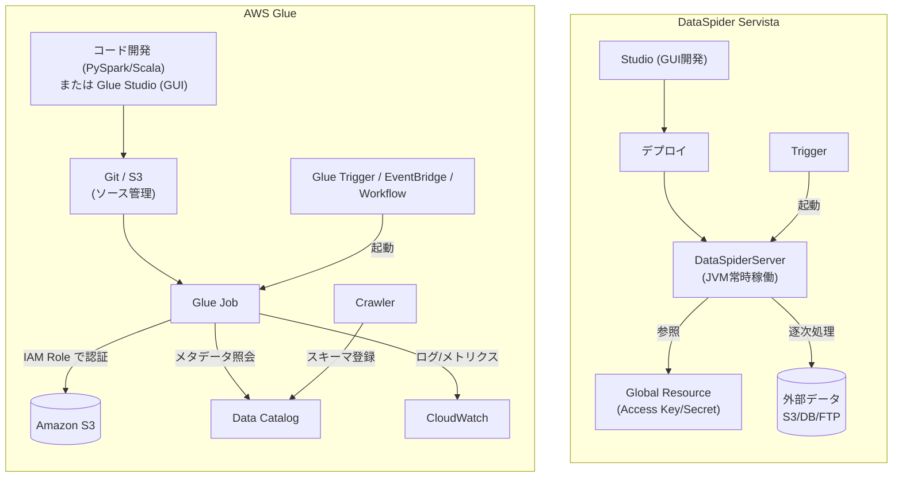
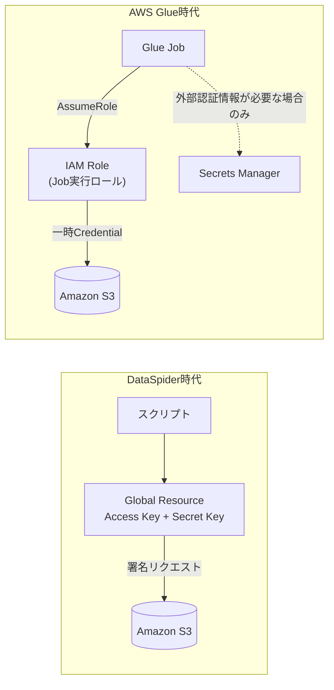
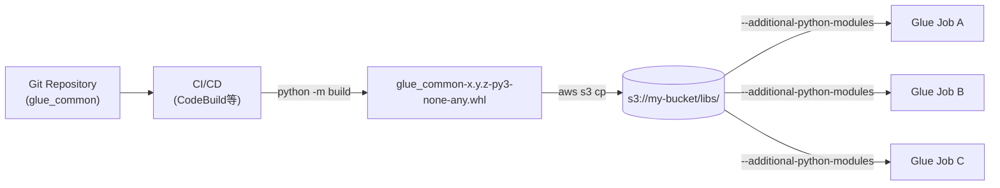

# DataSpiderからAWS Glueへの移植ガイド

DataSpider Servistaで構築されたETL資産をAWS Glueへ移植する際に、「不要になる機能」「大きく変わる機能(特にS3アクセス方式)」「共通処理のライブラリ化」を、初めてAWS Glueに触れる読者向けに整理したガイドです。

> **本ドキュメントの読み方**
>
> - 各記述の直後に出典URLを併記しています。
> - 「【事実】」「【解釈】」「【要確認】」のラベルで、公式ドキュメントで裏取り済みの記述と、調査者による解釈・注釈を区別しています。
> - サンプルコード・IAMポリシー・コマンドはそのまま動作する最小構成を意識していますが、実運用ではリージョン・アカウント・バケット名・バージョン等を適宜置換してください。

## 目次

1. [はじめに(移植の全体像)](#1-はじめに移植の全体像)
2. [AWS Glueの基礎(初学者向け)](#2-aws-glueの基礎初学者向け)
3. [DataSpider と AWS Glue の比較](#3-dataspider-と-aws-glue-の比較)
4. [移植で「不要になる」機能・概念](#4-移植で不要になる機能概念)
5. [移植で「大きく変わる」機能・概念](#5-移植で大きく変わる機能概念)
6. [共通処理のライブラリ化](#6-共通処理のライブラリ化)
7. [移植プロジェクトを進める上での注意点まとめ](#7-移植プロジェクトを進める上での注意点まとめ)
8. [補足: 用語集](#8-補足-用語集)
9. [参考リンク](#参考リンク)

---

## 1. はじめに(移植の全体像)

DataSpider ServistaはGUIベースでETLを組み上げるオンプレミス/クラウド対応の統合ミドルウェアで、Amazon S3をはじめ50種類以上のアダプタを持ちます([DataSpider製品ページ](https://www.saison-technology.com/service/product/lineup/dataspider/))。一方でAWS Glueは、サーバ管理不要でApache Spark(またはPython Shell)を実行する**サーバレスなデータ統合サービス**です([What is AWS Glue](https://docs.aws.amazon.com/glue/latest/dg/what-is-glue.html))。

両者は目的こそETLで共通ですが、思想が大きく異なります。移植プロジェクトでは、単純な機能マッピングではなく**「捨てるもの」「置き換えるもの」「新規に設計しなおすもの」**の3層に分解して整理することを推奨します。

```mermaid
flowchart LR
    subgraph AS_IS["現行 (DataSpider)"]
        DS_Studio["Studio (GUI)"]
        DS_Server["DataSpiderServer (JVM)"]
        DS_Trigger["Trigger"]
        DS_GR["Global Resource<br/>(Access Key/Secret)"]
    end

    subgraph TO_BE["移行後 (AWS Glue)"]
        Glue_Job["Glue Job (PySpark/Scala)"]
        Glue_Studio["Glue Studio<br/>(Visual editor)"]
        Glue_Trigger["Glue Trigger /<br/>EventBridge / Workflow"]
        IAM["IAM Role"]
        Catalog["Data Catalog"]
    end

    DS_Studio -->|コード資産へ再構成| Glue_Job
    DS_Studio -.->|GUI継続したい場合| Glue_Studio
    DS_Server -->|サーバレスへ| Glue_Job
    DS_Trigger -->|置換| Glue_Trigger
    DS_GR -->|置換(基本)| IAM
    DS_GR -.->|外部認証情報のみ| Catalog
```

## 2. AWS Glueの基礎(初学者向け)

### 2.1 AWS Glueとは

【事実】AWS Glueは、複数のデータソースからデータを「発見・準備・移動・統合」するための**サーバレスなデータ統合サービス**です。ETL(抽出・変換・ロード)パイプラインをビジュアルに作成・実行・監視でき、70以上のデータソースに接続し、メタデータを中央のData Catalogで一元管理できます。インフラ管理は不要で、ワークロードに応じて自動スケールし、従量課金(pay-as-you-go)で利用します([What is AWS Glue](https://docs.aws.amazon.com/glue/latest/dg/what-is-glue.html))。

> **補足: サーバレスとは**
> インスタンスやコンテナを利用者が事前に確保・管理する必要がなく、ジョブ実行時にAWS側が計算リソースを割り当てる方式です。料金は実行した時間・DPU数で従量課金され、待機コストが発生しません。DataSpiderServerの常時稼働との大きな差分となります。

### 2.2 主要コンポーネント

| コンポーネント | 役割 | DataSpider類似物 |
|---|---|---|
| **Glue Job** | ETL処理の実行単位。`glueetl`(Spark)/`gluestreaming`(Spark Streaming)/`pythonshell`(軽量Python)の3種類。SparkはPython/Scalaで記述 | スクリプト(サービス) |
| **Glue Crawler** | データソースをスキャンしスキーマを自動推論、Data Catalogへ登録 | 明示的な対応物なし(アダプタ側でスキーマ定義) |
| **Glue Data Catalog** | 全データの中央メタデータリポジトリ。Hiveメタストア互換 | 明示的な対応物なし |
| **Glue Studio** | ジョブをビジュアル(ノード配置)で作成・実行・監視するGUI | Studio(近い操作感) |
| **Trigger / Workflow** | Triggerはスケジュール/オンデマンド/イベント起動。Workflowは複数ジョブ・Crawlerを連鎖 | Trigger |
| **Glue DataBrew** | コードを書かずにデータクレンジング・正規化するビジュアルツール | 一部の変換系アイコン |

(出典: [What is AWS Glue](https://docs.aws.amazon.com/glue/latest/dg/what-is-glue.html), [Job properties](https://docs.aws.amazon.com/glue/latest/dg/add-job.html), [AWS Glue concepts](https://docs.aws.amazon.com/glue/latest/dg/components-key-concepts.html))

> **【要確認】AWS Glue for Ray**: 旧来はRayエンジンも提供されていましたが、公式に「end of support」の告知があります。新規採用は非推奨です。具体的なサポート終了日はGlueリリースノート等で最新情報を確認してください。

### 2.3 Glue Version

【事実】Glue VersionによってSpark/Python/Scala/Javaのバージョンが決まります。

| Version | Spark | Python | Scala | Java |
|---|---|---|---|---|
| Glue 4.0 | 3.3.0 | 3.10 | 2.12 | 8 |
| Glue 5.0 | 3.5.4 | 3.11 | 2.12.18 | 17 |
| Glue 5.1 | 3.5.6 | 3.11 | 2.12.18 | 17(【要確認】) |

- 【事実】**Glue 5.0**(2024年12月GA)は4.0比で約32%高速・コスト22%削減の実測が公式ブログで報告されています。SageMaker Unified Studio連携、requirements.txt依存管理、Lake Formationによるきめ細かなアクセス制御、S3 Tables対応、データリネージ(DataZone連携)、テーブルフォーマット更新(Hudi 0.15.0 / Iceberg 1.7.1 / Delta Lake 3.3.0)を追加([Introducing AWS Glue 5.0 for Apache Spark](https://aws.amazon.com/blogs/big-data/introducing-aws-glue-5-0-for-apache-spark/))。※パフォーマンス数値(32%/22%)は原典ブログの記載を引用しており、公開前に最新値を原典で最終確認することを推奨します。
- 【事実】**Glue 5.1**が2025年11月26日にGAとなり、**Spark 3.5.6 / Python 3.11 / Scala 2.12.18**を搭載します([What's New: AWS Glue 5.1](https://aws.amazon.com/about-aws/whats-new/2025/11/aws-glue-5-1/))。
- 【要確認】「バージョン未指定のジョブが Glue 5.1 をデフォルトとする」という運用ルールについては、上記What's Newページでは明記が確認できませんでした。実運用前に必ず[Job properties (add-job)](https://docs.aws.amazon.com/glue/latest/dg/add-job.html)ページ・最新コンソール挙動で確認してください。

### 2.4 料金体系(DPU中心)

【事実】課金の中心は **DPU(Data Processing Unit)** です。**1 DPU = 4 vCPU + 16 GBメモリ**。ETLジョブ・Crawler・Interactive Sessionは秒単位課金です([AWS Glue pricing](https://aws.amazon.com/glue/pricing/))。

- ETLジョブ / Crawler: **$0.44 / DPU-hour**(例: 6 DPUで15分 ≒ $0.66)
- Data Catalog: 月100万オブジェクト・100万リクエストまで無料、超過は10万オブジェクトあたり$1.00/月
- DataBrew: Interactive Session $1.00/30分、ジョブ $0.48/node-hour

ワーカータイプ(1ワーカーあたりのDPU、出典: [Job properties (add-job)](https://docs.aws.amazon.com/glue/latest/dg/add-job.html)):

| Type | DPU | vCPU | メモリ | 用途 |
|---|---|---|---|---|
| G.025X | 0.25 | 2 | 4 GB | 低容量ストリーミング(Glue 3.0+) |
| G.1X | 1 | 4 | 16 GB | 汎用(推奨デフォルト) |
| G.2X | 2 | 8 | 32 GB | 汎用・大きめ |
| G.4X | 4 | 16 | 64 GB | 重い変換/集計/結合(Glue 3.0+) |
| G.8X | 8 | 32 | 128 GB | 最も要求の高いワークロード(Glue 3.0+) |

【事実補足】さらに大規模向けのG.12X/G.16X、メモリ最適化R.1X〜R.8X(いずれもGlue 4.0以降、一部リージョン限定)もあります。**Flex実行**(非緊急ジョブ向けの割安クラス、Glue 3.0以降、G.1X/G.2X)も提供されています。単価はリージョン差・改定があるため、最新情報を[公式pricingページ](https://aws.amazon.com/glue/pricing/)で必ず確認してください。

### 2.5 向いているケース・向いていないケース

- 【事実ベース】**向いている**: S3データレイクへのETL/ELT、多数のソースの統合とカタログ化、サーバレスで運用負荷を下げたい大規模バッチ・ストリーミング、Athena/Redshift Spectrum等との連携前処理。
- 【解釈】**不向き・要検討**: ミリ秒級の低レイテンシAPI/OLTP、極小データを常時処理するケース(起動オーバーヘッドやDPUの最小課金が割高)、Spark/Python以外のランタイム前提の処理、リアルタイム双方向トランザクション。この節は公式明示ではなく調査者の解釈です。

---

## 3. DataSpider と AWS Glue の比較

### 3.1 DataSpider Servistaのアーキテクチャ

DataSpiderは大きく3層で構成されます([DataSpider製品ページ](https://www.saison-technology.com/service/product/lineup/dataspider/), [サービスの基礎知識](https://www.hulft.com/help/ja-jp/DataSpider/dss43/help/ja/servista/service_basic.html))。

- **Studio(開発ツール)**: スクリプトを設計するGUIデザイナ。処理アイコンのドラッグ&ドロップだけでデータ連携を組む「ノンプログラミング」開発環境。
- **Server(実行基盤)**: DataSpiderServerがスクリプトを実行。スクリプトは**Javaにコンパイルされて実行**される。
- **Trigger**: スケジュール/ファイル/HTTP/DB/FTP/Webサービス/Amazon Kinesis/SAP など多彩なイベントでサービス(スクリプト)を起動([トリガー](https://www.hulft.com/help/ja-jp/DataSpider/dss42sp3/help/ja/trigger/trigger.html))。

その他、外部システム接続部品としての**アダプタ(コネクタ)**、GUIワークフローとしての**スクリプト**、接続先情報を一元管理する**グローバルリソース**([グローバルリソース](https://www.hulft.com/help/ja-jp/DataSpider/dss43/help/ja/servista/global_resource.html))といった概念があります。

### 3.2 コンポーネント対応表

| 観点 | DataSpider Servista | AWS Glue |
|---|---|---|
| 開発方式 | GUIドラッグ&ドロップ(Studio、ノンプログラミング) | コード(PySpark/Scala) + Glue Studio でGUI作成も可能(生成コードは編集可) |
| 実行基盤 | 自前のDataSpiderServer(JVM上、Javaへコンパイル実行) | **サーバレス**(管理インフラなし、Apache Spark、**DPU/Worker**課金) |
| スケジューリング | Trigger(スケジュール/ファイル/HTTP/DB 等) | **Glue Trigger**(スケジュール/オンデマンド/イベント)、**Workflow**、EventBridge |
| 監視・ログ | DataSpiderのログ/運用ツール | **CloudWatch Logs/Metrics**、Job run insights、Spark UI、CloudTrail |
| 接続情報管理 | **Global Resource** | **Connection**(Data Catalogオブジェクト) + 認証情報は**Secrets Manager**連携 |
| エラーハンドリング | 例外処理コンポーネント | スクリプト内の`try/except` + **Job bookmarks** による再処理制御 |
| メタデータ/スキーマ | アダプタ単位でスキーマ定義 | **Data Catalog** + **Crawler**による自動スキーマ推論 |

(出典: Glue全般 [What is AWS Glue](https://docs.aws.amazon.com/glue/latest/dg/what-is-glue.html), 用語 [AWS Glue concepts](https://docs.aws.amazon.com/glue/latest/dg/components-key-concepts.html))

### 3.3 アーキテクチャ比較(図解)



---

## 4. 移植で「不要になる」機能・概念

サーバレスであるため、**サーバ管理・JVMチューニング・OSやミドルウェアの保守**が不要になります(Glueは「no infrastructure to manage」/「pay-as-you-go」/[What is AWS Glue](https://docs.aws.amazon.com/glue/latest/dg/what-is-glue.html))。ワーカーは負荷に応じて自動スケールするため、実行基盤のサイジングも大幅に軽減されます。

具体的に「捨てて良いもの」は以下です。

- **DataSpiderServerのプロビジョニング・OS/JVMパッチ適用・キャパシティプランニング**
- **JVMヒープ・GCチューニング**
- **DataSpiderServerライセンス管理**(Glueは従量課金モデル。※DataSpider側の具体的なライセンス形態は今回調査した公式製品ページでは確認できず、【要確認】)
- **アクセスキー/シークレットのグローバルリソース登録**(基本はIAM Roleに置換。詳細は5.2)
- **「ダウンロード→ローカル一時ファイル→加工→アップロード」型の中間ファイル管理**(GlueはSparkによるS3直読み・直書きが基本)
- **アイコン単位のリトライ設定**(Sparkのタスク再試行 + boto3リトライ + Job再試行に集約)

---

## 5. 移植で「大きく変わる」機能・概念

### 5.1 GUI開発 → コード開発

Glue StudioでGUIジョブも作れますが、実体は**PySpark/Scalaコード**であり、Studio上でも生成コードは編集可能です([AWS Glue concepts](https://docs.aws.amazon.com/glue/latest/dg/components-key-concepts.html))。DataSpiderのアイコン結線に慣れた開発者は、コードをGitで管理する開発体制、ユニットテスト、CI/CDパイプラインを新規に整備する必要があります。

### 5.2 S3アクセス方式(重点セクション)

#### 5.2.1 DataSpider側のS3アクセス方式

DataSpider Servista(および DataSpider Cloud)には **Amazon S3アダプタ**が用意されており、GUI上の処理アイコンをドラッグ&ドロップしてS3と連携します。

- **認証情報の管理**: 接続情報は**グローバルリソース**に集約する。コントロールパネルから「Cloud > Amazon S3」を選び、**Access Key ID**と**Secret Access Key**(IAMユーザーの認証情報)、および接続先**Endpoint**(例: `s3-ap-southeast-1.amazonaws.com`)を設定する。通信はHTTPS。スクリプト側はこのグローバルリソースを参照するため、キーをスクリプトに直書きしない設計になっている([HULFT FAQ 35507](https://faq2.hulft.com/faq/show/35507), [DataSpider Cloud Help: Amazon S3 データ書き込み](https://doc.dataspidercloud.com/v1/help/ja/adapter/cloud/amazons3_put_data.html))。
- **典型的な操作**: ファイルの**アップロード/ダウンロード**、**データ書き込み/データ読み込み**、**ファイル一覧取得**、**ファイル削除**に相当する操作が提供される。※各アイコンの正式名称の完全な一覧は今回参照した公式ヘルプ上では確認できず、【要確認】。移植時は実スクリプトのアイコン名を現物で確認してください。
- **典型フロー**: 「S3からローカル一時領域へダウンロード → マッピング/変換アイコンで加工 → S3へアップロード」という**一度ローカルに落とす**構成になりがち。

#### 5.2.2 AWS Glue側のS3アクセス方式(複数ある点が重要)

Glueには単一の「S3コンポーネント」はなく、**用途に応じて複数のAPIを使い分けます**。

| 方式 | 主な用途 | 特徴 |
|---|---|---|
| **DynamicFrame経由**(Glueネイティブ) | 大規模ETLの読み書き | スキーマ揺れ、Job bookmarks、大量小ファイルのグルーピング(`groupFiles`)に強い |
| **Spark DataFrame経由** | 標準的な大規模ETL | Sparkの一般的API。Glue外(EMR等)への移植性が高い |
| **boto3経由** | 単発のファイル操作、メタデータ取得、存在確認、削除 | DataFrameを介さない制御系処理向け |
| **awswrangler(AWS SDK for pandas)** | 小規模ファイルの読み書き | pandas風APIで手軽 |

(出典: [Amazon S3 connections in AWS Glue](https://docs.aws.amazon.com/glue/latest/dg/aws-glue-programming-etl-connect-s3-home.html), [Connecting to data in ETL scripts](https://docs.aws.amazon.com/glue/latest/dg/aws-glue-programming-etl-connect.html))

#### 5.2.3 `s3://` vs `s3a://` vs `s3n://`

Glue(および他のAWSサービス)では**`s3://`スキームを使う**のが基本です。`s3a://`(Hadoop実装)や`s3n://`(旧世代)は非推奨で、暗号化キーの取り扱いで不整合が起きるケースなどが報告されています。

> **【要確認】出典について**: `s3a`の非推奨扱いを明記したAWS公式単独のページは今回確認できず、技術ブログ([Tiny caveats of using different S3 Schemes on AWS Glue](https://datachef.co/blog/tiny-caveats-of-using-different-s3-schemes-on-aws-glue/))を出典としています。厳密なポリシーはプロジェクト内で必ず`s3://`に統一する運用ルールを敷くのが安全です。

#### 5.2.4 認証方式の変化(最重要)

- **DataSpider時代**: Access Key / Secret Key をグローバルリソースに保存し、それを参照。
- **Glue時代**: **Jobに紐づく IAM Role**が基本。Glue Job実行時、コード内でキーを一切指定しなくても、割り当てられたIAM RoleのCredentialが自動で使われます。Access Keyの直書きは**アンチパターン**です([Setting up IAM permissions for AWS Glue](https://docs.aws.amazon.com/glue/latest/dg/getting-started-access.html))。
- 別アカウントや外部サービスの認証情報が必要な場合は、**AWS Secrets Manager**に格納し、実行時に取得します。キーをスクリプトや環境変数に平文で置かないでください。



#### 5.2.5 具体コード例: S3上のCSVを読みParquetで書き出す最小Glue Job

```python
import sys
from awsglue.utils import getResolvedOptions
from pyspark.context import SparkContext
from awsglue.context import GlueContext
from awsglue.job import Job

args = getResolvedOptions(sys.argv, ["JOB_NAME"])
sc = SparkContext()
glueContext = GlueContext(sc)
job = Job(glueContext)
job.init(args["JOB_NAME"], args)

dyf = glueContext.create_dynamic_frame.from_options(
    connection_type="s3",
    connection_options={"paths": ["s3://my-input-bucket/csv/"], "recurse": True},
    format="csv",
    format_options={"withHeader": True},
)

glueContext.write_dynamic_frame.from_options(
    frame=dyf,
    connection_type="s3",
    connection_options={"path": "s3://my-output-bucket/parquet/"},
    format="parquet",
)
job.commit()
```

(API出典: [Amazon S3 connections / DynamicFrame from_options](https://docs.aws.amazon.com/glue/latest/dg/aws-glue-programming-etl-connect-s3-home.html))

#### 5.2.6 IAM Roleに付与する最小権限(サンプルJSON)

```json
{
  "Version": "2012-10-17",
  "Statement": [
    {
      "Sid": "ReadInput",
      "Effect": "Allow",
      "Action": ["s3:GetObject", "s3:ListBucket"],
      "Resource": [
        "arn:aws:s3:::my-input-bucket",
        "arn:aws:s3:::my-input-bucket/*"
      ]
    },
    {
      "Sid": "WriteOutput",
      "Effect": "Allow",
      "Action": ["s3:PutObject", "s3:DeleteObject"],
      "Resource": "arn:aws:s3:::my-output-bucket/*"
    }
  ]
}
```

この他に、Glue実行ロールには通常`AWSGlueServiceRole`相当(CloudWatch Logs等への書き込み)をアタッチします。

#### 5.2.7 S3アクセスに関するアンチパターン

- `boto3.client('s3', aws_access_key_id=..., aws_secret_access_key=...)` のような**キー直書き**(IAM Roleを使う)
- 大量ファイルを**1件ずつboto3でループ処理**(DynamicFrame/DataFrameで一括読み込み + `groupFiles`)
- **パーティション設計を無視した全件スキャン**(`year=/month=/`等のpartition pushdownを使わずコスト増)
- パスの**文字列連結ミス**で`s3://` が `s3//` や `s3:/` になる事故(末尾スラッシュ・区切りに注意)

### 5.3 スケジューリング/監視

- **スケジューリング**: DataSpiderのTriggerは、Glue Trigger(スケジュール/オンデマンド/イベント)や、より柔軟なEventBridge、複数ジョブを連鎖させるWorkflowに置き換わります。cron表記に近い記述が可能です。
- **監視・ログ**: DataSpiderのログや運用ツールは、CloudWatch Logs/Metrics、Job run insights、Spark UI、CloudTrailに分散します。Sparkジョブは特にSpark UIによる**ステージ・タスク単位の実行時間分析**が強力です。

### 5.4 エラーハンドリングとリトライの考え方

- DataSpiderのアイコン単位のリトライは、Glueでは3層に分散します。
  1. **Sparkのタスク自動再試行**: 個別タスクの失敗に対応(Spark設定)
  2. **boto3のリトライ設定**: `Config(retries={"max_attempts": 10, "mode": "standard"})`など、S3等の一時的なエラー
  3. **GlueのJob再試行回数**: Job定義の`MaxRetries`で全体再実行
- **Job bookmarks**は「処理済みデータの状態」を保持し再処理を防ぐ機能ですが、追跡するのは**ソースのみ(ターゲットは非追跡)**で、`job.commit()`時に状態確定します。S3ソースは最終更新時刻で判定します([Job bookmarks](https://docs.aws.amazon.com/glue/latest/dg/monitor-continuations.html))。DBの厳密なトランザクション境界とは別物である点に注意してください。

---

## 6. 共通処理のライブラリ化

複数のGlue Jobで共通処理を再利用するときは、**共通コードを成果物(wheel / zip / JAR)としてS3に配置し、Job parameter経由で各Jobに配布する**のが基本方針です。

### 6.1 全体像



### 6.2 主なJob Parameter

| Parameter | 用途 | 対応形式 | 備考 |
|---|---|---|---|
| `--extra-py-files` | 自作Pythonコードの配布 | 単一`.py`、`.zip`(S3パス、カンマ区切り、空白なし) | **個別ファイルのみ**。ディレクトリ指定不可。eggは非推奨 |
| `--additional-python-modules` | pipで解決するパッケージ | PyPI名`==版`、S3上の`.whl`、`requirements.txt`(Glue 5.0+)、zip of wheels(Glue 5.0+) | Glue 2.0以降でpip3利用 |
| `--python-modules-installer-option` | pip3への追加オプション | 例: `--no-index`, `-r`, `--only-binary` | Python 3.9では非対応 |
| `--extra-jars` | JAR/リソースをdriver・executorへ配布しclasspath追加 | S3パス(カンマ区切り、拡張子`.jar`不問) | Scala/Java共通化に使用 |
| `--extra-files` | 設定ファイル等を作業ディレクトリへコピー | S3パス(ファイル/ディレクトリ) | Python Shellでは非対応 |
| `--user-jars-first` | 自作JARをclasspath優先 | `true` | Glue 2.0以降 |
| `--class` | Scalaエントリポイント | クラス名 | `--job-language scala`時のみ |

(出典: [Special parameters used by AWS Glue](https://docs.aws.amazon.com/glue/latest/dg/aws-glue-programming-etl-glue-arguments.html), [Providing your own custom Python libraries](https://docs.aws.amazon.com/glue/latest/dg/aws-glue-programming-python-libraries.html))

> **使い分けの目安**: 自作の共通ライブラリは**wheel化して`--additional-python-modules`**で入れるのが公式推奨です。パッケージ化していないコードや既存Sparkツールチェーンからの移行時は`--extra-py-files`を使います。

### 6.3 Glue Version毎のPython/プラットフォーム差(重要)

| Glue版 | Python | Base image | 互換 platform tag |
|---|---|---|---|
| 5.1 / 5.0 | 3.11 | Amazon Linux 2023 | `manylinux_2_34` / `_2_28` / `2014_x86_64` |
| 4.0 | 3.10 | Amazon Linux 2 | `manylinux2014_x86_64` |
| 3.0 | 3.7 | Amazon Linux 2 | `manylinux2014_x86_64` |
| 2.0 | 3.7 | Amazon Linux AMI (AL1) | `manylinux2014_x86_64` |

wheelのビルドは**ターゲットGlue版のPython/プラットフォームに合わせる**必要があります。ネイティブ拡張(numpy/pandas等のCコンパイル済み依存)を含むパッケージが環境不一致だと実行時エラーになります(出典: [Python libraries](https://docs.aws.amazon.com/glue/latest/dg/aws-glue-programming-python-libraries.html) Appendix B)。

> なお、`--additional-python-modules`での**zip of wheels**と**requirements.txt**指定は**Glue 5.0以降のみ**の機能です。

### 6.4 wheelパッケージ化の実践(最小構成)

`pyproject.toml`(標準Pythonツールチェーン。Glue固有ではありません):

```toml
[build-system]
requires = ["setuptools>=61", "wheel"]
build-backend = "setuptools.build_meta"

[project]
name = "glue_common"
version = "0.1.0"
requires-python = ">=3.11"
```

ディレクトリ構造は`glue_common/__init__.py`をパッケージ直下に置きます(`.zip`利用時もroot直下 + `__init__.py`必須。出典: [Python libraries](https://docs.aws.amazon.com/glue/latest/dg/aws-glue-programming-python-libraries.html) 「Zipping libraries」)。

ビルドとS3配置:

```bash
python -m build
aws s3 cp dist/glue_common-0.1.0-py3-none-any.whl s3://my-bucket/libs/
```

Job Parameter:

```
--additional-python-modules s3://my-bucket/libs/glue_common-0.1.0-py3-none-any.whl
```

### 6.5 本番推奨: zip of wheels(Glue 5.0+)

全依存を`pip3 download`で取得し`.gluewheels.zip`にまとめてS3に配置、`--no-index`と併用することで、**実行時にPyPIへアクセスせず決定論的にインストール**できます。公式が本番環境で最も推奨する方式です。ビルドはGlue環境相当のAmazon Linuxコンテナ内で実施します。

```bash
pip3 download -r requirements.txt --dest wheels/ \
  --platform manylinux2014_x86_64 --python-version 311 --only-binary=:all:
zip -r mylibraries-1.0.0.gluewheels.zip wheels/
```

```
--additional-python-modules s3://my-bucket/libs/mylibraries-1.0.0.gluewheels.zip
--python-modules-installer-option --no-index
```

(出典: [Python libraries](https://docs.aws.amazon.com/glue/latest/dg/aws-glue-programming-python-libraries.html) Appendix A)

### 6.6 利用側コード例

```python
# glue_common/transforms.py (共通処理)
def normalize_columns(df):
    return df.toDF(*[c.lower() for c in df.columns])
```

```python
# Job本体
from glue_common.transforms import normalize_columns

df = normalize_columns(source_df)
```

Job Parameterの指定例(APIで登録する場合):

```python
# CreateJob 側
DefaultArguments = {
    "--extra-py-files": "s3://my-bucket/libs/glue_common-0.1.0-py3-none-any.whl",
}
# start_job_run の Arguments で Run 毎に上書きも可能
```

### 6.7 Git統合とCI/CD

Glue Studioは**GitHub / AWS CodeCommit / GitLab / Bitbucket**の4プロバイダに対応します([Configuring Git for Glue Studio](https://docs.aws.amazon.com/glue/latest/dg/edit-job-add-source-control-integration.html))。JobのVersion Controlタブでリポジトリ・ブランチ・フォルダを指定してpush/pullします。API: `UpdateJobFromSourceControl` / `UpdateSourceControlFromJob`。

> **【要確認】**: 公式ドキュメントで「GitLab Groupsからのpush/pullは非対応」と明記されている旨、調査担当より報告あり。実運用でGitLab Groupsを使う場合は最新の対応状況を確認してください。

CI/CDフロー例(共通ライブラリのビルド→配置→Job更新):

1. リポジトリへpush → CodeBuild等で`python -m build`を実行
2. 生成されたwheel/zipを`aws s3 cp`でS3へ配置(バージョン付きパス)
3. `aws glue update-job`でJobの`--additional-python-modules`を新バージョンに更新

AWS公式にはCodePipelineでGlue Jobをデプロイするパターンが公開されています([Deploy an AWS Glue job with an AWS CodePipeline CI/CD pipeline](https://docs.aws.amazon.com/prescriptive-guidance/latest/patterns/deploy-an-aws-glue-job-with-an-aws-codepipeline-ci-cd-pipeline.html))。※このパターンは主にJobデプロイの流れを示すもので、wheelビルドの詳細手順自体は別途一般的なPythonツールチェーンに従います。

### 6.8 Scala / Java(Spark)側の共通化

自作のScala/JavaコードはJARにまとめてS3に配置し、`--extra-jars`でclasspathへ追加、`--class`でエントリポイントを指定、必要に応じ`--user-jars-first=true`でGlue同梱JARより優先させます([Special parameters](https://docs.aws.amazon.com/glue/latest/dg/aws-glue-programming-etl-glue-arguments.html))。

> **【要確認】**: `sbt-assembly` / Maven shade plugin による fat JARビルドの手順は、AWS Glue公式ドキュメントでは扱っていません。これらは一般的なSparkビルドツールの機能で、Glueとしては「S3上のJARを`--extra-jars`で読む」ところまでが公式範囲です。

### 6.9 設計上のベストプラクティス

- **バージョニング**: 成果物にセマンティックバージョニング(例: `glue_common-0.1.0-...whl`)を付け、**S3パスにバージョンを含める**。Job側は明示的にバージョン指定して固定する。
- **依存の固定**: 全ライブラリの版をpinし、さらに**zip of wheelsで凍結(frozen artifact)**するのが公式で最も推奨されています。`requirements.txt`での実行時PyPI解決は、pipの依存解決が完全に決定論的でないため本番では高リスクです。未pinの推移的依存が非互換版を引き込む点も警告されています。
- **事前検証**: AWS公式の[`glue_python_dependency_analyzer`](https://github.com/aws-samples/aws-glue-samples/tree/master/utilities/glue_python_dependency_analyzer)で、ターゲットGlue環境に対する未pin依存・版衝突をデプロイ前に検出できます。
- **テスト戦略**: ローカルで`pytest`によりライブラリ単体をテスト → **Glue Interactive Sessions / Studio Notebook**で実環境相当の統合検証を行う([Interactive Sessions](https://docs.aws.amazon.com/glue/latest/dg/interactive-sessions.html))。
- 環境依存値(Data Catalogの接続情報、バケット名等)はライブラリに埋め込まず、**Job Parameter経由で注入**する(`getResolvedOptions`で取得)。

### 6.10 共通ライブラリ化のアンチパターン

- 各Jobにコードをコピペで運用する(修正が全Jobに波及し乖離の温床になる)
- 巨大な単一ライブラリに全処理を詰め込む(不要依存の肥大化・起動遅延)
- `--additional-python-modules`にネイティブ依存(numpy/pandas等)を無邪気に指定 → Glue環境のPython版/platform tag不一致でインストール失敗。対策はターゲット版でビルドしたwheel/zip of wheelsの利用
- Glue Version変更時にライブラリ側のPythonバージョンとズレる(例: Glue 4.0=Python 3.10 → Glue 5.0=Python 3.11 でwheelタグ非互換)。版更新時はwheel再ビルド必須
- 未pin依存で実行時にPyPIから最新版を引き、破壊的変更を取り込む
- 接続情報・バケット名・環境識別子などの環境依存値をライブラリ内にハードコード

---

## 7. 移植プロジェクトを進める上での注意点まとめ

1. **単純な機能マッピングではなく、思想の違いを踏まえた再設計を**: GUI逐次処理から分散処理(Spark)への移行なので、パーティション設計・スキーマ設計から見直す。
2. **S3の認証は必ずIAM Roleへ**: Access Keyの直書きはアンチパターン。移植と同時にセキュリティ姿勢が改善する好機と捉える。
3. **共通処理は最初からwheel化する**: 初回はコピペで済んでも、Jobが5〜10本を超えると保守コストが跳ね上がる。CI/CDと合わせて設計する。
4. **Glue Versionを固定する**: Version変更時は依存wheelの再ビルドが必要。Version昇格は計画的に。
5. **ローカル一時ファイル前提のロジックは書き換える**: DataFrame/DynamicFrameでS3を直接扱う。
6. **移植前にDataSpider側の実装(処理アイコン、グローバルリソース、トリガー)を棚卸しする**: 本ドキュメントの記載は公式ヘルプ準拠だが、アイコン名の完全一覧などは実物確認が確実。
7. **Job bookmarksの挙動を必ず理解する**: DBトランザクションとは別物。ソースのみ追跡でターゲットは非追跡。

---

## 8. 補足: 用語集

| 用語 | 説明 |
|---|---|
| **DPU (Data Processing Unit)** | Glueの課金単位。1 DPU = 4 vCPU + 16 GBメモリ。 |
| **DynamicFrame** | Glue独自のデータフレーム抽象。スキーマ揺れに強く、DataFrameへ相互変換可能。 |
| **Job bookmarks** | 処理済みデータの状態を保持し、次回実行時に増分処理を実現する機能。 |
| **Data Catalog** | メタデータ(データベース・テーブル・スキーマ)を管理する中央リポジトリ。Hiveメタストア互換。 |
| **Crawler** | データソースをスキャンし、スキーマを推論してData Catalogに登録するコンポーネント。 |
| **Interactive Sessions** | Glueが提供するNotebook風の対話実行環境。開発・検証用。 |
| **wheel (`.whl`)** | Pythonパッケージのビルド済み配布形式。 |
| **manylinux** | LinuxディストリビューションをまたいだPythonネイティブwheelの互換タグ規約。 |
| **Global Resource (DataSpider)** | DataSpiderの接続情報一元管理機構。 |

---

## 参考リンク

### AWS Glue公式

- [What is AWS Glue](https://docs.aws.amazon.com/glue/latest/dg/what-is-glue.html)
- [AWS Glue concepts](https://docs.aws.amazon.com/glue/latest/dg/components-key-concepts.html)
- [Job properties (add-job)](https://docs.aws.amazon.com/glue/latest/dg/add-job.html)
- [Amazon S3 connections](https://docs.aws.amazon.com/glue/latest/dg/aws-glue-programming-etl-connect-s3-home.html)
- [Connecting to data in ETL scripts](https://docs.aws.amazon.com/glue/latest/dg/aws-glue-programming-etl-connect.html)
- [Data format options](https://docs.aws.amazon.com/glue/latest/dg/aws-glue-programming-etl-format.html)
- [Setting up IAM permissions for AWS Glue](https://docs.aws.amazon.com/glue/latest/dg/getting-started-access.html)
- [Special parameters used by AWS Glue (Job parameters)](https://docs.aws.amazon.com/glue/latest/dg/aws-glue-programming-etl-glue-arguments.html)
- [Providing your own custom Python libraries](https://docs.aws.amazon.com/glue/latest/dg/aws-glue-programming-python-libraries.html)
- [Configuring Git integration in AWS Glue Studio](https://docs.aws.amazon.com/glue/latest/dg/edit-job-add-source-control-integration.html)
- [Interactive Sessions](https://docs.aws.amazon.com/glue/latest/dg/interactive-sessions.html)
- [Job bookmarks](https://docs.aws.amazon.com/glue/latest/dg/monitor-continuations.html)
- [AWS Glue version support policy](https://docs.aws.amazon.com/glue/latest/dg/glue-version-support-policy.html)
- [AWS Glue pricing](https://aws.amazon.com/glue/pricing/)
- [Introducing AWS Glue 5.0 for Apache Spark (公式ブログ)](https://aws.amazon.com/blogs/big-data/introducing-aws-glue-5-0-for-apache-spark/)
- [What's New: AWS Glue 5.1](https://aws.amazon.com/about-aws/whats-new/2025/11/aws-glue-5-1/)
- [Deploy an AWS Glue job with an AWS CodePipeline CI/CD pipeline (Prescriptive Guidance)](https://docs.aws.amazon.com/prescriptive-guidance/latest/patterns/deploy-an-aws-glue-job-with-an-aws-codepipeline-ci-cd-pipeline.html)
- [aws-glue-samples: glue_python_dependency_analyzer](https://github.com/aws-samples/aws-glue-samples/tree/master/utilities/glue_python_dependency_analyzer)

### DataSpider公式

- [DataSpider Servista 製品ページ (セゾンテクノロジー)](https://www.saison-technology.com/service/product/lineup/dataspider/)
- [DataSpider Servista ヘルプ: サービスの基礎知識](https://www.hulft.com/help/ja-jp/DataSpider/dss43/help/ja/servista/service_basic.html)
- [DataSpider Servista ヘルプ: グローバルリソース](https://www.hulft.com/help/ja-jp/DataSpider/dss43/help/ja/servista/global_resource.html)
- [DataSpider Servista ヘルプ: トリガー](https://www.hulft.com/help/ja-jp/DataSpider/dss42sp3/help/ja/trigger/trigger.html)
- [HULFT FAQ 35507 (Amazon S3アダプタ グローバルリソース設定)](https://faq2.hulft.com/faq/show/35507)
- [DataSpider Cloud Help: Amazon S3 データ書き込み](https://doc.dataspidercloud.com/v1/help/ja/adapter/cloud/amazons3_put_data.html)

### 参考ブログ

- [Tiny caveats of using different S3 Schemes on AWS Glue (DataChef)](https://datachef.co/blog/tiny-caveats-of-using-different-s3-schemes-on-aws-glue/)

---

最終更新日: 2026/07/30
