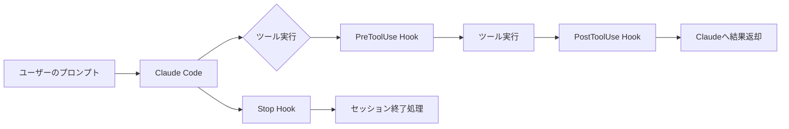

# Claude Code Hooks 導入ガイド

## 概要

Claude Code Hooksは、Claude Codeのセッション中に特定のライフサイクルイベントが発生したタイミングで自動的に実行される、ユーザー定義のスクリプト・コマンドの仕組みです。LLMの外側で動作する**決定論的な制御レイヤー**として機能します。



### なぜHooksが必要か

Claude Codeはプロンプトに従って動作しますが、確率的なモデルの性質上、指示が常に守られるとは限りません。Hooksを使うことで以下が実現できます。

- **強制的なポリシー適用**: 危険なコマンドのブロックなど、確実な制御
- **ワークフロー自動化**: コード整形・テスト実行・ログ記録の自動化
- **監査・コンプライアンス対応**: 全操作の記録
- **コンテキスト注入**: セッション開始時のプロジェクト情報をClaudeに渡す

参考: [Hooks reference - Claude Code Docs](https://docs.anthropic.com/en/docs/claude-code/hooks)

---

## Hookの種類と発火タイミング

Hookのイベントは3つのカデンスに分類されます。

### セッション単位（1セッション1回）

| イベント名 | 発火タイミング | 主なユースケース |
|---|---|---|
| `SessionStart` | セッション開始・再開・クリア時 | プロジェクト情報のコンテキスト注入 |
| `SessionEnd` | セッション終了時 | 後処理・統計ログ |

> `SessionStart` のstdout出力はClaudeへのコンテキストとして注入されます。

### ターン単位（1ターン1回）

| イベント名 | 発火タイミング | 主なユースケース |
|---|---|---|
| `UserPromptSubmit` | ユーザーがプロンプトを送信した直後 | 入力内容の前処理 |
| `Stop` | Claudeが応答を完了したとき | 完了通知・後処理 |
| `SubagentStop` | サブエージェントが処理を完了したとき | サブエージェント完了の記録 |

### ツール呼び出しごと（エージェントループ内）

| イベント名 | 発火タイミング | 主なユースケース |
|---|---|---|
| `PreToolUse` | ツール実行の**直前** | コマンドのブロック・書き換え |
| `PostToolUse` | ツールが正常に完了した**直後** | 結果のログ記録・後処理 |

### その他

| イベント名 | 発火タイミング | 主なユースケース |
|---|---|---|
| `Notification` | Claudeが通知を送るとき | 権限確認・アイドル検知のカスタマイズ |
| `PreCompact` | コンテキスト圧縮の直前 | 圧縮前の情報保存 |

---

## 設定方法

### 設定ファイルの場所と優先順位

| スコープ | パス | 説明 |
|---|---|---|
| Project Local | `.claude/settings.local.json` | git管理外・個人設定 |
| Project | `.claude/settings.json` | git管理・チーム共有 |
| User | `~/.claude/settings.json` | 全プロジェクト共通 |

> **Hooksの重要な特性**: 通常の設定は上位スコープが下位を上書きしますが、Hooksは配列型のため**スコープをまたいですべて実行**されます。グローバルのHooksとプロジェクトのHooksは両方とも動作します。

### 設定フォーマット

```json
{
  "hooks": {
    "PreToolUse": [
      {
        "matcher": "Bash",
        "hooks": [
          {
            "type": "command",
            "command": ".claude/hooks/check-dangerous.sh",
            "timeout": 30
          }
        ]
      }
    ],
    "PostToolUse": [
      {
        "matcher": "Edit|Write",
        "hooks": [
          {
            "type": "command",
            "command": ".claude/hooks/format.sh",
            "async": true
          }
        ]
      }
    ],
    "Stop": [
      {
        "matcher": "",
        "hooks": [
          {
            "type": "command",
            "command": ".claude/hooks/notify.sh"
          }
        ]
      }
    ]
  }
}
```

### matcherフィールドの仕様

`matcher` はHookを絞り込むフィールドで、値の内容によって評価方式が変わります。

| matcher値 | 評価方式 |
|---|---|
| `"*"`、`""`、省略 | すべてにマッチ |
| 英数字・`_`・`\|`のみ | 完全一致または`\|`区切りの複数指定 |
| それ以外の文字を含む | JavaScript正規表現として評価 |

- `PreToolUse` / `PostToolUse` では**ツール名**に対してマッチング
- MCP ツールは `mcp__<サーバー名>__<ツール名>` の形式（例: `mcp__github__search_repositories`）

```json
"matcher": "Bash"          // Bash のみ
"matcher": "Edit|Write"    // Edit または Write（完全一致の複数指定）
"matcher": "mcp__.*__write.*"  // 正規表現（任意サーバーの write 系ツール）
"matcher": ""              // すべてにマッチ
```

### Hookハンドラーの種類

| タイプ | 説明 |
|---|---|
| `command` | シェルコマンドを実行（最も一般的） |
| `http` | HTTP POSTリクエストを送信 |
| `mcp_tool` | 既存MCPサーバーのツールを呼び出す |
| `prompt` | Claudeモデルへプロンプトを送り判断させる |
| `agent` | サブエージェントを起動して検証する |

---

## 入出力仕様

### 入力（stdin）の形式

Hookスクリプトはイベント発火時に**JSONをstdinで受け取り**ます。

**共通フィールド**:
```json
{
  "session_id": "abc123",
  "cwd": "/Users/username/myproject",
  "hook_event_name": "PreToolUse",
  "transcript_path": "/tmp/claude-transcript-abc123.json"
}
```

**PreToolUse の追加フィールド**:
```json
{
  "tool_name": "Bash",
  "tool_use_id": "toolu_01XYZ",
  "tool_input": {
    "command": "npm test"
  }
}
```

**PostToolUse の追加フィールド**（`tool_input` に加えて `tool_response` も含む）:
```json
{
  "tool_name": "Edit",
  "tool_input": { "file_path": "/src/index.ts", "old_string": "foo", "new_string": "bar" },
  "tool_response": { "content": "ファイルを編集しました" }
}
```

### 出力（stdout）とexit codeによる挙動

**2つの制御方法**があり、**どちらか一方のみ**を使用します。

#### 方法1: exit codeによる制御（シンプルなケース向け）

| exit code | 挙動 |
|---|---|
| `0` | 成功。stdoutのJSONを処理し、処理を続行 |
| `2` | **ブロック**。ツールの実行を阻止し、stderrの内容をClaudeに返す |
| `0`・`2`以外 | 非ブロッキングエラー。stderrの内容を表示するが処理は続行 |

> exit code `2` でブロックした場合、stderrの内容はClaudeに返されます（ユーザーには直接表示されない）。Claudeはそのエラーメッセージをもとに代替案を提案します。

#### 方法2: exit 0 + stdout JSONによる細粒度制御

exit 0でJSON文字列をstdoutに出力することで、より細かい制御が可能です。

**Stop・UserPromptSubmit など（top-levelで `decision` を指定）**:
```json
{
  "decision": "block",
  "reason": "本番環境への直接操作はブロックされています"
}
```

**PreToolUseのみ: ツールのブロック・書き換え**（RTKが利用している仕組み）:

`hookSpecificOutput` 内の `permissionDecision` で制御し、書き換えは `modifiedInput` で行います。

```json
{
  "hookSpecificOutput": {
    "hookEventName": "PreToolUse",
    "permissionDecision": "deny",
    "permissionDecisionReason": "本番環境のファイルは直接編集できません"
  }
}
```

```json
{
  "hookSpecificOutput": {
    "hookEventName": "PreToolUse",
    "permissionDecision": "allow",
    "modifiedInput": {
      "command": "rtk npm test"
    }
  }
}
```

| `permissionDecision` の値 | 挙動 |
|---|---|
| `allow` | 権限チェックをバイパスして許可 |
| `deny` | ツールをブロックし理由をClaudeに返す |
| `ask` | ユーザーに確認を求める |
| `defer` | デフォルトの権限チェックに委ねる |

---

## 実装チュートリアル

実際にHookを作成する手順を3つのステップで説明します。

### Step 1: ディレクトリとスクリプトの準備

```bash
# Hooksスクリプト格納ディレクトリを作成
mkdir -p .claude/hooks

# スクリプトファイルを作成
touch .claude/hooks/check-dangerous.sh
chmod +x .claude/hooks/check-dangerous.sh
```

### Step 2: スクリプトを実装

**例: 危険なBashコマンドをブロックするHook**

```bash
#!/bin/bash
# .claude/hooks/check-dangerous.sh

INPUT=$(cat)  # stdinからJSONを受け取る
COMMAND=$(echo "$INPUT" | jq -r '.tool_input.command // ""')

DANGEROUS_PATTERNS=("rm -rf /" "git reset --hard" "DROP TABLE")

for pattern in "${DANGEROUS_PATTERNS[@]}"; do
  if echo "$COMMAND" | grep -qi "$pattern"; then
    echo "セキュリティポリシー違反: '$pattern' を含むコマンドは実行できません。" >&2
    exit 2  # exit 2でブロック
  fi
done

exit 0
```

**例: 完了をデスクトップ通知で知らせるHook（macOS）**

```bash
#!/bin/bash
# .claude/hooks/notify.sh

if command -v osascript &>/dev/null; then
  osascript -e 'display notification "Claude Codeが完了しました" with title "Claude Code"'
elif command -v notify-send &>/dev/null; then
  notify-send "Claude Code" "処理が完了しました"
fi
exit 0
```

**例: 全操作をログに記録するHook（Python）**

```python
#!/usr/bin/env python3
# .claude/hooks/audit-log.py

import json
import sys
import datetime

data = json.load(sys.stdin)
log_entry = {
    "timestamp": datetime.datetime.now().isoformat(),
    "session_id": data.get("session_id"),
    "tool_name": data.get("tool_name"),
    "tool_input": data.get("tool_input"),
}
with open("/tmp/claude-audit.log", "a") as f:
    f.write(json.dumps(log_entry, ensure_ascii=False) + "\n")

sys.exit(0)
```

### Step 3: 設定ファイルに登録

```json
{
  "hooks": {
    "PreToolUse": [
      {
        "matcher": "Bash",
        "hooks": [
          {
            "type": "command",
            "command": ".claude/hooks/check-dangerous.sh",
            "timeout": 30
          }
        ]
      }
    ],
    "PostToolUse": [
      {
        "matcher": ".*",
        "hooks": [
          {
            "type": "command",
            "command": "python3 .claude/hooks/audit-log.py",
            "async": true
          }
        ]
      }
    ],
    "Stop": [
      {
        "matcher": "",
        "hooks": [
          {
            "type": "command",
            "command": ".claude/hooks/notify.sh"
          }
        ]
      }
    ]
  }
}
```

### 動作確認

```bash
# Claude Codeを起動してHookが発火するか確認
claude

# Hookのログを確認（audit-log.pyを設定した場合）
tail -f /tmp/claude-audit.log
```

### /hooks メニューで設定を確認する

Claude Code起動中に `/hooks` と入力すると、登録されているHookの一覧をブラウザ形式で確認できます。各Hookのタイプ・ソース・コマンドが表示されるため、設定が正しく反映されているかの確認に便利です。

```
# セッション中に入力
/hooks
```

---

## アンチパターン

### 1. exit code 1 でブロックしようとする

ブロックには `exit 2` が必要です。`exit 1` は非ブロッキングエラーで処理は続行されます。

```bash
# NG: exit 1はブロックしない
echo "このコマンドは危険です" >&2
exit 1

# OK: exit 2でブロック
echo "このコマンドは危険です" >&2
exit 2
```

### 2. exit 2 と stdout JSON を混在させる

`exit 2` でブロックする場合、stdoutのJSONは無視されます。どちらか一方のみ使用してください。

```bash
# NG: 混在させると stdout JSON は無視される
echo '{"hookSpecificOutput": {"permissionDecision": "deny"}}' 
exit 2

# OK: exit 2 のみ（stderrにメッセージ）
echo "ブロックします" >&2
exit 2

# OK: exit 0 + stdout JSON のみ
echo '{"hookSpecificOutput": {"hookEventName": "PreToolUse", "permissionDecision": "deny"}}'
exit 0
```

### 3. 重いスクリプトを同期実行する

ログ記録など実行をブロックする必要がないHooksには `"async": true` を設定してください。

```json
// NG: ログ記録なのに同期実行
{ "type": "command", "command": "python3 .claude/hooks/audit-log.py" }

// OK: 非同期実行
{ "type": "command", "command": "python3 .claude/hooks/audit-log.py", "async": true }
```

### 4. スクリプト内にAPIキーをハードコードする

HooksスクリプトはシェルコマンドとしてClaude Codeから実行されます。認証情報は必ず環境変数から取得してください。

```bash
# NG
API_KEY="sk-xxxx"

# OK
API_KEY="$MY_API_KEY"
```

### 5. フックエラー時に意図しないexit codeを返す

フック内でエラーが発生した場合に `exit 2` が返ると、Claudeのコマンド実行がブロックされます。エラーハンドリングにはフォールバックとして `exit 0` を返す設計にしてください。

```bash
#!/bin/bash
INPUT=$(cat)

# 処理に失敗してもブロックしない
COMMAND=$(echo "$INPUT" | jq -r '.tool_input.command // ""') || exit 0

# 問題ある場合のみ exit 2
if echo "$COMMAND" | grep -q "dangerous"; then
  exit 2
fi

exit 0
```

### 6. 不明なリポジトリのHooksを無審査で実行する

悪意のある `.claude/settings.json` に記載されたHooksが、リポジトリをcloneしてClaude Codeを起動するだけで任意のシェルコマンドを実行できるセキュリティリスクがあります。不明なリポジトリのclone後は必ず `.claude/settings.json` の内容を確認してください。

---

## 参考情報

- [Hooks reference - Claude Code Docs](https://docs.anthropic.com/en/docs/claude-code/hooks)
- [Claude Code settings - Claude Code Docs](https://docs.anthropic.com/en/docs/claude-code/settings)
- [Claude Code Hooks: Complete Guide to All 12 Lifecycle Events](https://claudefa.st/blog/tools/hooks/hooks-guide)
- [Claude Code Hook Control Flow - Steve Kinney](https://stevekinney.com/courses/ai-development/claude-code-hook-control-flow)
- [Claude Code Hooks: A Practical Guide to Workflow Automation - DataCamp](https://www.datacamp.com/tutorial/claude-code-hooks)
- [Simple Notifications Hook for Claude Code](https://aitmpl.com/blog/simple-notifications-hook/)
- [Claude Code Hooks Complete Guide - SmartScope](https://smartscope.blog/en/generative-ai/claude/claude-code-hooks-guide/)

最終更新日: 2026/05/20
