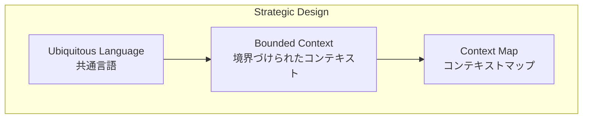
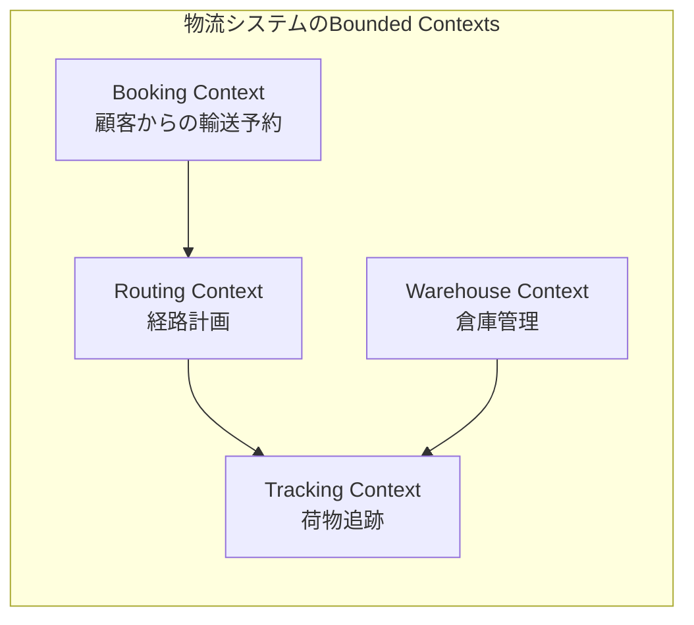
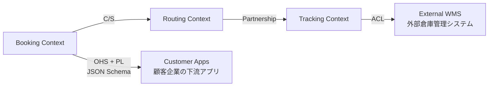
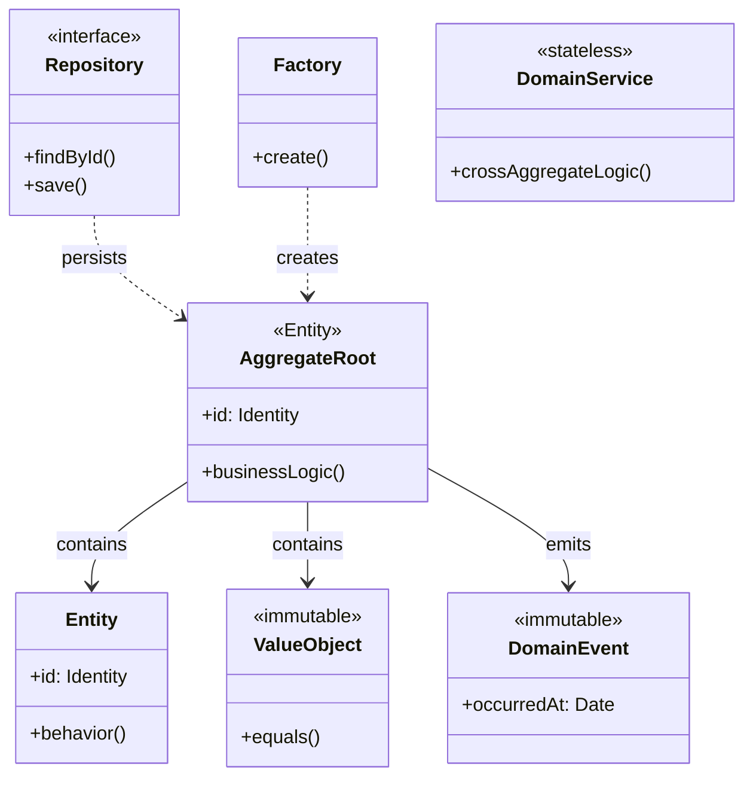
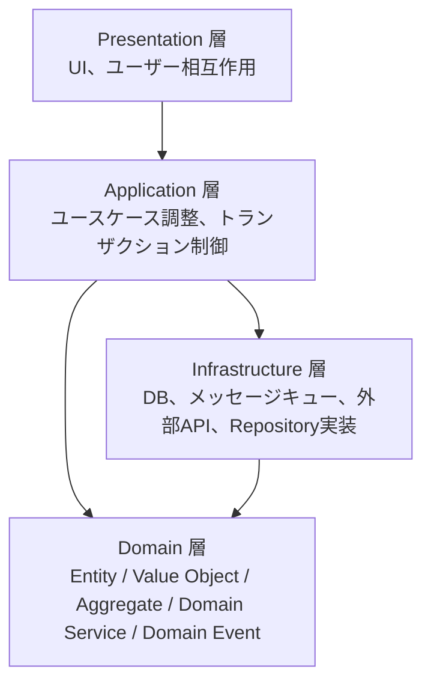
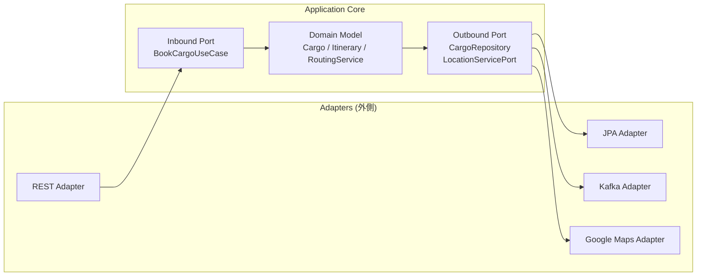
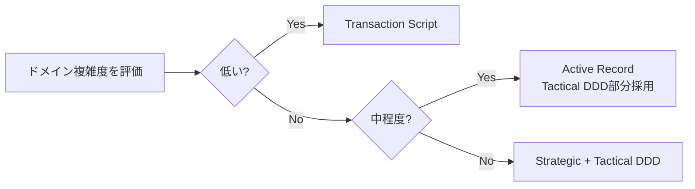
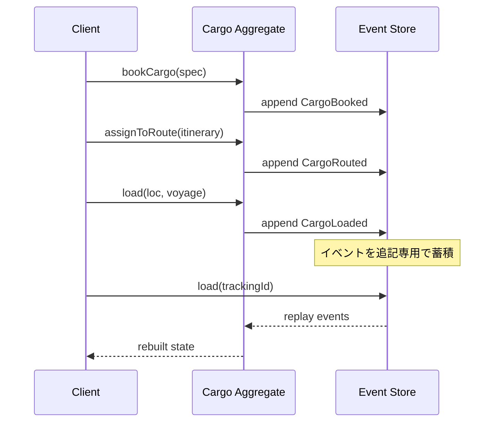

# Domain-Driven Design（DDD）完全ガイド

本ドキュメントは、**物流システム（配送管理、荷物追跡、倉庫管理）** を題材として、Domain-Driven Design（DDD）の概念、戦略的・戦術的設計パターン、アーキテクチャ、アンチパターン、関連フレームワークまでを体系的に整理した技術ドキュメントです。

---

## 目次

1. [はじめに](#1-はじめに)
2. [戦略的設計（Strategic Design）](#2-戦略的設計strategic-design)
3. [戦術的設計（Tactical Design）](#3-戦術的設計tactical-design)
4. [アーキテクチャ](#4-アーキテクチャ)
5. [DDDの選択基準（比較手法）](#5-dddの選択基準比較手法)
6. [アンチパターン](#6-アンチパターン)
7. [関連フレームワーク・ツール](#7-関連フレームワークツール)
8. [まとめ](#8-まとめ)
9. [参考情報](#9-参考情報)

---

## 1. はじめに

### 1.1 DDDとは

**Domain-Driven Design（DDD）** は、ソフトウェア設計を「対象ドメインの専門家からの入力」に合わせてモデル化することに焦点を当てた開発アプローチです。複雑なドメインにおける深い理解に基づいて、ドメインモデルをプログラミングすることを中心に据えます。

DDDは **Eric Evans** が2003年に出版した書籍 *『Domain-Driven Design: Tackling Complexity in the Heart of Software』* で体系化しました。Evansは本書を通じて、ドメイン設計を議論するための語彙を開発し、Entity / Value Object / Service Object といったオブジェクト分類、戦略的設計（Bounded Context のネットワーク化）などの重要概念を提示しました。

[参考: Domain-Driven Design (Amazon)](https://www.amazon.com/Domain-Driven-Design-Tackling-Complexity-Software/dp/0321125215)
[参考: bliki: Domain Driven Design – Martin Fowler](https://martinfowler.com/bliki/DomainDrivenDesign.html)
[参考: Domain-driven design – Wikipedia](https://en.wikipedia.org/wiki/Domain-driven_design)

### 1.2 なぜDDDが必要か（従来手法の課題）

複雑な業務領域に従来のCRUD中心アーキテクチャや手続き型アプローチを適用すると、以下の課題が顕在化します。

- **ビジネスロジックの散在**: 「Big Ball of Mud（大きな泥団子）」と呼ばれる、モジュール構造を欠いた無秩序なコードへ退化する。
- **ドメイン専門家とのコミュニケーション不全**: 開発者と業務担当者が異なる用語で会話することにより、要求がずれる。
- **アネミックドメインモデル化**: ドメインオブジェクトがゲッター/セッターのデータ構造のみとなり、ビジネスルールが外部のサービス層へ漏れ出す。

DDDは **Ubiquitous Language**・**Bounded Context**・**Aggregate** といった構造化された語彙とパターンによって、これらの課題に対する処方箋を示します。

[参考: Anemic Domain Model – Martin Fowler](https://martinfowler.com/bliki/AnemicDomainModel.html)
[参考: Big Ball of Mud – DevIQ](https://deviq.com/antipatterns/big-ball-of-mud/)

### 1.3 DDDの歴史と現在のトレンド

- **2002年**: Martin Fowlerが *Patterns of Enterprise Application Architecture* で **Domain Model** パターンを Transaction Script / Active Record と並ぶ業務ロジック実装の選択肢として体系化。
- **2003年**: Eric Evansが *Domain-Driven Design* を出版し、戦略的設計と戦術的設計の語彙とパターンを体系化。
- **2013年**: Vaughn Vernonが *Implementing Domain-Driven Design*（通称 IDDD 本）を出版し、実装側の標準を確立。
- **現在のトレンド**:
  - **Microservicesとの結合**: 体系的文献レビュー（Özkan ら, 2023）では、調査対象 36 件の研究のうち約 44% で Microservices 関連トピックが扱われ、Bounded Context を Microservice 境界に整合させる設計が広く採用されている（※「44%」は研究全体に占める Microservices 関連研究の比率であり、Bounded Context = Microservice 一致率そのものではない点に注意）。
  - **Event-Driven Architecture**: Kafka などのメッセージバス上での Domain Event 公開によって、Aggregate 間のステートを伝播する設計が主流化。
  - **DDDツール・DSLの成熟**: Context Mapper DSL（CML）や LEMMA DDML 等、DDD 構造を一級市民として扱う形式言語が登場。

[参考: Patterns of Enterprise Application Architecture – Martin Fowler](https://martinfowler.com/books/eaa.html)
[参考: Domain-Driven Design in software development: A systematic literature review (ScienceDirect)](https://www.sciencedirect.com/science/article/pii/S0164121225002055)
[参考: Same review on arXiv (open access)](https://arxiv.org/html/2310.01905v4)
[参考: Domain-Driven Design Demystified (ByteByteGo)](https://blog.bytebytego.com/p/domain-driven-design-ddd-demystified)

---

## 2. 戦略的設計（Strategic Design）

戦略的設計は「全体としてどう分割し、どう統合するか」を扱う層で、Ubiquitous Language・Bounded Context・Context Map が中核となります。



### 2.1 Ubiquitous Language（ユビキタス言語）

開発者・ドメイン専門家・ユーザーが共有する **厳密で一貫した言語** です。ソフトウェアのドメインモデルに基づき、図・文書・特に会話で同じ言葉を使うことを徹底します。

- **物流での例**: 業務担当者が「Cargo（貨物）」「Itinerary（経路）」「Port（港）」「Voyage（航海）」と呼ぶなら、コードのクラス名・メソッド名にも同じ語彙を採用する。
- **進化性**: チームのドメイン理解が深まるにつれて言語とモデルは継続的に進化させる。
- **言語が変わるところ**: モデルの変更点でもあり、新しいBounded Contextの境界候補となる。

[参考: bliki: Ubiquitous Language – Martin Fowler](https://martinfowler.com/bliki/UbiquitousLanguage.html)

### 2.2 Bounded Context（境界づけられたコンテキスト）

特定の用語・定義・ルールが一貫して適用されるソフトウェアの境界領域です。**1つの大規模統合モデル** ではなく、それぞれが独自モデルを持つ複数のBounded Contextに分割します。

物流ドメインでの例を以下に示します。



| Bounded Context | `Cargo` の意味 |
|---|---|
| `Booking Context` | これから輸送する貨物の予約レコード |
| `Routing Context` | 輸送経路を割り当てる必要がある荷物 |
| `Tracking Context` | 現在地と最新ステータスを持つ運行中の荷物 |
| `Warehouse Context` | `Package` の保管位置・ピッキング状況に焦点 |

同じ「Cargo」でもコンテキストごとにモデルの責務が異なります（**ポリセミー** の管理）。

[参考: bliki: Bounded Context – Martin Fowler](https://martinfowler.com/bliki/BoundedContext.html)
[参考: Defining Bounded Contexts — Eric Evans at DDD Europe (InfoQ)](https://www.infoq.com/news/2019/06/bounded-context-eric-evans/)

### 2.3 Context Map（コンテキストマップ）と関係パターン

Context MapはBounded Context間の関係を可視化する図です。チームやサービス間の相互作用を体系化します。

| 関係パターン | 種別 | 概要 |
|---|---|---|
| **Partnership** | 対称 | 両者が対等に協力。失敗を共有する。 |
| **Shared Kernel (SK)** | 対称 | 共有コードやモデル（共通ライブラリ）。両チームが同期して保守する。 |
| **Customer/Supplier (C/S)** | 上下流 | 下流（Customer）の要求が上流（Supplier）の計画に組み込まれる。 |
| **Conformist (CF)** | 下流側 | 上流のAPI/プロトコルにそのまま従う。下流に発言権がない場合に用いる。 |
| **Anti-Corruption Layer (ACL)** | 下流側 | 上流とのインターフェースを変換する隔離層。レガシー連携などで上流の概念汚染を防ぐ。 |
| **Open Host Service (OHS)** | 上流側 | 多数の下流向けに公開されたプロトコル/APIを提供する。 |
| **Published Language (PL)** | 上流側 | OHSと組み合わせて使う、文書化された共通言語（iCalendar, vCard等）。 |

物流システムにおけるContext Mapの例を以下に示します。



- **物流での例**:
  - `Tracking Context` が外部WMS（倉庫管理システム）と連携する際、ACLを介して外部の `HandlingReport` を内部の `HandlingEvent` に変換する。
  - `Booking Context` がRESTful API（OHS）+ JSON Schema（PL）を通じて、複数の顧客企業（下流）に予約機能を提供する。

[参考: Context Map – Context Mapper](https://contextmapper.org/docs/context-map/)
[参考: Anticorruption Layer – Context Mapper](https://contextmapper.org/docs/anticorruption-layer/)
[参考: Open Host Service – Context Mapper](https://contextmapper.org/docs/open-host-service/)
[参考: Published Language – Context Mapper](https://contextmapper.org/docs/published-language/)
[参考: Open Group: DDD Strategic Patterns](https://pubs.opengroup.org/architecture/o-aa-standard/DDD-strategic-patterns.html)

---

## 3. 戦術的設計（Tactical Design）

戦術的設計は **Bounded Context内部** をどのようにモデリングするかを扱います。



### 3.1 Entity（エンティティ）

時間を超えて持続する **一意な識別子** を持つオブジェクトです。属性が変わってもアイデンティティが同じなら同じEntityとして扱います。

- **物流での例**: `Cargo`（追跡IDで識別）、`DeliveryOrder`（注文IDで識別）、`Driver`（運転手IDで識別）。
- **責務**: ビジネスルールをカプセル化する。例：`Cargo.canBeRerouted()` のように振る舞いをEntity内に置く。

> Entityがデータのみを持ち振る舞いをサービス層に持たせると、**Anemic Domain Model アンチパターン** となります。

[参考: Use Tactical DDD to Design Microservices – Microsoft Learn](https://learn.microsoft.com/en-us/azure/architecture/microservices/model/tactical-ddd)

### 3.2 Value Object（値オブジェクト）

アイデンティティを持たず、**属性値だけで等価性が決まる不変オブジェクト** です。

- **物流での例**:
  - `Address`（番地・市・郵便番号で同一性が定義される）
  - `Weight`（10kgは10kgであり、どの荷物の重さかは関係ない）
  - `Location`（緯度経度や港コードで表現）
  - `TrackingId`（追跡番号文字列のラッピング）
  - `ETA`（到着予定時刻）
- **特性**: 不変であるため、スレッド間で安全に共有でき、防御的コピーが不要。

> 「特定の住所レコードを監査目的で時系列追跡する」必要がある場合のみ、`Address` をEntityに昇格します。

```typescript
// Value Object: 不変・等価性は属性値で判定
export class Address {
  constructor(
    public readonly street: string,
    public readonly city: string,
    public readonly postalCode: string,
    public readonly country: string,
  ) {
    if (!postalCode) throw new Error('postalCode is required');
    Object.freeze(this);
  }

  equals(other: Address): boolean {
    return (
      this.street === other.street &&
      this.city === other.city &&
      this.postalCode === other.postalCode &&
      this.country === other.country
    );
  }
}

export class Weight {
  constructor(public readonly grams: number) {
    if (grams < 0) throw new Error('weight must be non-negative');
    Object.freeze(this);
  }

  add(other: Weight): Weight {
    return new Weight(this.grams + other.grams);
  }

  isHeavierThan(other: Weight): boolean {
    return this.grams > other.grams;
  }
}

export class TrackingId {
  constructor(public readonly value: string) {
    if (!/^[A-Z0-9-]{6,32}$/.test(value)) {
      throw new Error(`invalid tracking id: ${value}`);
    }
    Object.freeze(this);
  }

  equals(other: TrackingId): boolean {
    return this.value === other.value;
  }
}

export class Location {
  constructor(
    public readonly portCode: string, // 例: 'JPTYO', 'USNYC'
    public readonly name: string,
  ) {
    Object.freeze(this);
  }
}
```

[参考: DDD Modelling - Aggregates vs Entities (Dan Does Code)](https://www.dandoescode.com/blog/ddd-modelling-aggregates-vs-entities)

### 3.3 Aggregate（集約）と Aggregate Root

**Aggregate** はトランザクションと整合性の境界です。1つ以上のEntityとValue Objectをクラスタ化し、その全体を一つの単位として扱います。**Aggregate Root** は外部からアクセス可能な唯一のEntityで、内部要素への参照を制御します。

#### Vaughn Vernonによる集約設計の4ルール

1. **真の不変条件を整合性境界の中でモデル化する**。
2. **小さな集約を設計する**（独立したライフサイクルを持つ要素は別集約に切り出す）。
3. **他の集約は識別子で参照する**（オブジェクト参照を直接持たない）。
4. **集約境界をまたぐ整合性は結果整合性で実現する**（Domain Eventを使う）。

#### 物流での例

- `Cargo` 集約: ルート `Cargo` Entity + `Itinerary`（複数の `Leg` を含む値オブジェクト）+ `Delivery`（現在の配送状態を表す値オブジェクト）+ `RouteSpecification`。
- `HandlingEvent` を別集約として切り出すことで、イベント数が膨大になるシナリオでも `Cargo` を毎回ロードせず高速処理できる（Cargo Shipping例の設計判断）。

```mermaid
graph TB
    subgraph "Cargo Aggregate"
        Cargo[Cargo<br/>Aggregate Root]
        Itinerary[Itinerary<br/>Value Object]
        RouteSpec[RouteSpecification<br/>Value Object]
        Legs[Leg[]<br/>Value Object]
        Cargo --> Itinerary
        Cargo --> RouteSpec
        Itinerary --> Legs
    end
    subgraph "HandlingEvent Aggregate"
        HE[HandlingEvent<br/>Aggregate Root]
    end
    HE -.->|TrackingIdで参照| Cargo
```

[参考: bliki: DDD Aggregate – Martin Fowler](https://martinfowler.com/bliki/DDD_Aggregate.html)
[参考: Effective Aggregate Design – Vaughn Vernon (Part I)](https://www.dddcommunity.org/wp-content/uploads/files/pdf_articles/Vernon_2011_1.pdf)
[参考: Effective Aggregate Design – Vaughn Vernon (Part II)](https://dddcommunity.org/wp-content/uploads/files/pdf_articles/Vernon_2011_2.pdf)

### 3.4 Domain Event（ドメインイベント）

**過去にドメインで起こったこと** を表す不変オブジェクトです。「ドメイン専門家が関心を持つ事象」を明示的に表します。

- **物流での例**: `CargoBooked`、`CargoRouted`、`CargoLoaded`、`CargoUnloaded`、`CargoDelivered`、`DeliveryCanceled`、`PackagePickedUp`。
- **命名規則**: 過去形動詞（`OrderShipped`, `PackageDelivered`）。
- **用途**:
  - 集約間の結果整合性を実現（同一ドメイン内）。
  - Integration Eventとして外部Bounded Contextに伝搬する基礎となる。
  - 監査証跡・分析基盤の入力。
- **不変性**: イベントは過去に起きたものなので変更不可（プロパティはread-only）。

```typescript
// 不変、過去形、必要なすべての情報を保持
export interface DomainEvent {
  readonly occurredAt: Date;
  readonly eventName: string;
}

export class CargoBooked implements DomainEvent {
  readonly occurredAt: Date;
  readonly eventName = 'CargoBooked';

  constructor(
    public readonly trackingId: TrackingId,
    public readonly origin: Location,
    public readonly destination: Location,
    public readonly arrivalDeadline: Date,
  ) {
    this.occurredAt = new Date();
    Object.freeze(this);
  }
}

export class CargoRouted implements DomainEvent {
  readonly occurredAt: Date;
  readonly eventName = 'CargoRouted';

  constructor(
    public readonly trackingId: TrackingId,
    public readonly itineraryLegCount: number,
  ) {
    this.occurredAt = new Date();
    Object.freeze(this);
  }
}

export class CargoLoaded implements DomainEvent {
  readonly occurredAt: Date;
  readonly eventName = 'CargoLoaded';

  constructor(
    public readonly trackingId: TrackingId,
    public readonly location: Location,
    public readonly voyageNumber: string,
  ) {
    this.occurredAt = new Date();
    Object.freeze(this);
  }
}

export class CargoDelivered implements DomainEvent {
  readonly occurredAt: Date;
  readonly eventName = 'CargoDelivered';

  constructor(
    public readonly trackingId: TrackingId,
    public readonly deliveredAt: Location,
  ) {
    this.occurredAt = new Date();
    Object.freeze(this);
  }
}
```

[参考: Domain events: Design and implementation – Microsoft Learn](https://learn.microsoft.com/en-us/dotnet/architecture/microservices/microservice-ddd-cqrs-patterns/domain-events-design-implementation)

### 3.5 Aggregate Rootの実装例

```typescript
// Package は Cargo 集約内の子 Entity
export class Package {
  constructor(
    public readonly packageId: string, // ローカル識別子
    public readonly description: string,
    public readonly weight: Weight,
  ) {}
}

// RouteSpecification は値オブジェクト
export class RouteSpecification {
  constructor(
    public readonly origin: Location,
    public readonly destination: Location,
    public readonly arrivalDeadline: Date,
  ) {
    Object.freeze(this);
  }

  isSatisfiedBy(itinerary: Itinerary): boolean {
    return (
      itinerary.firstLeg().loadLocation.portCode === this.origin.portCode &&
      itinerary.lastLeg().unloadLocation.portCode === this.destination.portCode &&
      itinerary.finalArrivalDate() <= this.arrivalDeadline
    );
  }
}

export class Leg {
  constructor(
    public readonly voyageNumber: string,
    public readonly loadLocation: Location,
    public readonly unloadLocation: Location,
    public readonly loadTime: Date,
    public readonly unloadTime: Date,
  ) {}
}

export class Itinerary {
  constructor(public readonly legs: ReadonlyArray<Leg>) {
    if (legs.length === 0) throw new Error('itinerary must have at least one leg');
  }

  firstLeg(): Leg { return this.legs[0]; }
  lastLeg(): Leg { return this.legs[this.legs.length - 1]; }
  finalArrivalDate(): Date { return this.lastLeg().unloadTime; }
}

export enum TransportStatus {
  NotReceived = 'NOT_RECEIVED',
  InPort = 'IN_PORT',
  OnboardCarrier = 'ONBOARD_CARRIER',
  Claimed = 'CLAIMED',
  Unknown = 'UNKNOWN',
}

// Aggregate Root: 外部からは Cargo にしかアクセスさせない
export class Cargo {
  private _itinerary?: Itinerary;
  private _transportStatus: TransportStatus = TransportStatus.NotReceived;
  private _domainEvents: DomainEvent[] = [];

  constructor(
    public readonly trackingId: TrackingId,
    public readonly packages: ReadonlyArray<Package>,
    public readonly routeSpecification: RouteSpecification,
  ) {
    this.recordEvent(
      new CargoBooked(
        trackingId,
        routeSpecification.origin,
        routeSpecification.destination,
        routeSpecification.arrivalDeadline,
      ),
    );
  }

  // ビジネスロジックは Entity 内にある (アネミックではない)
  assignToRoute(itinerary: Itinerary): void {
    if (!this.routeSpecification.isSatisfiedBy(itinerary)) {
      throw new Error('itinerary does not satisfy route specification');
    }
    this._itinerary = itinerary;
    this.recordEvent(new CargoRouted(this.trackingId, itinerary.legs.length));
  }

  load(location: Location, voyageNumber: string): void {
    if (!this._itinerary) throw new Error('cargo is not routed yet');
    this._transportStatus = TransportStatus.OnboardCarrier;
    this.recordEvent(new CargoLoaded(this.trackingId, location, voyageNumber));
  }

  markDelivered(location: Location): void {
    this._transportStatus = TransportStatus.Claimed;
    this.recordEvent(new CargoDelivered(this.trackingId, location));
  }

  get transportStatus(): TransportStatus { return this._transportStatus; }
  get itinerary(): Itinerary | undefined { return this._itinerary; }

  // 集約から Domain Event を取り出してアプリケーション層が dispatch する
  pullDomainEvents(): DomainEvent[] {
    const events = [...this._domainEvents];
    this._domainEvents = [];
    return events;
  }

  private recordEvent(event: DomainEvent): void {
    this._domainEvents.push(event);
  }
}

// DeliveryOrder Aggregate Root（受注の集約。Cargo とは別ライフサイクル）
export class DeliveryOrder {
  constructor(
    public readonly orderId: string,
    public readonly customerId: string,
    public readonly shipFrom: Address,
    public readonly shipTo: Address,
    public readonly trackingId: TrackingId, // Cargo を ID 参照
  ) {}
}
```

### 3.6 Repository（リポジトリ）

**Aggregate Rootを永続化層から取得・保存する** 抽象化です。クライアントには「コレクションのような」インターフェースを提供します。

- **原則**: RepositoryはAggregate Rootにのみ用意する（`OrderLineRepository` のような子エンティティ向けは禁忌）。
- **物流での例**: `CargoRepository`, `HandlingEventRepository`, `VoyageRepository`。

```typescript
// Repository は Aggregate Root にのみ用意する
export interface CargoRepository {
  findByTrackingId(id: TrackingId): Promise<Cargo | null>;
  save(cargo: Cargo): Promise<void>;
  nextTrackingId(): Promise<TrackingId>;
}

export interface DeliveryOrderRepository {
  findById(orderId: string): Promise<DeliveryOrder | null>;
  save(order: DeliveryOrder): Promise<void>;
}

// HandlingEvent は別集約 (パフォーマンス上の判断)
export class HandlingEvent {
  constructor(
    public readonly handlingEventId: string,
    public readonly trackingId: TrackingId, // Cargo を ID 参照
    public readonly type: 'LOAD' | 'UNLOAD' | 'RECEIVE' | 'CLAIM' | 'CUSTOMS',
    public readonly location: Location,
    public readonly completionTime: Date,
    public readonly registrationTime: Date,
    public readonly voyageNumber?: string,
  ) {}
}

export interface HandlingEventRepository {
  findByTrackingId(id: TrackingId): Promise<HandlingEvent[]>;
  store(event: HandlingEvent): Promise<void>;
}
```

[参考: Designing a DDD-oriented microservice – Microsoft Learn](https://learn.microsoft.com/en-us/dotnet/architecture/microservices/microservice-ddd-cqrs-patterns/ddd-oriented-microservice)

### 3.7 Factory（ファクトリ）

複雑な集約・Entityの **生成ロジックをクライアントから分離** するオブジェクトです。常に有効な状態の集約を生成することを保証します。

- **物流での例**: `CargoFactory.newCargo(packages, origin, destination, arrivalDeadline)` で、追跡 ID の採番と `RouteSpecification` の組み立てを行い、初期状態の正しい `Cargo` を返却する。
- **コンストラクタとの違い**: コンストラクタが「単一クラスのインスタンス化」を担うのに対し、Factory は「複数オブジェクトの組み立てと不変条件の検証」までを引き受ける。

### 3.8 Domain Service（ドメインサービス）

**特定のEntity / Value Objectに自然に属さないビジネスロジック** を実装するステートレスなオブジェクトです。複数の集約をまたぐルールに用います。

- **物流での例**:
  - `RoutingService`: 出発地・目的地・期限から最適経路（`Itinerary`）を計算する。Cargo単独でもVoyage単独でも持てない知識を扱う。
  - `Scheduler`: ドローン配送やトラック配車の調整。

> Application Serviceとは異なります。Application Serviceはユースケース調整・トランザクション管理・通知などインフラ的責務を担い、ビジネスルールを直接持ちません。

下記コード例には §3.7 Factory と §3.8 Domain Service の両方の実装パターンを併記しています。

```typescript
// Factory: 複雑な生成ロジックをカプセル化
export class CargoFactory {
  constructor(private readonly repo: CargoRepository) {}

  async newCargo(
    packages: Package[],
    origin: Location,
    destination: Location,
    arrivalDeadline: Date,
  ): Promise<Cargo> {
    const trackingId = await this.repo.nextTrackingId();
    const spec = new RouteSpecification(origin, destination, arrivalDeadline);
    return new Cargo(trackingId, packages, spec);
  }
}

// Domain Service: 単一の Entity に属さないドメイン知識
export interface RoutingService {
  // 経路計画は Cargo 単独でも Voyage 単独でも持てない知識
  fetchRoutesForSpecification(spec: RouteSpecification): Promise<Itinerary[]>;
}
```

[参考: Domain Services and Factories in DDD – DEV Community](https://dev.to/ruben_alapont/domain-services-and-factories-in-domain-driven-design-55lo)

参考実装ベース：

[参考: DDD Sample Application (Cargo Shipping) – Domain Language & Citerus](https://dddsample.sourceforge.net/)
[参考: DDD Sample 公式リポジトリ – citerus/dddsample-core (GitHub)](https://github.com/citerus/dddsample-core)
[参考: Cargo Shipping Example – O&B Insights](https://insights.orangeandbronze.com/domain-driven-design-cargo-shipping-example/)

---

## 4. アーキテクチャ

### 4.1 Layered Architecture（レイヤードアーキテクチャ）

DDDで伝統的に採用される4層構造です。**依存は内側（下位層）に向かう** のが鉄則です。



| 層 | 責務 |
|---|---|
| **Presentation 層** | UI、ユーザーとの相互作用。 |
| **Application 層** | ユースケース調整。トランザクション制御、認可。**ビジネスロジックは持たない**。 |
| **Domain 層** | ビジネスロジックの中核。Entity, Value Object, Aggregate, Domain Service, Domain Eventを含む。 |
| **Infrastructure 層** | DB、メッセージキュー、外部API、Repository実装。 |

問題点として、伝統的レイヤードでは「ドメインロジックが境界を漏れる」現象が知られており、これを解決するのがHexagonal/Onion/Clean Architectureです。

[参考: Layered Architecture – DDD Practitioner's Guide](https://ddd-practitioners.com/home/glossary/layered-architecture/)
[参考: Domain Driven Design: Layers – HiBit](https://www.hibit.dev/posts/15/domain-driven-design-layers)

### 4.2 Hexagonal Architecture（Ports and Adapters）

Alistair Cockburnが2005年に提唱しました。**アプリケーションコア** を中心とし、外部技術を **Port（インターフェース）** と **Adapter（実装）** で隔離します。

- **Port**: ドメインから外部世界への抽象境界（例: `CargoRepository` インターフェース）。
- **Adapter**: 具体技術での実装（例: `JpaCargoRepository`, `KafkaShipmentEventPublisher`）。
- **物流での例**: `RoutingService`（コア）は `LocationServicePort` を介して外部の地図APIと話す。Adapterとして `GoogleMapsLocationAdapter` や `OpenStreetMapLocationAdapter` を交換可能。



DDDとHexagonalは補完的です。DDDが **ビジネスルールの構造化** を扱い、Hexagonalが **コアと外部の境界** を扱います。

[参考: Hexagonal Architecture & DDD – codecentric](https://www.codecentric.de/en/knowledge-hub/blog/hexagon-schmexagon-1)
[参考: Hexagonal architecture pattern – AWS Prescriptive Guidance](https://docs.aws.amazon.com/prescriptive-guidance/latest/cloud-design-patterns/hexagonal-architecture.html)

### 4.3 Clean Architecture との関係

| アーキテクチャ | 提唱者 / 年 | 特徴 |
|---|---|---|
| **Hexagonal (Ports & Adapters)** | Alistair Cockburn / 2005 | 「内/外」のメタファ。コアの内部構造には踏み込まない。 |
| **Onion** | Jeffrey Palermo / 2008 | DDDの層を内側のリングとして取り込む。中心がドメイン。 |
| **Clean** | Robert C. Martin / 2012 | Entities → Use Cases → Adapters → Frameworks の同心円。 |

#### 共通する原則

- 依存関係逆転原則（DIP）に基づき、**外側が内側に依存** する。
- ビジネスロジックを技術的詳細から隔離する。
- 関心の分離（SoC）。

すべて似た考え方の異なる表現であり、DDDと組み合わせて使うのが定石です。

[参考: DDD, Hexagonal, Onion, Clean, CQRS, … How I put it all together (Herberto Graça)](https://herbertograca.com/2017/11/16/explicit-architecture-01-ddd-hexagonal-onion-clean-cqrs-how-i-put-it-all-together/)
[参考: Clean Architecture vs. Onion vs. Hexagonal – CCD Akademie](https://ccd-akademie.de/en/clean-architecture-vs-onion-architecture-vs-hexagonal-architecture/)

---

## 5. DDDの選択基準（比較手法）

### 5.1 Transaction Script

「各ユースケースを1つの手続き」として実装するパターンです（Martin Fowler *Patterns of Enterprise Application Architecture*）。

- **特徴**: シンプル、低オーバーヘッド、データベースアクセスを直接行う。
- **適用場面**: ロジックが少なく、ほぼデータの転送のみのアプリケーション。

### 5.2 Active Record

「DBのレコードをラップしたオブジェクトに、データアクセスとドメインロジックを混在させる」パターンです。

- **特徴**: 単純なCRUD + 軽い検証ロジックなら高速開発可能。
- **問題**: ドメインが複雑になると、Active Recordはビジネスルールの自然な置き場所にならない（永続化との結合が強すぎる）。

### 5.3 Domain Model（DDD）をいつ選ぶか

#### DDDを選ぶべき場面

- ビジネスルールが **複雑** で、頻繁に変更される。
- 複数チーム/部門で共通概念に合意する必要がある（→ 戦略的設計を活用）。
- ドメインロジックが業務上の競争優位の源泉になっている。

#### DDDが過剰になる場面

- 純粋なCRUDアプリケーション。
- 要件が安定していて長年変わらない。
- プロトタイプやMVP。
- 単純なUI用のデータバックエンド。

| 複雑度 | 推奨パターン |
|---|---|
| 低 | Transaction Script / Active Record |
| 中 | Active Record / Tactical DDD（部分採用） |
| 高 | Strategic + Tactical DDD |



[参考: Transaction Script – Martin Fowler](https://martinfowler.com/eaaCatalog/transactionScript.html)
[参考: Tackling Complex Business Logic – Learning DDD (O'Reilly)](https://www.oreilly.com/library/view/learning-domain-driven-design/9781098100124/ch06.html)
[参考: When to Use DDD and When to Keep It Simple – ilovedotnet](https://ilovedotnet.org/blogs/ddd-when-to-use-and-when-to-avoid/)

---

## 6. アンチパターン

### 6.1 Anemic Domain Model（貧血症のドメインモデル）

**症状**: ドメインオブジェクトがゲッター/セッターのデータホルダーとなり、ビジネスロジックがすべてサービス層に置かれる。

**問題点**:

- オブジェクト指向の「データと振る舞いの統合」原則に反する。
- ドメインモデルのコスト（マッピング、抽象化）を支払うのに、利益（カプセル化、表現力）が得られない。
- 実質的にTransaction Scriptへの退化。

**対策**: 検証・計算・状態遷移ルールをEntity / Value Object内に書く。サービス層は薄く保つ。

[参考: Anemic Domain Model – Martin Fowler](https://martinfowler.com/bliki/AnemicDomainModel.html)

### 6.2 Big Ball of Mud

**症状**: モジュール構造を欠いた、無秩序にコードが積み重なったシステム。要件追加のたびに整理せず、結合と複雑さが指数関数的に増大する。

**対策**: Bounded Contextによる分割、責務の明確化、リファクタリングの継続。

[参考: Big Ball of Mud – DevIQ](https://deviq.com/antipatterns/big-ball-of-mud/)

### 6.3 その他のDDDアンチパターン

| アンチパターン | 内容 | 対策 |
|---|---|---|
| **God Aggregate** | 1つの集約に多すぎる責務とデータを詰め込む | 小さな集約・別集約への分離 |
| **Aggregate Too Large** | 集約が大きすぎてロード不要な部分まで読み込む | Vernonの4ルール準拠 |
| **Repository for Non-Root** | ルート以外のEntityにRepositoryを作る | ルート集約からのみアクセス |
| **Smart UI** | UIに検証・ビジネスルールが散らばる | ドメイン層へロジックを集約 |
| **Cross-Aggregate Transaction** | 1つのトランザクションで複数集約を変更する | Domain Eventによる結果整合性 |
| **Dogmatic DDD** | パターンを目的化してすべての場所に適用する | 文脈に合わせた選択 |
| **Repository に UI 関心** | ソート・ページングなどをRepositoryに書く | クエリは別レイヤ（CQRSのRead Model）へ |

[参考: Common Mistakes and Anti-Patterns in DDD – Kranio](https://www.kranio.io/en/blog/de-bueno-a-excelente-en-ddd-errores-comunes-y-anti-patrones-en-domain-driven-design---10-10)
[参考: DDD Anti-patterns – Alok Mishra](https://alok-mishra.com/2021/11/03/ddd-anti-patterns/)
[参考: STOP doing dogmatic DDD – CodeOpinion](https://codeopinion.com/stop-doing-dogmatic-domain-driven-design/)

---

## 7. 関連フレームワーク・ツール

### 7.1 DDDを支援するフレームワーク

| フレームワーク | 言語 | 特徴 |
|---|---|---|
| **NestJS** | TypeScript / Node.js | モジュラー設計がDDDのBounded Contextにマップしやすい。Mikro-ORM/TypeORM/Prisma連携でEntity表現が容易。`nestjslatam/ddd` 等のDDD拡張ライブラリも存在。 |
| **Spring Boot** | Java | DDDSample, DDDLeavenといった参考実装。Spring ModulithはBounded Contextのモジュール検証を支援。 |
| **Axon Framework** | Java | CQRS + Event Sourcingを一級市民として扱う最も広く採用されたJavaフレームワーク。Aggregate, CommandBus, EventBusがコア概念。 |
| **Lagom** | Java/Scala | リアクティブMicroservices向け。Event Sourcing/CQRSベースの永続化モジュール内蔵。 |
| **akka-ddd** | Scala | Akka上でCQRS/DDDパターンを実装。 |
| **Apache Isis (Causeway)** | Java | ドメインモデルから自動的にUIを生成する「Naked Objects」アプローチ。 |
| **ABP Framework** | C#/.NET | DDDのレイヤとビルディングブロックを公式にサポート。 |
| **EventSourcingDB** | DB専用 | Event Sourcing専用データベース。CQRS/DDDと組み合わせる前提。 |

[参考: awesome-ddd – heynickc (GitHub)](https://github.com/heynickc/awesome-ddd)
[参考: Axon Framework – AxonIQ](https://www.axoniq.io/products/axon-framework)
[参考: Applying DDD principles to a Nest.js project (DEV Community)](https://dev.to/bendix/applying-domain-driven-design-principles-to-a-nest-js-project-5f7b)
[参考: Domain Driven Design | ABP.IO Documentation](https://abp.io/docs/latest/framework/architecture/domain-driven-design)

### 7.2 Event Sourcing と DDD の関係

**Event Sourcing**: エンティティの現在状態ではなく、**イベントの追記専用ストア** を真実の源（system of record）とするパターン。現在状態は過去イベントの再生（rehydration）で導出します。

#### DDD との結合

- Domain EventをそのままEvent Storeに永続化することで、ドメインモデルとイベントスキーマが直接対応する。
- 集約はEvent Storeからイベントを読み出し再構築されるため、集約境界がストリーム境界となる。
- 監査・履歴追跡が要件のドメイン（金融・医療・物流）と相性が良い。

**物流での例**: `Cargo` の状態を `CargoBooked → CargoRouted → CargoLoaded → CargoUnloaded → CargoLoaded → CargoDelivered` のイベントストリームとして保存。任意の時点での状態を再現でき、誤った経路変更を補償イベントで取り消せる。



#### 注意点

- スキーマ進化のコストが高い（Tolerant Deserialization, Upcasting, Versioning）。
- 結果整合性が前提となる。
- 個人情報の削除要件（GDPR）対応にCrypto-Shredding等の工夫が必要。

[参考: Event Sourcing Pattern – Microsoft Learn](https://learn.microsoft.com/en-us/azure/architecture/patterns/event-sourcing)
[参考: Event-Sourcing as a DDD pattern – Eliran Natan (Medium)](https://medium.com/swlh/event-sourcing-as-a-ddd-pattern-fea6de35fcca)

### 7.3 CQRS と DDD の関係

**CQRS（Command Query Responsibility Segregation）**: 書き込み（Command）と読み取り（Query）を別モデルに分離する設計パターンです。

#### DDD との結合

- 書き込みモデルはAggregateを活用してドメインルールを強制。
- 読み取りモデルはクエリ最適化されたDTO/Materialized ViewでUI要件に応える。
- 集約の小ささ（書き込み側）と複雑な集計クエリ（読み取り側）を両立。

**物流での例**:

- 書き込み側: `CargoBookingService.bookCargo(command)` が `Cargo` 集約を生成。
- 読み取り側: 「直近30日の遅延率トレンド」「倉庫別在庫サマリ」など、集約をまたぐ集計用のRead Modelを別に用意。

**Event Sourcing との合わせ技**: イベントストアを書き込みモデル、それをProjectionしたMaterialized Viewを読み取りモデルとする構成は最もスケーラブルですが、複雑さも最大化します。

[参考: CQRS Pattern – Microsoft Learn](https://learn.microsoft.com/en-us/azure/architecture/patterns/cqrs)
[参考: Applying simplified CQRS and DDD patterns in a microservice – Microsoft Learn](https://learn.microsoft.com/en-us/dotnet/architecture/microservices/microservice-ddd-cqrs-patterns/apply-simplified-microservice-cqrs-ddd-patterns)
[参考: DDD, CQRS and Event Sourcing Explained (AxonIQ Whitepaper)](https://www.axoniq.io/whitepapers/ddd-cqrs-and-event-sourcing-explained)

### 7.4 周辺ツール

- **Context Mapper**: Bounded Contextと関係をDSL（CML）で記述し、Microservice候補境界を自動生成。
- **EventStorming**: ドメインイベントを起点に業務知識をワークショップ形式で可視化する手法。
- **jMolecules / xmolecules**: JavaでDDDコンセプト（@AggregateRoot, @ValueObject等）をアノテーションで宣言できるライブラリ。

[参考: Context Mapper](https://contextmapper.org/docs/home/)
[参考: EventStorming 公式サイト – Alberto Brandolini](https://www.eventstorming.com/)
[参考: jMolecules Discussions – xmolecules/jmolecules](https://github.com/xmolecules/jmolecules/discussions/70)

---

## 8. まとめ

DDDは、複雑なドメインに対するソフトウェア設計のための **思考フレームワーク** であり、銀の弾丸ではありません。本ドキュメントの要点は以下のとおりです。

- **戦略的設計** で「どこを分けるか」を決める（Ubiquitous Language → Bounded Context → Context Map）。
- **戦術的設計** で「中身をどう作るか」を組み立てる（Entity / Value Object / Aggregate / Domain Event / Repository / Factory / Domain Service）。
- **アーキテクチャ** はLayered → Hexagonal/Onion/Cleanへと進化し、いずれもDDDと補完的に機能する。
- **DDDの採用判断** はドメイン複雑度に基づき、CRUD中心ならTransaction ScriptやActive Recordが妥当。
- **アンチパターン**（Anemic Domain Model、God Aggregate、Dogmatic DDDなど）を理解することで、健全なモデリングを維持できる。
- **Event Sourcing / CQRS / Microservices** との組み合わせはDDDの表現力を大きく拡張する一方、複雑さも増すため、文脈に応じた選択が必要。

物流システムを例にとると、`Cargo`、`Itinerary`、`HandlingEvent` といった概念をUbiquitous Languageとして定着させ、Booking / Routing / Tracking / Warehouseの各Bounded Contextに分割し、Aggregateごとに整合性境界を引くことで、業務の進化に追従できる柔軟なモデルが得られます。

---

## 9. 参考情報

### 一次情報・公式サイト

- [Eric Evans – *Domain-Driven Design: Tackling Complexity in the Heart of Software*](https://www.amazon.com/Domain-Driven-Design-Tackling-Complexity-Software/dp/0321125215)
- [Martin Fowler – *Patterns of Enterprise Application Architecture* (Domain Model パターン)](https://martinfowler.com/books/eaa.html)
- [Domain-driven design – Wikipedia](https://en.wikipedia.org/wiki/Domain-driven_design)
- [DDD Reference (Eric Evans 2015 PDF)](https://www.domainlanguage.com/wp-content/uploads/2016/05/DDD_Reference_2015-03.pdf)

### Martin Fowler の Bliki

- [Domain Driven Design](https://martinfowler.com/bliki/DomainDrivenDesign.html)
- [Bounded Context](https://martinfowler.com/bliki/BoundedContext.html)
- [Ubiquitous Language](https://martinfowler.com/bliki/UbiquitousLanguage.html)
- [DDD_Aggregate](https://martinfowler.com/bliki/DDD_Aggregate.html)
- [Anemic Domain Model](https://martinfowler.com/bliki/AnemicDomainModel.html)
- [Transaction Script](https://martinfowler.com/eaaCatalog/transactionScript.html)

### Microsoft Learn（公式ドキュメント）

- [Use Tactical DDD to Design Microservices](https://learn.microsoft.com/en-us/azure/architecture/microservices/model/tactical-ddd)
- [Domain events: Design and implementation](https://learn.microsoft.com/en-us/dotnet/architecture/microservices/microservice-ddd-cqrs-patterns/domain-events-design-implementation)
- [CQRS Pattern](https://learn.microsoft.com/en-us/azure/architecture/patterns/cqrs)
- [Event Sourcing Pattern](https://learn.microsoft.com/en-us/azure/architecture/patterns/event-sourcing)
- [Designing a DDD-oriented microservice](https://learn.microsoft.com/en-us/dotnet/architecture/microservices/microservice-ddd-cqrs-patterns/ddd-oriented-microservice)
- [Applying simplified CQRS and DDD patterns](https://learn.microsoft.com/en-us/dotnet/architecture/microservices/microservice-ddd-cqrs-patterns/apply-simplified-microservice-cqrs-ddd-patterns)

### Vaughn Vernon 関連

- [Effective Aggregate Design Part I](https://www.dddcommunity.org/wp-content/uploads/files/pdf_articles/Vernon_2011_1.pdf)
- [Effective Aggregate Design Part II](https://dddcommunity.org/wp-content/uploads/files/pdf_articles/Vernon_2011_2.pdf)
- [Effective Aggregate Design Part III](https://www.dddcommunity.org/wp-content/uploads/files/pdf_articles/Vernon_2011_3.pdf)

### Context Mapper / Open Group

- [Context Map – Context Mapper](https://contextmapper.org/docs/context-map/)
- [Anticorruption Layer – Context Mapper](https://contextmapper.org/docs/anticorruption-layer/)
- [Open Host Service – Context Mapper](https://contextmapper.org/docs/open-host-service/)
- [Published Language – Context Mapper](https://contextmapper.org/docs/published-language/)
- [Customer/Supplier – Context Mapper](https://contextmapper.org/docs/customer-supplier/)
- [Conformist – Context Mapper](https://contextmapper.org/docs/conformist/)
- [Shared Kernel – Context Mapper](https://contextmapper.org/docs/shared-kernel/)
- [Open Group: DDD Strategic Patterns](https://pubs.opengroup.org/architecture/o-aa-standard/DDD-strategic-patterns.html)

### 物流ドメインの実装例

- [DDD Sample Application (Cargo) – SourceForge](https://dddsample.sourceforge.net/)
- [DDD Sample 公式リポジトリ – citerus/dddsample-core (GitHub)](https://github.com/citerus/dddsample-core)
- [Domain-Driven Design: Cargo Shipping Example – O&B Insights](https://insights.orangeandbronze.com/domain-driven-design-cargo-shipping-example/)

### 学術・体系的レビュー

- [Domain-Driven Design in software development: A systematic literature review (ScienceDirect)](https://www.sciencedirect.com/science/article/pii/S0164121225002055)
- [Same review on arXiv](https://arxiv.org/html/2310.01905v4)

### アーキテクチャ統合

- [DDD, Hexagonal, Onion, Clean, CQRS, … How I put it all together (Herberto Graça)](https://herbertograca.com/2017/11/16/explicit-architecture-01-ddd-hexagonal-onion-clean-cqrs-how-i-put-it-all-together/)
- [Hexagonal Architecture & DDD – codecentric](https://www.codecentric.de/en/knowledge-hub/blog/hexagon-schmexagon-1)
- [Hexagonal architecture pattern – AWS Prescriptive Guidance](https://docs.aws.amazon.com/prescriptive-guidance/latest/cloud-design-patterns/hexagonal-architecture.html)
- [Layered Architecture – DDD Practitioner's Guide](https://ddd-practitioners.com/home/glossary/layered-architecture/)
- [Domain Driven Design: Layers – HiBit](https://www.hibit.dev/posts/15/domain-driven-design-layers)
- [Clean Architecture vs. Onion vs. Hexagonal – CCD Akademie](https://ccd-akademie.de/en/clean-architecture-vs-onion-architecture-vs-hexagonal-architecture/)

### アンチパターン

- [Common Mistakes and Anti-Patterns in DDD – Kranio](https://www.kranio.io/en/blog/de-bueno-a-excelente-en-ddd-errores-comunes-y-anti-patrones-en-domain-driven-design---10-10)
- [DDD Anti-patterns – Alok Mishra](https://alok-mishra.com/2021/11/03/ddd-anti-patterns/)
- [STOP doing dogmatic DDD – CodeOpinion](https://codeopinion.com/stop-doing-dogmatic-domain-driven-design/)
- [Big Ball of Mud – DevIQ](https://deviq.com/antipatterns/big-ball-of-mud/)

### フレームワーク・ツール

- [awesome-ddd – heynickc (GitHub)](https://github.com/heynickc/awesome-ddd)
- [awesome-ddd – kgrzybek (GitHub)](https://github.com/kgrzybek/awesome-ddd)
- [Axon Framework – AxonIQ](https://www.axoniq.io/products/axon-framework)
- [Domain Driven Design | ABP.IO Documentation](https://abp.io/docs/latest/framework/architecture/domain-driven-design)
- [Applying DDD principles to a Nest.js project (DEV Community)](https://dev.to/bendix/applying-domain-driven-design-principles-to-a-nest-js-project-5f7b)
- [DDD, CQRS and Event Sourcing Explained (AxonIQ Whitepaper)](https://www.axoniq.io/whitepapers/ddd-cqrs-and-event-sourcing-explained)
- [Context Mapper](https://contextmapper.org/docs/home/)
- [EventStorming 公式サイト – Alberto Brandolini](https://www.eventstorming.com/)
- [jMolecules Discussions – xmolecules/jmolecules](https://github.com/xmolecules/jmolecules/discussions/70)

### 戦術的設計関連

- [Defining Bounded Contexts — Eric Evans at DDD Europe (InfoQ)](https://www.infoq.com/news/2019/06/bounded-context-eric-evans/)
- [DDD Modelling - Aggregates vs Entities (Dan Does Code)](https://www.dandoescode.com/blog/ddd-modelling-aggregates-vs-entities)
- [Domain Services and Factories in DDD – DEV Community](https://dev.to/ruben_alapont/domain-services-and-factories-in-domain-driven-design-55lo)
- [Tackling Complex Business Logic – Learning DDD (O'Reilly)](https://www.oreilly.com/library/view/learning-domain-driven-design/9781098100124/ch06.html)
- [When to Use DDD and When to Keep It Simple – ilovedotnet](https://ilovedotnet.org/blogs/ddd-when-to-use-and-when-to-avoid/)
- [Event-Sourcing as a DDD pattern – Eliran Natan (Medium)](https://medium.com/swlh/event-sourcing-as-a-ddd-pattern-fea6de35fcca)
- [Domain-Driven Design Demystified (ByteByteGo)](https://blog.bytebytego.com/p/domain-driven-design-ddd-demystified)

---

最終更新日: 2026/05/01
