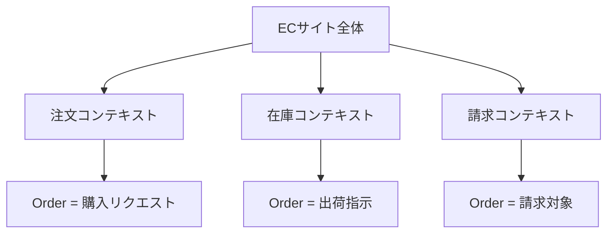
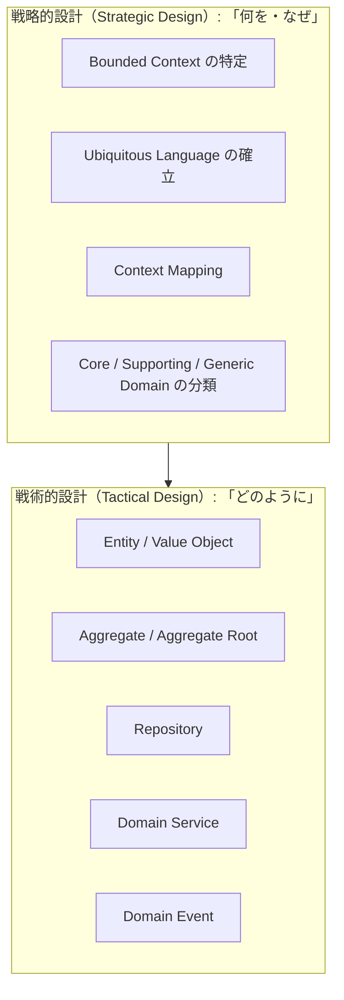
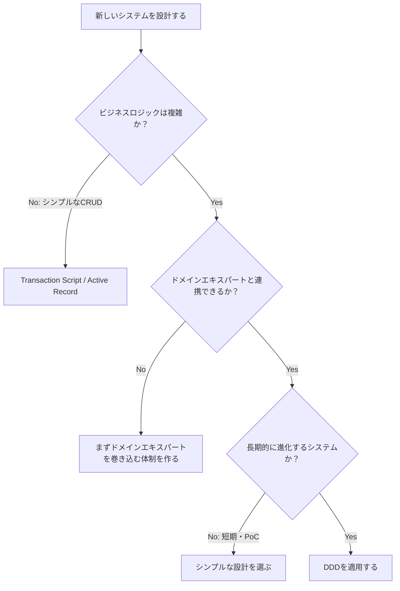

# ドメイン駆動設計（Domain-Driven Design / DDD）入門

## 目次

1. [DDDとは何か](#1-dddとは何か)
2. [なぜDDDが必要か](#2-なぜdddが必要か)
3. [コア概念](#3-コア概念)
4. [戦略的設計 vs 戦術的設計](#4-戦略的設計-vs-戦術的設計)
5. [DDDのアンチパターン](#5-dddのアンチパターン)
6. [DDDが向く場面・向かない場面](#6-dddが向く場面向かない場面)
7. [参考情報](#7-参考情報)

---

## 1. DDDとは何か

Domain-Driven Design（DDD）とは、ソフトウェア開発においてビジネスの問題領域（Domain）を中心に据えた設計手法です。
技術的な都合ではなく、解決すべきビジネスの課題をモデルとして表現し、そのモデルをコードに反映させることを重視します。

DDDは2003年にEric Evansが著書 *"Domain-Driven Design: Tackling Complexity in the Heart of Software"* で提唱しました。
このアプローチは以下の3つの柱に基づいています。

1. **Coreドメインに集中する** — ビジネス価値の最も高い領域を重点的にモデリングする
2. **ドメインエキスパートと開発者が協力してモデルを探求する** — ビジネス専門家と開発者が共同作業でモデルを洗練させる
3. **明確に境界づけられたContextの中でUbiquitous Languageを使う** — 共通言語でコミュニケーションする

[参考: Domain-Driven Design - Wikipedia](https://en.wikipedia.org/wiki/Domain-driven_design)
[参考: bliki: Domain Driven Design - Martin Fowler](https://martinfowler.com/bliki/DomainDrivenDesign.html)

---

## 2. なぜDDDが必要か

### 従来のアプローチの問題点

ビジネスロジックが複雑になると、従来のTransaction Script（トランザクションスクリプト）パターンでは限界が生じます。

**Transaction Scriptとは：** リクエストを受け取り、1つのビジネストランザクションを実行して結果を返す単純な手続き型のパターンです。

```typescript
// Transaction Script の例（問題のあるアプローチ）
async function processOrder(userId: string, items: Item[]): Promise<void> {
  const user = await db.query("SELECT * FROM users WHERE id = ?", [userId]);
  // バリデーション、在庫チェック、料金計算、メール送信がすべてここに集約される
  // ロジックが増えるにつれ関数が肥大化し、重複コードが生まれる
  const total = items.reduce((sum, item) => sum + item.price * item.quantity, 0);
  await db.query("INSERT INTO orders ...", [userId, total]);
  await sendEmail(user.email, "注文を受け付けました");
}
```

#### Transaction Script の課題

| 課題 | 内容 |
|------|------|
| コードの重複 | 同じビジネスルールが複数箇所に散在する |
| 保守困難 | ロジックが増えるほど関数が肥大化する |
| 意図が不明確 | コードがビジネス要件を直接表現しない |
| テスト困難 | データアクセスとビジネスロジックが混在する |

### DDDが解決すること

DDDは、ビジネスロジックをドメインオブジェクト自体に持たせることで、**コードがビジネスの意図を直接表現する**ようにします。
これにより、開発者とビジネス担当者の間の「翻訳コスト」が削減され、変更に強い設計が実現します。

[参考: Transaction Script or Domain Model - Control Code](https://www.controlcode.space/transaction-script-or-domain-model/)

---

## 3. コア概念

DDDの主要な構成要素（Building Blocks）について説明します。

### 3-1. Ubiquitous Language（ユビキタス言語）

Ubiquitous Languageとは、ドメインエキスパートと開発者が**共有する共通の言語**です。
この言語はコードのクラス名・メソッド名・変数名にも反映させます。

[参考: bliki: Ubiquitous Language - Martin Fowler](https://martinfowler.com/bliki/UbiquitousLanguage.html)

```typescript
// Ubiquitous Language を使わない例
class DataProcessor {
  processUserInput(data: any): void { /* ... */ }
}

// Ubiquitous Language を適用した例
// ドメインエキスパートと「予約（Reservation）」という言語を統一した結果
class ReservationService {
  reserveCarForCustomer(customerId: string, carId: string): Reservation { /* ... */ }
  cancelReservation(reservationId: string): void { /* ... */ }
}
```

**ポイント：** ドメインエキスパートが「予約をキャンセルする」と話すなら、コードも `cancelReservation` とする。
「予約データを削除する」というような技術的表現には翻訳しない。

---

### 3-2. Bounded Context（境界づけられたコンテキスト）

Bounded Contextとは、特定のドメインモデルが有効に機能する**明示的な境界**です。
大規模なシステムを複数の独立した領域に分割し、それぞれの境界内でUbiquitous Languageを一貫させます。

[参考: bliki: Bounded Context - Martin Fowler](https://martinfowler.com/bliki/BoundedContext.html)



同じ「Order」という単語でも、コンテキストによって意味が異なることがあります。
Bounded Contextを設けることで、各領域が独自のモデルを持てるようになります。

---

### 3-3. Entity（エンティティ）

Entityとは、**一意のID（識別子）を持つ**ドメインオブジェクトです。
属性が変化しても同一のオブジェクトとして扱われます。

```typescript
class User {
  constructor(
    private readonly id: string,  // 一意のID（変わらない）
    private name: string,
    private email: string,
  ) {}

  getId(): string {
    return this.id;
  }

  changeName(newName: string): void {
    if (!newName || newName.trim() === "") {
      throw new Error("名前は空にできません");
    }
    this.name = newName;
  }

  // IDが同じなら同一のEntityとみなす
  equals(other: User): boolean {
    return this.id === other.id;
  }
}
```

---

### 3-4. Value Object（値オブジェクト）

Value Objectとは、**IDを持たず、属性の値そのもので同一性を判断する**イミュータブルなオブジェクトです。
変更が必要な場合は、新しいオブジェクトを生成します。

[参考: Implementing value objects - Microsoft Learn](https://learn.microsoft.com/en-us/dotnet/architecture/microservices/microservice-ddd-cqrs-patterns/implement-value-objects)

```typescript
class Money {
  constructor(
    private readonly amount: number,
    private readonly currency: string,
  ) {
    if (amount < 0) {
      throw new Error("金額は0以上である必要があります");
    }
  }

  getAmount(): number { return this.amount; }
  getCurrency(): string { return this.currency; }

  // 加算すると新しいMoneyオブジェクトを返す（イミュータブル）
  add(other: Money): Money {
    if (this.currency !== other.currency) {
      throw new Error("通貨が異なります");
    }
    return new Money(this.amount + other.amount, this.currency);
  }

  // 値が同じなら等しいとみなす
  equals(other: Money): boolean {
    return this.amount === other.amount && this.currency === other.currency;
  }
}

const price = new Money(100, "JPY");
const tax = new Money(10, "JPY");
const total = price.add(tax);  // new Money(110, "JPY")
```

---

### 3-5. Aggregate（集約）

Aggregateとは、**整合性の境界**として扱われるEntityとValue Objectのクラスタです。
Aggregate内には必ず1つの**Aggregate Root**（集約ルート）が存在し、外部からはこのRootを通じてのみ操作します。

[参考: Entity, Value Object, and Aggregate Root in Domain-Driven Design - Medium](https://medium.com/sharpassembly/entity-value-object-and-aggregate-root-in-domain-driven-design-0ce9402e4ad3)

```typescript
// OrderLine はOrderの一部（外部から直接操作しない）
class OrderLine {
  constructor(
    private readonly productId: string,
    private quantity: number,
    private readonly unitPrice: Money,
  ) {}

  getSubtotal(): Money {
    return new Money(this.unitPrice.getAmount() * this.quantity, this.unitPrice.getCurrency());
  }
}

// Order が Aggregate Root
class Order {
  private readonly id: string;
  private lines: OrderLine[] = [];

  constructor(id: string) {
    this.id = id;
  }

  // 外部からはAggregate Rootのメソッドを通じて操作する
  addLine(productId: string, quantity: number, unitPrice: Money): void {
    if (quantity <= 0) {
      throw new Error("数量は1以上である必要があります");
    }
    this.lines.push(new OrderLine(productId, quantity, unitPrice));
  }

  getTotal(): Money {
    return this.lines.reduce(
      (sum, line) => sum.add(line.getSubtotal()),
      new Money(0, "JPY"),
    );
  }
}
```

---

### 3-6. Repository（リポジトリ）

Repositoryとは、Aggregateの永続化と取得を担うオブジェクトです。
データベースアクセスの詳細を隠蔽し、ドメイン層とインフラ層を分離します。

```typescript
// ドメイン層にInterfaceを定義する
interface OrderRepository {
  findById(id: string): Promise<Order | null>;
  save(order: Order): Promise<void>;
  delete(id: string): Promise<void>;
}

// インフラ層で実装する（DB詳細はここに閉じ込める）
class PostgresOrderRepository implements OrderRepository {
  async findById(id: string): Promise<Order | null> {
    const row = await db.query("SELECT * FROM orders WHERE id = $1", [id]);
    if (!row) return null;
    // DBのデータをドメインオブジェクトに変換する
    return this.toDomain(row);
  }

  async save(order: Order): Promise<void> {
    await db.query("INSERT INTO orders ... ON CONFLICT DO UPDATE ...", [
      order.getId(),
      // ...
    ]);
  }

  async delete(id: string): Promise<void> {
    await db.query("DELETE FROM orders WHERE id = $1", [id]);
  }

  private toDomain(row: any): Order { /* ... */ }
}
```

**重要な原則：** Repositoryは必ずAggregate Root単位で定義します。
`OrderLine` だけを直接保存・取得するようなRepositoryは作りません。

---

### 3-7. Domain Service（ドメインサービス）

Domain Serviceとは、特定のEntityやValue Objectに自然に属さないビジネスロジックを置く場所です。
複数のAggregateにまたがる処理や、外部システムとの連携が必要な場合に使います。

```typescript
// 送金処理は送り手・受け手の両Accountにまたがるため、
// どちらかのEntityに持たせるのは不自然 → Domain Serviceに置く
class TransferService {
  constructor(
    private readonly accountRepository: AccountRepository,
  ) {}

  async transfer(
    fromAccountId: string,
    toAccountId: string,
    amount: Money,
  ): Promise<void> {
    const from = await this.accountRepository.findById(fromAccountId);
    const to = await this.accountRepository.findById(toAccountId);

    if (!from || !to) throw new Error("口座が見つかりません");

    from.withdraw(amount);
    to.deposit(amount);

    await this.accountRepository.save(from);
    await this.accountRepository.save(to);
  }
}
```

**使いすぎに注意：** なんでもDomain Serviceに入れると、後述のAnemic Domain Model（貧血ドメインモデル）になります。
まずEntityやValue Objectへの配置を検討してから、Domain Serviceを選択してください。

---

## 4. 戦略的設計 vs 戦術的設計

DDDは大きく「戦略的設計（Strategic Design）」と「戦術的設計（Tactical Design）」の2つのレイヤーに分かれます。

[参考: Domain-Driven Design (DDD): Strategic Design Explained - Medium](https://medium.com/@lambrych/domain-driven-design-ddd-strategic-design-explained-55e10b7ecc0f)
[参考: DDD Part 2: Tactical Domain-Driven Design - Vaadin](https://vaadin.com/blog/ddd-part-2-tactical-domain-driven-design)



| 観点 | 戦略的設計 | 戦術的設計 |
|------|-----------|-----------|
| 対象 | ビジネス全体の構造 | 各Bounded Context内の実装 |
| 問い | 何をなぜ作るか | どう実装するか |
| 主要パターン | Bounded Context, Ubiquitous Language, Context Map | Entity, Value Object, Aggregate, Repository, Domain Service |
| 抽象度 | 高い（ビジネス寄り） | 低い（コード寄り） |

戦略的設計はビジネスの全体像を把握する「地図」を描く作業です。
戦術的設計はその地図に従って各領域を「実装」する作業です。
両者はイテレーティブに行き来しながら洗練されていきます。

---

## 5. DDDのアンチパターン

### 5-1. Anemic Domain Model（貧血ドメインモデル）

最も代表的なアンチパターンです。Martin Fowlerが2003年に批判した概念で、
ドメインオブジェクトがgetterとsetterのみを持ち、ビジネスロジックを持たない状態を指します。

[参考: bliki: Anemic Domain Model - Martin Fowler](https://martinfowler.com/bliki/AnemicDomainModel.html)

```typescript
// アンチパターン: Anemic Domain Model
class Order {
  id: string = "";
  status: string = "";
  total: number = 0;
  // getterとsetterだけで、ビジネスロジックがない
  getId(): string { return this.id; }
  setStatus(status: string): void { this.status = status; }
}

// ビジネスロジックがServiceに集まり、手続き型になる
class OrderService {
  cancelOrder(order: Order): void {
    // ここにビジネスルールが集まり、肥大化する
    if (order.getStatus() === "shipped") {
      throw new Error("発送済みはキャンセルできません");
    }
    order.setStatus("cancelled");
  }
}
```

これはDDDの費用（複雑なモデル、O/Rマッピング）だけを被り、
ドメインモデルの恩恵を受けられない最悪のパターンです。

### 5-2. Ubiquitous Languageの不統一

同じ概念に複数の呼び方が存在する状態は、チーム内での誤解や実装のバグにつながります。
用語集（Glossary）を作成し、常に一貫した言語を使うことが重要です。

### 5-3. 肥大化したAggregate

Aggregateに多くのEntityやValue Objectを含めすぎると、パフォーマンスの問題やトランザクション競合が発生します。
Aggregateは**できるだけ小さく**保つことが推奨されます。

```typescript
// アンチパターン: 過大なAggregate
class Order {
  private lines: OrderLine[] = [];
  private customer: Customer;    // Customer全体を持つべきではない
  private products: Product[] = []; // Product全体を持つべきではない
  // → customerId, productId のみ保持し、必要に応じてRepositoryで取得する
}
```

### 5-4. DDDをすべてのシステムに適用する

DDDは複雑なドメインに適した手法です。シンプルなCRUD操作だけのシステムに適用すると、
不必要な複雑性が生まれます。ドメインの複雑さに応じて設計手法を選択することが重要です。

### 5-5. ドメインエキスパートの不参加

DDDはビジネス専門家と開発者の協働が前提です。技術者だけで進めると、
ビジネスと乖離したモデルができあがり、DDD本来の効果を発揮できません。

[参考: DDD Anti-patterns: 5 things we get wrong - Alok Mishra](https://alok-mishra.com/2021/11/03/ddd-anti-patterns/)
[参考: 10 Things to Avoid in Domain-Driven Design (DDD) - DZone](https://dzone.com/articles/10-things-to-avoid-in-domain-driven-design)

---

## 6. DDDが向く場面・向かない場面

[参考: Should I bother with Domain-Driven Design? - Medium](https://medium.com/@m.merkulov/should-i-bother-with-domain-driven-design-2883c55b9895)
[参考: What Architectural Style Should You Use? - DEV Community](https://dev.to/dmitrii-abramov/what-architectural-style-should-you-use-a-guide-to-tactical-ddd-decision-tree-1gf7)

### DDDが向く場面

| 条件 | 具体例 |
|------|--------|
| ビジネスロジックが複雑 | 金融系、保険、医療、物流など複雑なルールを持つシステム |
| 長期にわたって進化するシステム | 要件が変化し続けるコアビジネスアプリケーション |
| ドメインエキスパートと密に連携できる | ビジネス専門家がプロジェクトに積極的に参加できる |
| チームが大きい・複数チームで開発する | Bounded Contextで責任範囲を分割できる |
| マイクロサービスアーキテクチャを採用している | 各サービスの境界設計にBounded Contextを活用できる |

### DDDが向かない場面

| 条件 | 推奨アプローチ |
|------|--------------|
| シンプルなCRUD操作のみ | Transaction Script / Active Record |
| 短期プロジェクト・プロトタイプ | シンプルな実装を優先する |
| ドメインが技術的で変化しない | 技術的なアーキテクチャ中心の設計 |
| チームがDDDに不慣れ | 段階的に導入する（戦術的パターンから始める） |
| リソースが限られている | DDD導入コストに見合うリターンを確認する |

### 判断の目安



---

## 7. 参考情報

| 資料 | 内容 |
|------|------|
| [Domain-Driven Design - Wikipedia](https://en.wikipedia.org/wiki/Domain-driven_design) | DDDの概要（英語） |
| [bliki: Domain Driven Design - Martin Fowler](https://martinfowler.com/bliki/DomainDrivenDesign.html) | Martin FowlerによるDDD解説 |
| [bliki: Ubiquitous Language - Martin Fowler](https://martinfowler.com/bliki/UbiquitousLanguage.html) | Ubiquitous Languageの解説 |
| [bliki: Bounded Context - Martin Fowler](https://martinfowler.com/bliki/BoundedContext.html) | Bounded Contextの解説 |
| [bliki: Anemic Domain Model - Martin Fowler](https://martinfowler.com/bliki/AnemicDomainModel.html) | Anemic Domain Modelアンチパターン |
| [Implementing value objects - Microsoft Learn](https://learn.microsoft.com/en-us/dotnet/architecture/microservices/microservice-ddd-cqrs-patterns/implement-value-objects) | Value Objectの実装例（.NET） |
| [DDD Anti-patterns - Alok Mishra](https://alok-mishra.com/2021/11/03/ddd-anti-patterns/) | DDDアンチパターン解説 |
| [10 Things to Avoid in DDD - DZone](https://dzone.com/articles/10-things-to-avoid-in-domain-driven-design) | DDDで避けるべき10のこと |
| [Domain-Driven Design: Tackling Complexity in the Heart of Software - Eric Evans (O'Reilly)](https://www.oreilly.com/library/view/domain-driven-design-tackling/0321125215/) | DDDの原典（Eric Evans著） |
| [Domain-Driven Design (DDD): A Summary - softengbook.org](https://softengbook.org/articles/ddd) | DDDのサマリー記事 |

---

最終更新日: 2026/05/10
