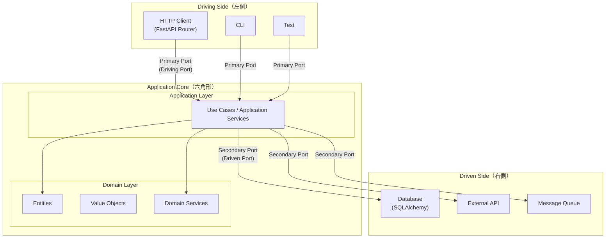

# ヘキサゴナルアーキテクチャ（Ports and Adapters）

## 目次

1. [ヘキサゴナルアーキテクチャとは何か](#1-ヘキサゴナルアーキテクチャとは何か)
2. [主要構成要素](#2-主要構成要素)
3. [他のアーキテクチャとの比較](#3-他のアーキテクチャとの比較)
4. [FastAPIでの実装例](#4-fastapiでの実装例)
5. [メリット・デメリット](#5-メリットデメリット)
6. [Anti-patterns（アンチパターン）](#6-anti-patternsアンチパターン)
7. [バージョン情報](#7-バージョン情報)
8. [参考情報](#参考情報)

---

## 1. ヘキサゴナルアーキテクチャとは何か

### 概念・定義

ヘキサゴナルアーキテクチャ（Hexagonal Architecture）は、Alistair Cockburn が 2005 年に提唱したソフトウェア設計パターンである。
別名「Ports and Adapters」とも呼ばれ、アプリケーションのコアビジネスロジックを外部技術（UI、データベース、フレームワークなど）から切り離すことを目的としている。

> "Allow an application to equally be driven by users, programs, automated test or batch scripts, and to be developed and tested in isolation from its eventual run-time devices and databases."
>
> — Alistair Cockburn, [Hexagonal Architecture](https://alistair.cockburn.us/hexagonal-architecture)

> ※ 2026年5月時点で上記URLのSSL証明書が期限切れのため、ブラウザから直接アクセスする際に警告が表示される場合がある。代替として [Wayback Machine アーカイブ](https://web.archive.org/web/2024*/https://alistair.cockburn.us/hexagonal-architecture) を参照されたい。

### 別名「Ports and Adapters」の意味

- **Port（ポート）**: アプリケーションコアと外部世界の間に定義されるインターフェース（契約）。コアが何を期待するか、または何を提供するかを宣言する。
- **Adapter（アダプター）**: Port を実装（または利用）する具体的なコンポーネント。外部技術（HTTP、DB、メッセージキューなど）との橋渡しをする。

六角形（Hexagon）という形状に特別な意味はなく、「複数の Port が存在すること」を視覚的に表現するために選ばれた形状である。

### 誕生した背景・解決しようとした問題

従来の Layered Architecture（レイヤードアーキテクチャ）では以下の問題が存在していた。

- UI やデータベースとのテストが難しく、ビジネスロジックを単体でテストできない。
- フレームワークや DB への密結合により、技術スタックの変更が困難。
- テストコードとプロダクションコードで設定が異なり、「テスト専用の迂回路」が必要になる。

ヘキサゴナルアーキテクチャはこれらを解決するために「アプリケーションを外から見た境界線を Port として明示し、外部との接続は必ず Adapter を経由する」という構造を採用した。

---

## 2. 主要構成要素



### Domain層（ドメイン層）

- **責務**: ビジネスルールとドメインロジックの中核を担う。
- **含まれるもの**: Entity（エンティティ）、Value Object（値オブジェクト）、Domain Service（ドメインサービス）、Domain Event
- **依存関係ルール**: 外部フレームワーク・ライブラリへの依存を持たない。Pure Python で記述される。

### Application層（アプリケーション層）

- **責務**: ユースケースの調整役（Orchestrator）。ドメインオブジェクトと Port を組み合わせてビジネスフローを実現する。
- **含まれるもの**: Use Case クラス、Application Service、Command/Query オブジェクト
- **依存関係ルール**: Domain 層のみに依存。具体的な外部実装（DB、HTTP）には依存しない。

### Ports（ポート）

Port は 2 種類に分類される。

| 種別 | 別名 | 方向 | 役割 | 例 |
|------|------|------|------|-----|
| Primary Port | Driving Port / Inbound Port | 外→内 | 外部アクターがアプリを呼び出すための契約 | `UserServicePort` |
| Secondary Port | Driven Port / Outbound Port | 内→外 | アプリが外部システムを呼び出すための契約 | `UserRepositoryPort` |

**重要**: Primary Port（左側）はインターフェースとして定義することが推奨されない場合もある（ヘッダーインターフェースになる場合）。Secondary Port（右側）は必ずインターフェースとして定義する。
（参考: [Hexagonal Architecture - Alistair Cockburn](https://alistair.cockburn.us/hexagonal-architecture) の "The Right-Hand Side vs. the Left-Hand Side" セクション）

### Adapters（アダプター）

| 種別 | 別名 | 役割 | 例 |
|------|------|------|-----|
| Driving Adapter | Primary Adapter | Primary Port を利用して外部リクエストをコアに渡す | FastAPI Router |
| Driven Adapter | Secondary Adapter | Secondary Port を実装し、外部システムと接続する | SQLAlchemy Repository |

---

## 3. 他のアーキテクチャとの比較

### Layered Architecture（レイヤードアーキテクチャ）との違い

参考: [Hexagonal/Clean Architecture vs Layered/N-Tier Architecture](https://www.systemsarchitect.io/blog/hexagonal-clean-architecture-vs-layered-n-tier-architecture-dc025)

| 観点 | Layered Architecture | Hexagonal Architecture |
|------|---------------------|----------------------|
| 依存の方向 | 上位層から下位層へ一方向 | 全て Core に向かって内向き |
| テスト容易性 | 下位層への依存でテストが困難 | Port を Mock に差し替え容易 |
| DB 変更への対応 | 全層への影響が大きい | Driven Adapter のみ差し替えればよい |
| 適した場面 | CRUD 中心のシンプルなアプリ | 複雑なドメインロジックを持つアプリ |

### Clean Architecture との違い

Clean Architecture は Robert C. Martin（Uncle Bob）が 2012 年に提唱。ヘキサゴナルアーキテクチャと本質的に同じ思想を持つが、命名と層の構成が異なる。

参考: [Clean Architecture vs. Onion Architecture vs. Hexagonal Architecture - CCD Akademie](https://ccd-akademie.de/en/clean-architecture-vs-onion-architecture-vs-hexagonal-architecture/)

| 観点 | Hexagonal Architecture | Clean Architecture |
|------|----------------------|--------------------|
| 提唱者・年 | Alistair Cockburn（2005年） | Robert C. Martin（2012年） |
| 中心概念 | Port と Adapter | Entities / Use Cases / Interface Adapters / Frameworks |
| 層の構造 | 明確な層の定義はない | 同心円状の4層 |
| 依存方向 | Core への内向き依存 | 依存性逆転の原則（DIP）で内向き |
| DB・UI の位置 | Driven/Driving Adapter | Frameworks & Drivers（最外層） |

両者の主な違いは「命名」と「層の詳細度」であり、根底にある原則（ビジネスロジックを外部から独立させる）は共通している。

### Onion Architecture との違い

Onion Architecture は Jeffrey Palermo が 2008 年に提唱。ヘキサゴナルアーキテクチャを発展させ、内部に同心円状の層を導入した。

| 観点 | Hexagonal Architecture | Onion Architecture |
|------|----------------------|--------------------|
| 提唱者・年 | Alistair Cockburn（2005年） | Jeffrey Palermo（2008年） |
| 内部構造 | Core（Domain + Application）を明示的に分割しない | Domain Model → Domain Services → Application Services → Infrastructure という層を定義 |
| 外部との境界 | Port/Adapter で明示 | 最外層を Infrastructure として定義 |

---

## 4. FastAPIでの実装例

### ディレクトリ構成例

```
my_app/
├── domain/                         # Domain層
│   ├── models/
│   │   └── user.py                 # Entity / Value Object
│   └── services/
│       └── user_domain_service.py  # Domain Service
│
├── application/                    # Application層
│   ├── ports/
│   │   ├── inbound/
│   │   │   └── user_service_port.py    # Primary Port（インターフェース）
│   │   └── outbound/
│   │       └── user_repository_port.py # Secondary Port（インターフェース）
│   └── use_cases/
│       └── user_use_cases.py           # Use Case（Application Service）
│
├── adapters/                       # Adapter層
│   ├── inbound/                    # Driving Adapters
│   │   └── http/
│   │       └── user_router.py      # FastAPI Router
│   └── outbound/                   # Driven Adapters
│       └── persistence/
│           ├── database.py         # DB接続設定
│           ├── models.py           # SQLAlchemy ORM Model
│           └── user_repository.py  # SQLAlchemy Repository実装
│
├── main.py                         # エントリーポイント
└── dependencies.py                 # DI（依存性注入）の設定
```

### Domain Entity（`domain/models/user.py`）

```python
from dataclasses import dataclass, field
from uuid import UUID, uuid4


@dataclass
class User:
    """ユーザーエンティティ。フレームワーク非依存のPure Python。"""
    name: str
    email: str
    id: UUID = field(default_factory=uuid4)

    def __post_init__(self) -> None:
        if not self.name:
            raise ValueError("ユーザー名は空にできません")
        if "@" not in self.email:
            raise ValueError("不正なメールアドレスです")

    def update_email(self, new_email: str) -> None:
        if "@" not in new_email:
            raise ValueError("不正なメールアドレスです")
        self.email = new_email
```

### Secondary Port（`application/ports/outbound/user_repository_port.py`）

```python
from abc import ABC, abstractmethod
from uuid import UUID

from domain.models.user import User


class UserRepositoryPort(ABC):
    """Secondary Port: アプリケーションコアが外部永続化層に期待する契約。"""

    @abstractmethod
    async def find_by_id(self, user_id: UUID) -> User | None:
        ...

    @abstractmethod
    async def find_by_email(self, email: str) -> User | None:
        ...

    @abstractmethod
    async def save(self, user: User) -> User:
        ...

    @abstractmethod
    async def delete(self, user_id: UUID) -> None:
        ...
```

### Use Case（`application/use_cases/user_use_cases.py`）

```python
from uuid import UUID

from application.ports.outbound.user_repository_port import UserRepositoryPort
from domain.models.user import User


class CreateUserUseCase:
    """ユーザー作成ユースケース。ドメインと Port のみに依存する。"""

    def __init__(self, user_repository: UserRepositoryPort) -> None:
        self._user_repository = user_repository

    async def execute(self, name: str, email: str) -> User:
        existing = await self._user_repository.find_by_email(email)
        if existing is not None:
            raise ValueError(f"メールアドレス {email} は既に使用されています")

        user = User(name=name, email=email)
        return await self._user_repository.save(user)


class GetUserUseCase:
    """ユーザー取得ユースケース。"""

    def __init__(self, user_repository: UserRepositoryPort) -> None:
        self._user_repository = user_repository

    async def execute(self, user_id: UUID) -> User:
        user = await self._user_repository.find_by_id(user_id)
        if user is None:
            raise ValueError(f"ユーザー {user_id} が見つかりません")
        return user
```

### FastAPI Router（Driving Adapter）（`adapters/inbound/http/user_router.py`）

```python
from uuid import UUID

from fastapi import APIRouter, Depends, HTTPException, status
from pydantic import BaseModel, EmailStr

from application.use_cases.user_use_cases import CreateUserUseCase, GetUserUseCase
from dependencies import get_create_user_use_case, get_get_user_use_case

router = APIRouter(prefix="/users", tags=["users"])


class CreateUserRequest(BaseModel):
    name: str
    email: EmailStr


class UserResponse(BaseModel):
    id: UUID
    name: str
    email: str

    model_config = {"from_attributes": True}


@router.post("/", response_model=UserResponse, status_code=status.HTTP_201_CREATED)
async def create_user(
    request: CreateUserRequest,
    use_case: CreateUserUseCase = Depends(get_create_user_use_case),
) -> UserResponse:
    try:
        user = await use_case.execute(name=request.name, email=request.email)
        return UserResponse(id=user.id, name=user.name, email=user.email)
    except ValueError as e:
        raise HTTPException(status_code=status.HTTP_400_BAD_REQUEST, detail=str(e))


@router.get("/{user_id}", response_model=UserResponse)
async def get_user(
    user_id: UUID,
    use_case: GetUserUseCase = Depends(get_get_user_use_case),
) -> UserResponse:
    try:
        user = await use_case.execute(user_id=user_id)
        return UserResponse(id=user.id, name=user.name, email=user.email)
    except ValueError as e:
        raise HTTPException(status_code=status.HTTP_404_NOT_FOUND, detail=str(e))
```

### SQLAlchemy Repository（Driven Adapter）（`adapters/outbound/persistence/user_repository.py`）

```python
from uuid import UUID

from sqlalchemy import select
from sqlalchemy.ext.asyncio import AsyncSession

from adapters.outbound.persistence.models import UserORM
from application.ports.outbound.user_repository_port import UserRepositoryPort
from domain.models.user import User


class SQLAlchemyUserRepository(UserRepositoryPort):
    """Driven Adapter: Secondary Port（UserRepositoryPort）の SQLAlchemy 実装。"""

    def __init__(self, session: AsyncSession) -> None:
        self._session = session

    async def find_by_id(self, user_id: UUID) -> User | None:
        result = await self._session.execute(
            select(UserORM).where(UserORM.id == user_id)
        )
        orm_user = result.scalar_one_or_none()
        return self._to_domain(orm_user) if orm_user else None

    async def find_by_email(self, email: str) -> User | None:
        result = await self._session.execute(
            select(UserORM).where(UserORM.email == email)
        )
        orm_user = result.scalar_one_or_none()
        return self._to_domain(orm_user) if orm_user else None

    async def save(self, user: User) -> User:
        orm_user = UserORM(id=user.id, name=user.name, email=user.email)
        self._session.add(orm_user)
        await self._session.commit()
        await self._session.refresh(orm_user)
        return self._to_domain(orm_user)

    async def delete(self, user_id: UUID) -> None:
        result = await self._session.execute(
            select(UserORM).where(UserORM.id == user_id)
        )
        orm_user = result.scalar_one_or_none()
        if orm_user:
            await self._session.delete(orm_user)
            await self._session.commit()

    @staticmethod
    def _to_domain(orm_user: UserORM) -> User:
        return User(id=orm_user.id, name=orm_user.name, email=orm_user.email)
```

### 依存性注入（`dependencies.py`）

```python
from collections.abc import AsyncIterator

from fastapi import Depends
from sqlalchemy.ext.asyncio import AsyncSession

from adapters.outbound.persistence.database import AsyncSessionLocal
from adapters.outbound.persistence.user_repository import SQLAlchemyUserRepository
from application.use_cases.user_use_cases import CreateUserUseCase, GetUserUseCase


async def get_db_session() -> AsyncIterator[AsyncSession]:  # AsyncGenerator より AsyncIterator が推奨（FastAPI Depends との型チェック互換性）
    async with AsyncSessionLocal() as session:
        yield session


def get_user_repository(
    session: AsyncSession = Depends(get_db_session),
) -> SQLAlchemyUserRepository:
    return SQLAlchemyUserRepository(session)


def get_create_user_use_case(
    repository: SQLAlchemyUserRepository = Depends(get_user_repository),
) -> CreateUserUseCase:
    return CreateUserUseCase(user_repository=repository)


def get_get_user_use_case(
    repository: SQLAlchemyUserRepository = Depends(get_user_repository),
) -> GetUserUseCase:
    return GetUserUseCase(user_repository=repository)
```

### テスト時の In-Memory Adapter への差し替え例

```python
# tests/adapters/in_memory_user_repository.py
from uuid import UUID

from application.ports.outbound.user_repository_port import UserRepositoryPort
from domain.models.user import User


class InMemoryUserRepository(UserRepositoryPort):
    """テスト用 In-Memory Adapter。DB なしでテスト可能にする。"""

    def __init__(self) -> None:
        self._store: dict[UUID, User] = {}

    async def find_by_id(self, user_id: UUID) -> User | None:
        return self._store.get(user_id)

    async def find_by_email(self, email: str) -> User | None:
        return next((u for u in self._store.values() if u.email == email), None)

    async def save(self, user: User) -> User:
        self._store[user.id] = user
        return user

    async def delete(self, user_id: UUID) -> None:
        self._store.pop(user_id, None)


# tests/test_create_user.py
import pytest
from application.use_cases.user_use_cases import CreateUserUseCase
from tests.adapters.in_memory_user_repository import InMemoryUserRepository


@pytest.mark.asyncio
async def test_create_user_success() -> None:
    repository = InMemoryUserRepository()
    use_case = CreateUserUseCase(user_repository=repository)

    user = await use_case.execute(name="テストユーザー", email="test@example.com")

    assert user.name == "テストユーザー"
    assert user.email == "test@example.com"
    assert user.id is not None


@pytest.mark.asyncio
async def test_create_user_duplicate_email() -> None:
    repository = InMemoryUserRepository()
    use_case = CreateUserUseCase(user_repository=repository)

    await use_case.execute(name="ユーザー1", email="dup@example.com")

    with pytest.raises(ValueError, match="既に使用されています"):
        await use_case.execute(name="ユーザー2", email="dup@example.com")
```

---

## 5. メリット・デメリット

### メリット

#### テスタビリティの向上

Secondary Port をインターフェースとして定義することで、テスト時に In-Memory 実装や Mock に差し替えることが容易になる。
データベースや外部 API なしにビジネスロジックの Unit Test が実行できる。

参考: [Hexagonal Architecture: Building Maintainable and Testable Applications](https://dev.to/asm_tarek/hexagonal-architecture-building-maintainable-and-testable-applications-1gp9)

- Use Case の Unit Test: `InMemoryRepository` を注入するだけで実行可能。
- 実行速度が速い（DB 接続不要）。
- フレームワーク非依存で CI/CD パイプラインでの実行が容易。

#### 技術スタックの置換容易性

Driven Adapter のみを差し替えることで、データベースエンジンや外部 API クライアントを変更できる。

- MySQL → PostgreSQL: `SQLAlchemyUserRepository` の接続 URL 変更のみ。
- REST API → gRPC: Driving Adapter（Router）の差し替えのみ。
- ビジネスロジック（Use Case / Domain）への影響ゼロ。

#### 関心の分離と保守性

各レイヤーの責務が明確に分離されているため、変更の影響範囲が限定される。

### デメリット

#### 学習コスト

Port/Adapter/Use Case/Domain という概念の理解が必要であり、チーム全体での設計原則の共有が求められる。

#### コード量・複雑性の増大

「ユーザー」1 件に関しても、Domain Entity・Secondary Port・Driven Adapter・ORM Model・Pydantic Schema を別々に定義する必要がある。
新フィールドを 1 つ追加する際にこれら全ての変更が必要になる場合がある。

#### 小規模アプリケーションへの過剰設計

CRUD 中心の単純なアプリケーションや MVP 開発においては、構築コストが恩恵を上回る可能性がある。

---

## 6. Anti-patterns（アンチパターン）

参考: [Hexagonal Architecture: Common pitfalls](https://medium.com/@allousas/hexagonal-architecture-common-pitfalls-f155e12388a3)（※ 閲覧にはMediumアカウントが必要な場合がある）

### 1. ドメイン層へのフレームワーク依存の混入

最も多いミス。Domain Entity や Use Case に FastAPI や SQLAlchemy の import が入り込む。

```python
# Bad: Domain Entity が SQLAlchemy に依存している
class User(DeclarativeBase):  # ORM を継承している
    __tablename__ = "users"
    name = Column(String)

# Good: Pure Python
@dataclass
class User:
    name: str
    email: str
```

### 2. ユースケース間の依存チェーン

1 つのユースケースが別のユースケースを呼び出す構造はアンチパターン。必要なデータは Repository から直接取得する。

### 3. ユースケースへの技術詳細の混入

Use Case に SQLAlchemy の `AsyncSession` を直接注入するなど、インフラ詳細がアプリケーション層に混入する。

### 4. Anemic Domain Model（貧血ドメインモデル）

Entity がデータの入れ物（DTO）にすぎず、ビジネスロジックが全て Use Case 側に集中する状態。
Entity 自身がバリデーションとビジネスルールを持つべきである。

### 5. Driven Adapter への過剰な責務付与

Repository などの Driven Adapter にビジネスロジック（例: 重複チェック）が含まれると、ドメインロジックがインフラ層に散在する。

### 6. 過剰設計の罠（CRUD アプリへの適用）

YAGNI・KISS 原則に反して、単純な CRUD アプリにヘキサゴナルアーキテクチャを強制適用することは推奨されない。

**適用が有効な状況**:
- ビジネスドメインが複雑で、ルールが多い。
- 複数の外部システムとの統合が必要。
- 長期間にわたりメンテナンスが必要なアプリ。

**適用が不向きな状況**:
- シンプルな CRUD のみのマイクロサービス。
- MVP や PoC での開発。

---

## 7. バージョン情報

### FastAPI

| 項目 | バージョン |
|------|---------|
| 最新安定版 | **0.136.3**（2026年5月23日リリース） |
| 必要 Python バージョン | Python >= 3.10 |
| 推奨 Python バージョン | Python 3.12 または 3.13 |

参考: [FastAPI PyPI](https://pypi.org/project/fastapi/)

### Python

| 項目 | バージョン |
|------|---------|
| 最新安定版 | **3.14.5**（2026年5月10日リリース） |
| 推奨（本番運用） | Python 3.12 〜 3.13（実績豊富な安定版）または 3.14（最新。2026年10月以降 security-fixes フェーズへ移行予定） |
| FastAPI 最低要件 | Python 3.10 以上 |

参考: [Python バージョン一覧 - devguide.python.org](https://devguide.python.org/versions/)

---

## 参考情報

- [Hexagonal Architecture - Alistair Cockburn 公式](https://alistair.cockburn.us/hexagonal-architecture)（※ 2026年5月時点でSSL証明書期限切れ。代替: [Wayback Machine アーカイブ](https://web.archive.org/web/2024*/https://alistair.cockburn.us/hexagonal-architecture)）
- [Hexagonal Architecture (software) - Wikipedia](https://en.wikipedia.org/wiki/Hexagonal_architecture_(software))
- [Hexagonal architecture pattern - AWS Prescriptive Guidance](https://docs.aws.amazon.com/prescriptive-guidance/latest/cloud-design-patterns/hexagonal-architecture.html)
- [Clean Architecture vs. Onion Architecture vs. Hexagonal Architecture - CCD Akademie](https://ccd-akademie.de/en/clean-architecture-vs-onion-architecture-vs-hexagonal-architecture/)
- [Hexagonal vs Clean vs Onion: which one actually survives your app - DEV Community](https://dev.to/dev_tips/hexagonal-vs-clean-vs-onion-which-one-actually-survives-your-app-in-2026-273f)
- [Hexagonal Architecture in Python - Szymon Miks Blog](https://blog.szymonmiks.pl/p/hexagonal-architecture-in-python/)
- [Hexagonal architecture in Python (FastAPI example included) - Medium](https://medium.com/@miks.szymon/hexagonal-architecture-in-python-e16a8646f000)（※ 閲覧にはMediumアカウントが必要な場合がある）
- [Building Maintainable Python Applications with Hexagonal Architecture and DDD - DEV Community](https://dev.to/hieutran25/building-maintainable-python-applications-with-hexagonal-architecture-and-domain-driven-design-chp)
- [Hexagonal Architecture: Common pitfalls - Medium](https://medium.com/@allousas/hexagonal-architecture-common-pitfalls-f155e12388a3)（※ 閲覧にはMediumアカウントが必要な場合がある）
- [Hexagonal/Clean Architecture vs Layered/N-Tier Architecture](https://www.systemsarchitect.io/blog/hexagonal-clean-architecture-vs-layered-n-tier-architecture-dc025)
- [Hexagonal Architecture: Building Maintainable and Testable Applications - DEV Community](https://dev.to/asm_tarek/hexagonal-architecture-building-maintainable-and-testable-applications-1gp9)
- [GitHub: hexagonal-architecture-with-python (FastAPI)](https://github.com/marcosvs98/hexagonal-architecture-with-python)
- [GitHub: python-fastapi-hex-todo](https://github.com/GArmane/python-fastapi-hex-todo)
- [GitHub: hexagonal-fastapi-sentry-sqlalchemy](https://github.com/Iazzetta/hexagonal-fastapi-sentry-sqlalchemy)
- [FastAPI PyPI](https://pypi.org/project/fastapi/)
- [Python バージョン一覧 - devguide.python.org](https://devguide.python.org/versions/)

最終更新日: 2026/05/26
