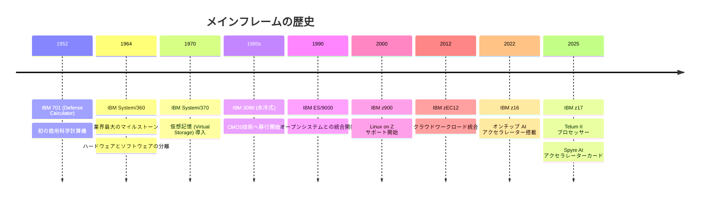
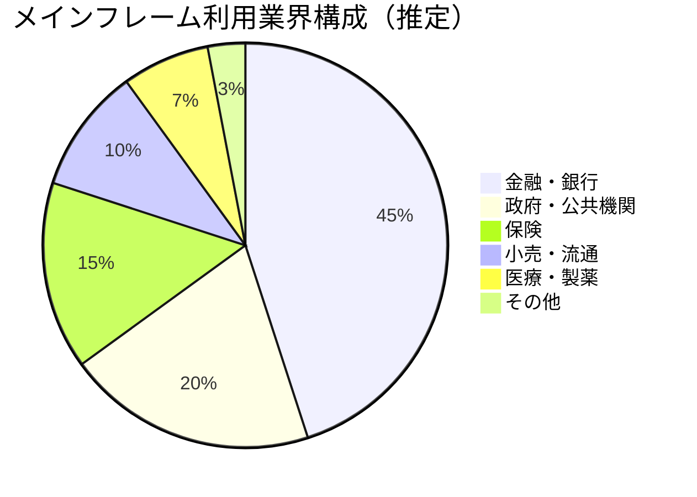
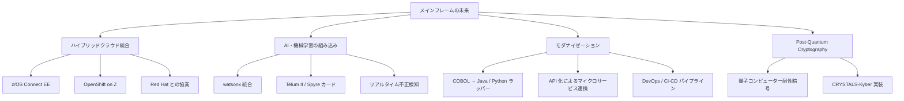
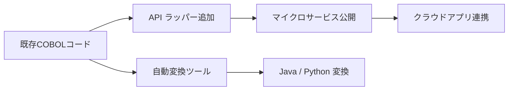

# メインフレーム 総合調査ドキュメント

## 目次

1. [メインフレームとは](#メインフレームとは)
2. [歴史](#歴史)
3. [現在の利用シーン](#現在の利用シーン)
4. [クラウド・サーバーとの比較](#クラウドサーバーとの比較)
5. [今後のメインフレーム業界](#今後のメインフレーム業界)
6. [アンチパターン](#アンチパターン)
7. [参考情報](#参考情報)

---

## メインフレームとは

メインフレームとは、大量のデータ処理・トランザクション処理を高信頼性・高可用性で実行するために設計された大型コンピューターシステムである。一般的なサーバーやクラウドと異なり、24時間365日のノンストップ稼働、極めて低いエラー率（ダウンタイム年間数分以下）、数千の同時接続に耐えるスループットを実現する。

現代においてメインフレームの代名詞は **IBM Z シリーズ** であり、世界の日次取引量（金額ベース）の約 70%（IBM 公式）、グローバルGDPの約 $8 兆ドル相当の取引、Fortune 500 企業の約 71% がメインフレームを利用していると言われている。

---

## 歴史

### 年表



### 主要マイルストーンの詳細

#### IBM 701（1952年）
IBM が初めてリリースした商用科学計算機。真空管を使用し、主に国防計算に利用された。価格は月額 $15,000（当時）。

#### IBM System/360（1964年）
メインフレーム史上最も重要なマイルストーン。当時 IBMが約 $50 億ドル（現在価値で約 $400 億ドル）を投じて開発。以下の革新をもたらした。

- **ハードウェアとOSの分離**: 同一アーキテクチャ上で異なる性能・価格帯のモデルを提供
- **後方互換性の確立**: 以降60年にわたるアーキテクチャの基盤となった
- **バイトアドレッシング**: 8ビット = 1バイトという概念を業界標準化

#### IBM System/370（1970年）
仮想記憶（Virtual Storage）を導入し、物理メモリを超えるプログラム実行を可能にした。

#### IBM z900（2000年）
Linux on Z のサポートを開始。オープンシステムとの統合が本格化した。

#### IBM z16（2022年）
- オンチップ AI アクセラレーター搭載（最大 6 TFLOPS）
- Post-Quantum Cryptography（PQC）対応
- Telum プロセッサー（5.2GHz、8コア）

#### IBM z17（2025年4月発表）
最新世代のメインフレーム。

- **Telum II プロセッサー**: 5.5GHz、8コア
- **AI 処理能力**: 4,500 億回（450 billion）/日以上の AI 推論トランザクション
- **Spyre AI アクセラレーターカード**: 32コア、128GB LPDDR5、専用 AI ワークロード処理
- **watsonx 統合**: IBM の AI プラットフォームとのネイティブ統合

> 参考: [IBM z17 Newsroom](https://newsroom.ibm.com/z17), [Planet Mainframe: IBM z17](https://planetmainframe.com/2025/04/its-here-ibm-introduces-z17-mainframe-with-integrated-ai-capabilities/)

---

## 現在の利用シーン

### 主要業界



### 金融・銀行

世界の金融システムの根幹を担っている。

- **SWIFT決済**: 国際送金の大部分がメインフレーム経由で処理
- **ATM処理**: 世界中の ATM トランザクションの大多数がメインフレームで管理
- **リアルタイム決済**: 1秒間に数万件のトランザクション処理が必要な場面で不可欠

**日本の事例（みずほフィナンシャルグループ）**

みずほは **MINORI** プロジェクト（2019年完了）においてメインフレーム台数を 19台 → 4台 に削減した。しかし、2021年に発生した大規模障害の一因はこのシステム移行の複雑性にあるとされており、メインフレーム統合の難しさを示す事例となった。

三菱UFJ、三井住友などメガバンクも引き続きコア勘定系システムにメインフレームを採用している。

### 政府・公共機関

- **米国社会保障局（SSA）**: 数億人の給付金・年金データを管理
- **IRS（米国国税庁）**: 納税申告処理
- **日本の官公庁**: 住民基本台帳ネットワーク、年金システムなど

### 小売・流通

- **クレジットカード処理**: Visa・Mastercard の決済バックエンド
- **在庫管理**: 大規模な SCM（Supply Chain Management）システム

### 代表的な技術スタック

メインフレームで動作する主な言語・技術：

| 技術 | 用途 |
|------|------|
| COBOL | ビジネスロジック（金融計算・帳票処理） |
| PL/I | 科学計算・汎用処理 |
| Assembler | 低レベル最適化 |
| JCL | ジョブ制御 |
| z/OS | IBM の主力 OS |
| Linux on Z | オープン系ワークロード |
| CICS | トランザクション処理ミドルウェア |
| DB2 | リレーショナルデータベース |

**JCL（Job Control Language）の例**:

```jcl
//MYJOB    JOB (ACCT),'MY NAME',CLASS=A,MSGCLASS=X
//STEP1    EXEC PGM=IEFBR14
//INPUT    DD DSN=MY.INPUT.FILE,DISP=SHR
//OUTPUT   DD DSN=MY.OUTPUT.FILE,
//             DISP=(NEW,CATLG,DELETE),
//             SPACE=(CYL,(5,2)),
//             DCB=(RECFM=FB,LRECL=80)
```

**COBOL コードの例（利息計算）**:

```cobol
IDENTIFICATION DIVISION.
PROGRAM-ID. INTEREST-CALC.

DATA DIVISION.
WORKING-STORAGE SECTION.
    01 PRINCIPAL      PIC 9(10)V99.
    01 RATE           PIC 9(3)V9(4).
    01 YEARS          PIC 9(3).
    01 INTEREST       PIC 9(12)V99.

PROCEDURE DIVISION.
    COMPUTE INTEREST = PRINCIPAL * RATE * YEARS
    DISPLAY "利息額: " INTEREST
    STOP RUN.
```

> 参考: [IBM z/OS 公式ドキュメント](https://www.ibm.com/docs/en/zos)

---

## クラウド・サーバーとの比較

### 主要な違い

| 観点 | メインフレーム | クラウド（AWS/Azure/GCP） | 汎用サーバー |
|------|--------------|--------------------------|-------------|
| 可用性 | 99.9999%（年間ダウン数秒） | 99.9〜99.99% | 99〜99.9% |
| トランザクション処理 | 数万〜数十万 TPS | スケールアウトで対応 | 限定的 |
| セキュリティ | ハードウェアレベルの暗号化 | ソフトウェアベース | ソフトウェアベース |
| コスト（初期） | 数億〜数十億円 | 低コスト（従量制） | 低〜中コスト |
| レイテンシ | 極めて低い（マイクロ秒） | ネットワーク依存 | 中程度 |
| 運用スキル | 専門家が必要 | 汎用クラウドスキル | 汎用スキル |

### なぜクラウドに全移行しないのか

1. **レガシーデータの問題**: 数十年分のデータ・ビジネスロジックが COBOL で記述されており、書き換えのリスクとコストが膨大
2. **コンプライアンス**: 金融規制（Basel III、PCI DSS など）がメインフレームの分離・制御を前提とした設計になっている場合がある
3. **TCO（Total Cost of Ownership）**: ワークロードによってはメインフレームの方がクラウドより安価になるケースがある（数万 TPS 以上の場合）
4. **信頼性の実績**: 「稼働し続けている」という事実そのものが価値

> 参考: [IBM Mainframe vs Cloud の比較](https://www.ibm.com/think/topics/mainframe-vs-cloud)

---

## 今後のメインフレーム業界

### 市場規模と成長予測

- **2024年時点の市場規模**: 約 $27〜53 億ドル（調査機関により差異あり）
- **CAGR（年平均成長率）**: 約 5〜8%
- **2030年予測**: 約 $70〜90 億ドル規模

### 主要トレンド



#### 1. ハイブリッドクラウド統合

IBM は **z/OS Connect** を通じて、メインフレーム上のアプリケーションを REST API として公開し、クラウドネイティブアプリと連携できる仕組みを提供している。

また **OpenShift on Z** により、Red Hat OpenShift コンテナプラットフォームをメインフレーム上で動かし、Kubernetes ベースのワークロードをオンプレミスで実行できる。

```yaml
# OpenShift on Z の Service 定義例
apiVersion: v1
kind: Service
metadata:
  name: cobol-backend-service
spec:
  selector:
    app: cobol-api-wrapper
  ports:
    - protocol: TCP
      port: 8080
      targetPort: 8080
```

#### 2. AI との融合

IBM z17 に搭載された **Spyre AI アクセラレーターカード** は、メインフレーム上でリアルタイムの AI 推論を実行する。用途例：

- **リアルタイム不正検知**: 決済トランザクションと同時に AI 判定を実施（レイテンシ数ミリ秒以内）
- **異常検知**: システムログの AI 分析による障害予知
- **自然言語インターフェース**: watsonx を通じた COBOL コードへの問い合わせ・説明生成

#### 3. モダナイゼーション戦略

完全な書き換えではなく、段階的な近代化が主流になっている。



**代表的なモダナイゼーションツール**:
- **IBM watsonx Code Assistant for Z**: AI を活用した COBOL → Java 変換支援
- **Micro Focus Enterprise Developer**: COBOL の PC 環境開発・テスト
- **AWS Mainframe Modernization**: AWS が提供するリホスト・リファクタリングサービス

#### 4. Post-Quantum Cryptography（PQC）

IBM z16 から量子コンピューター耐性暗号を実装。NIST が標準化した **CRYSTALS-Kyber**（鍵交換）・**CRYSTALS-Dilithium**（署名）をハードウェアレベルでサポート。金融・政府機関の長期データ保護に不可欠な機能として注目されている。

### 課題と懸念

1. **COBOL 技術者の高齢化**: 現役 COBOL エンジニアの平均年齢は 55〜60 歳とされており、技術継承が急務
2. **ブラックボックス化**: 長年の改修により、誰もビジネスロジックを把握していないシステムが多数存在
3. **IBM の市場独占**: 実質的に IBM 一社による市場支配であり、代替選択肢が極めて限られる
4. **コスト**: ハードウェア・ソフトウェアライセンスのコストが非常に高く、中小企業には参入障壁が高い

---

## アンチパターン

### 1. ビッグバン書き換え（Big Bang Rewrite）

**問題**: 既存システムを一度に全面書き換えしようとする試み。  
**なぜ危険か**: ビジネスロジックの完全な理解が前提となるが、数十年分の暗黙知がコードに埋め込まれており、仕様書が存在しないことが多い。  
**事例**: 米国 TSA（交通安全局）や複数の銀行でプロジェクトが数年を経て失敗・断念。  
**推奨**: ストラングラーフィグパターン（段階的置き換え）を採用する。

### 2. Exotic 言語依存（Assembler・PL/I・Easytrieve）

**問題**: COBOL より難解な Assembler や Easytrieve が混在しているシステムの移行。  
**なぜ危険か**: 自動変換ツールが対応しておらず、手動書き換えが必要。さらに理解できる人材がほぼいない。  
**推奨**: 移行前にコードの棚卸しを行い、Exotic 言語の割合を把握する。

### 3. 依存関係の後期発覚

**問題**: 移行中に予期しないプログラム間依存（バッチジョブの連鎖、共有ファイル）が発覚する。  
**推奨**: 静的解析ツール（IBM Application Discovery and Delivery Intelligence など）で事前に依存マップを作成する。

### 4. テスト環境の欠如

**問題**: 本番環境に近いテスト環境がなく、移行後に初めて問題が発覚する。  
**なぜ危険か**: メインフレームのテスト環境構築コストが高いため省略されがちだが、本番障害時の影響は甚大。  
**推奨**: IBM Z Development and Test Environment（ZD&T）などの仮想環境を活用する。

### 5. クラウド移行後のコスト増大

**問題**: オンプレミスのメインフレームからクラウドへ移行したところ、コストが想定の 3〜5 倍になるケース。  
**なぜ起きるか**: 高 TPS ワークロードはクラウドのスケールアウトコストが積み上がりやすい。  
**推奨**: 移行前に詳細な TCO（Total Cost of Ownership）分析を実施する。

> 参考: [Google Developers: Mainframe Modernization Antipatterns](https://developers.googleblog.com/2021/02/mainframe-modernization-antipatterns.html)

---

## 参考情報

| タイトル | URL |
|----------|-----|
| IBM 公式: z16 製品ページ | [https://www.ibm.com/products/z16](https://www.ibm.com/products/z16) |
| IBM Newsroom: z17 発表 | [https://newsroom.ibm.com/z17](https://newsroom.ibm.com/z17) |
| IBM: メインフレームのライフサイクル歴史 | [https://www.ibm.com/support/pages/ibm-mainframe-life-cycle-history](https://www.ibm.com/support/pages/ibm-mainframe-life-cycle-history) |
| IBM: z/OS 公式ドキュメント | [https://www.ibm.com/docs/en/zos](https://www.ibm.com/docs/en/zos) |
| IBM: Mainframe vs Cloud | [https://www.ibm.com/think/topics/mainframe-vs-cloud](https://www.ibm.com/think/topics/mainframe-vs-cloud) |
| IMARC Group: Mainframe 市場レポート | [https://www.imarcgroup.com/mainframe-market](https://www.imarcgroup.com/mainframe-market) |
| Planet Mainframe: IBM z17 詳細 | [https://planetmainframe.com/2025/04/its-here-ibm-introduces-z17-mainframe-with-integrated-ai-capabilities/](https://planetmainframe.com/2025/04/its-here-ibm-introduces-z17-mainframe-with-integrated-ai-capabilities/) |
| Google Developers: Modernization Antipatterns | [https://developers.googleblog.com/2021/02/mainframe-modernization-antipatterns.html](https://developers.googleblog.com/2021/02/mainframe-modernization-antipatterns.html) |

---

最終更新日: 2026/04/29
